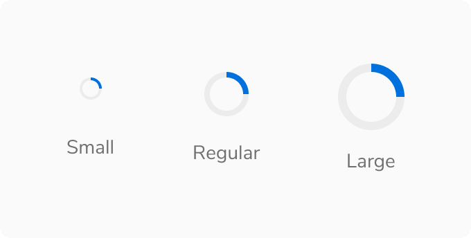
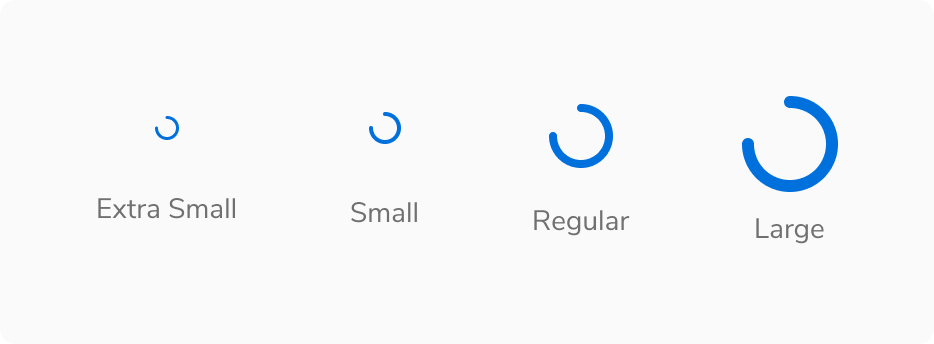
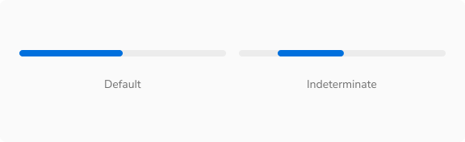
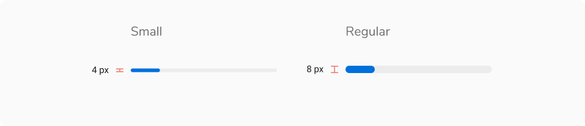
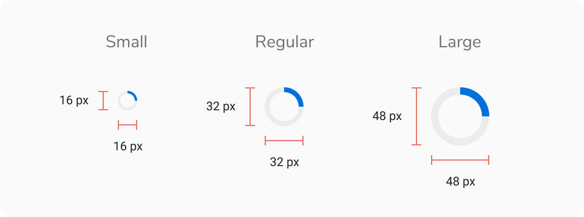
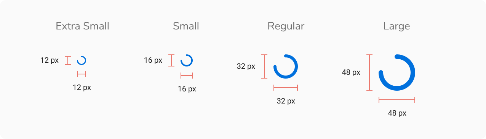
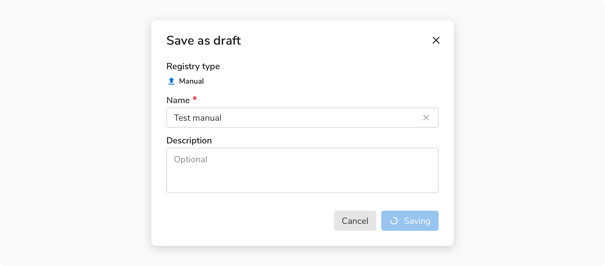
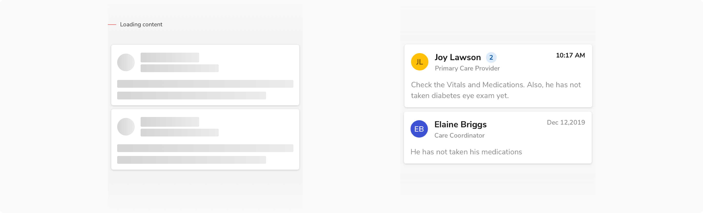

Progress indicator is a key part of any user interface screen. It helps users become aware of the loading progress of different components in the application.

### Types

 

#### Progress Bar

Goes from 0 to 100 linearly.

<Preview name='components-progress-indicators-progressbar-fifty-percent--fifty-percent'/>

#### Progress Ring

Goes from 0 to 100 along the circumference.

<Preview name='components-progress-indicators-progressring-size--size'/>

#### Spinner

Spins endlessly to show indeterminate progress unlike progress bar and ring.

<Preview name='components-progress-indicators-spinner-size--size'/>

#### Skeleton Loader

Skeleton loaders are used if there is a defined template for the data that is going to be displayed. This type of loading state should be used for container-based components(like avatars, lists, and so on) and data-based components(like tables).

<Preview name='components-progress-indicators-placeholder-skeleton-loaders--skeleton-loaders'/>
 

### Sizes

#### Progress Bar

Progress bar comes in **2 sizes** - small and regular.

<Caption>Progress Bar - Size</Caption>

#### Progress Ring

Progress bar comes in **3 sizes** - small, regular and large.

<Caption>Progress Ring - Size</Caption>

#### Spinner

Progress bar comes in **4 sizes** - extra small, small, regular and large. 

<Caption>Spinner - Size</Caption>

### States

#### Progress Bar

Progress bar comes in **2 states** - default and indeterminate

<Caption>Progress Bar - States</Caption>

### Shape

#### Skeleton Loaders - Image

For images, skeleton loaders come in **2 shapes** - round and square. 

<Caption>Skeleton Loaders - Image - Shape</Caption>

### Structure
 
 

#### Progress Bar

 
 

<table style={{width: "100%"}}>
 <tbody>
   <tr>
     <th style={{width:"50%",  textAlign: "left"}}>Property</th>
     <th style={{width:"50%",  textAlign: "left"}}>Value(s)</th>
   </tr>
   <tr style={{verticalAlign: "top"}}>
      <td>Height</td>
      <td>
        4 px <em>(Small)</em> 
        8 px <em>(Regular)</em>
      </td>
   </tr>
   <tr>
      <td> Progress Percentage (Indeterminate state) </td>
      <td>32%</td>
   </tr>
   
   <tr style={{verticalAlign: "top"}}>
      <td>Corner radius</td>
      <td>4 px</td>
   </tr>
 </tbody>
</table>
 

#### Progress Ring

 
 

<table style={{width: "100%"}}>
 <tbody>
   <tr>
     <th style={{width:"50%",  textAlign: "left"}}>Property</th>
     <th style={{width:"50%",  textAlign: "left"}}>Value(s)</th>
   </tr>
   <tr style={{verticalAlign: "top"}}>
      <td>Height</td>
      <td>16x16 px <em>(Small)</em> 
          32x32 px <em>(Regular)</em> 
          48x48 px <em>(Large)</em></td>
   </tr>
 </tbody>
</table>
 

#### Spinner

 
 

<table style={{width: "100%"}}>
 <tbody>
   <tr>
     <th style={{width:"50%",  textAlign: "left"}}>Property</th>
     <th style={{width:"50%",  textAlign: "left"}}>Value(s)</th>
   </tr>
   <tr style={{verticalAlign: "top"}}>
      <td>Height</td>
      <td>12x12 px <em>(Extra small)</em> 
          16x16 px <em>(Small)</em> 
          32x32 px <em>(Regular)</em> 
          48x48 px <em>(Large)</em></td>
   </tr>
 </tbody>
</table>
 

### Configurations
 
 

#### Progress Bar

<table style={{width: "100%"}}>
  <tbody>
    <tr>
      <th style={{width:"33%", textAlign: "left"}}>Property</th>
      <th style={{width:"33%", textAlign: "left"}}>Value(s)</th>
      <th style={{width:"33%", textAlign: "left"}}>Default value</th>
    </tr>
    <tr style={{verticalAlign: "top"}}>
      <td>Value</td>
      <td>&#60;value&#62;</td>
      <td>-</td>
    </tr>
  </tbody>
</table>
 

#### Progress Indicator

<table style={{width: "100%"}}>
  <tbody>
    <tr>
      <th style={{width:"33%", textAlign: "left"}}>Property</th>
      <th style={{width:"33%", textAlign: "left"}}>Value(s)</th>
      <th style={{width:"33%", textAlign: "left"}}>Default value</th>
    </tr>
    <tr style={{verticalAlign: "top"}}>
      <td>Size</td>
      <td>
          <ul>
              <li>Small</li>
              <li>Regular</li>
              <li>Large</li>
          </ul>
      </td>
      <td>Regular</td>
    </tr>
    <tr style={{verticalAlign: "top"}}>
      <td>Value</td>
      <td>&#60;value&#62;</td>
      <td>-</td>
    </tr>
  </tbody>
</table>
 

#### Spinner

<table style={{width: "100%"}}>
  <tbody>
    <tr>
      <th style={{width:"33%", textAlign: "left"}}>Property</th>
      <th style={{width:"33%", textAlign: "left"}}>Value(s)</th>
      <th style={{width:"33%", textAlign: "left"}}>Default value</th>
    </tr>
    <tr style={{verticalAlign: "top"}}>
      <td>Size</td>
      <td>
          <ul>
            <li>Extra small</li>
            <li>Small</li>
            <li>Regular</li>
            <li>Large</li>
          </ul>
      </td>
      <td>Regular</td>
    </tr>
    <tr style={{verticalAlign: "top"}}>
      <td>Value</td>
      <td>&#60;value&#62;</td>
      <td>-</td>
    </tr>
  </tbody>
</table>
 

### Usage

 

#### Nature of the Process

 

##### Determinate

When the time taken to load a process is determinable.

-   Use **Progress Bar** for general determinable processes.

<Caption> Showing progress using progress bar </Caption>

 

-   Use **Progress Ring** if the process is contextual to a component

<Caption> Showing progress using progress ring </Caption>

 

##### Indeterminate

When the time taken to load a process cannot be determined.

-   Use **Skeleton loaders** if there is a defined template for the data that is going to be displayed.

<Caption> Showing loading state using skeleton loaders </Caption>

 

-   Use **Spinners** if there is no defined template for the data that is going to be displayed

<Caption> Showing loading state using spinner </Caption>

 

-   Use **Spinners** if the process is contextual to a component, e.g. button.

<Caption> Showing loading state using spinner in button </Caption>

 
 

#### Skeleton Loaders

 

##### Visual Structure

Skeleton loaders imitate each component of a cell separately at the time of loading, to create a perception of decreased loading time. 

<Caption> Visual structure of skeleton loaders </Caption>

 

##### Page With Static vs Dynamic Content

<Caption> Static vs Dynamic content </Caption>

 

##### Using a spinner based on size

Spinners are used differently depending on their size.

<Card shadow='none'>
  <Table
    showMenu={false}
    separator={true}
    data={[
      {
        Size: 'Extra small',
        Usecase: 'For inline loaders such as in tiny buttons',
      },
      {
        Size: 'Small',
        Usecase: 'For inline loaders such as in regular and large buttons',
      },
      {
        Size: 'Regular',
        Usecase: 'For Modals and Cards',
      },
      {
        Size: 'Large',
        Usecase: 'For Media and Page loaders.',
      },
    ]}
    schema={[
      {
        name: 'Size',
        displayName: 'Size',
        width: '50%',
        sorting: false,
        separator: true,
      },
      {
        name: 'Usecase',
        displayName: 'Use-case',
        width: '50%',
        sorting: false,
        separator: true
      },
    ]}
    withHeader={false}
  />
</Card>
 

##### Skeleton Loader vs Spinner

A typical process starts with loading the app first. Refer to the table below and  the examples to have a better understanding:

<Card shadow='none'>
  <Table
    showMenu={false}
    separator={true}
    data={[
      {
        Property: 'Loading the app',
        Value: 'Unpredictable',
        Configurable: 'Spinner',
      },
      {
        Property: 'Loading page template',
        Value: 'Predictable',
        Configurable: 'Skeleton',
      },
      {
        Property: 'Making API Calls',
        Value: 'Data can be empty',
        Configurable: 'Spinner',
      },
      {
        Property: 'Making API Calls',
        Value: 'Data will always be present',
        Configurable: 'Skeleton',
      },
      {
        Property: 'Searching',
        Value: 'Data can be empty',
        Configurable: 'Spinner',
      },
      {
        Property: 'Changing page',
        Value: 'Data will always be present',
        Configurable: 'Skeleton',
      },
    ]}
    schema={[
      {
        name: 'Property',
        displayName: 'State',
        width: '33%',
        sorting: false,
        separator: true,
      },
      {
        name: 'Value',
        displayName: 'Content-type',
        width: '33%',
        sorting: false,
        separator: true
        
      },
      {
        name: 'Configurable',
        displayName: 'Loader-type',
        width: '33%',
        sorting: false,
        separator: true
      },
    ]}
    withHeader={false}
  />
</Card>
 

##### Progressive Loading

Progressive loading is a technique that loads the page in chunks i.e. from the simplest view to the most detailed view. Table in the above section demonstrates the step-by-step loading of a page. 
