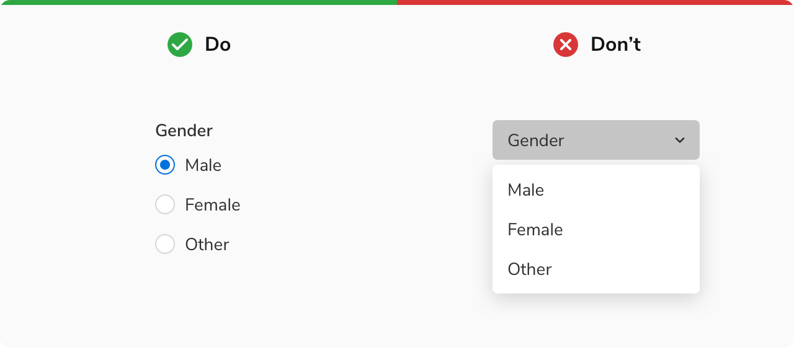

### Types

 

#### Basic

<Preview name='components-radio-default-radio--default-radio'/>

#### With help text

The radio button can have a help text below the label to provide some extra information about the particular option. The help text will always be aligned to the label. Clicking over the help text will not change the state of radio. 

<Preview name='components-radio-with-help-text--with-help-text'/>

### Sizes

Radio comes in two sizes: Regular and Tiny.

<Preview name='components-radio-variants-size--size'/>
 

### Structure
 

 
 

<table style="width: 100%">
 <tbody>
   <tr>
     <th style="width:50%; text-align: left;">Property</th>
     <th style="width:50%; text-align: left;">Value(s)</th>
   </tr>
   <tr style="vertical-align: top">
      <td>Size (radio control)</td>
      <td>12x12 px <em>(Small)</em> 
          12x12 px <em>(Regular)</em></td>
   </tr>
   <tr style="vertical-align: top">
      <td>Spacing between radio control and label</td>
      <td>8 px</td>
   </tr>
 </tbody>
</table>
 

### Configurations
 
 

<table style="width: 100%">
  <tbody>
    <tr>
      <th style="width:33%; text-align: left;">Property</th>
      <th style="width:33%; text-align: left;">Value(s)</th>
      <th style="width:33%; text-align: left;">Default value</th>
    </tr>
    <tr style="vertical-align: top">
      <td>Size</td>
      <td>
        <ul>
            <li>Small</li>
            <li>Regular</li>
        </ul>
      </td>
      <td>Regular</td>
    </tr>
    <tr style="vertical-align: top">
      <td>Label <em>(optional)</em></td>
      <td>&#60;label&#62;</td>
      <td>-</td>
    </tr>
    <tr style="vertical-align: top">
      <td>Help text <em>(optional)</em></td>
      <td>&#60;help text&#62;</td>
      <td>-</td>
    </tr>
  </tbody>
</table>
 

### Usage
 

#### Radio group

Radio group consists of a list of multiple options, with a label on the top. The label should clearly state the grouping category or the action to perform. 

*Note: Multiple radio buttons should have a minimum of ***8px*** spacing in between.*

<Preview name='components-radio-radio-group--radio-group'/>

#### Alignment

The radio buttons in a group can be aligned either vertically or horizontally. However, it is advisable to stack the radio buttons vertically with one option in a line for easier reading and scanning. If you need to use them horizontally, make sure to space the options appropriately so that it is clear which control goes with which label. 

<Preview name='components-radio-alignment-of-radio-group--alignment-of-radio-group'/>

#### Overflow Behaviour 

If the label or the help text with the radio component overflows, wrap it to the next line but make sure that the control and the label are top aligned.

<Preview name='components-radio-overflow-content--overflow-content'/>

#### Default Selection

<ul>
  <li>If a radio group is optional to fill, no option from the list should be selected by default. </li>
  <li>Even if the radio group is mandatory to fill, it is recommended not to have a default option selected in order to avoid submitting that option by mistake. However, if the need arises you have the choice to make an option selected by default. In that case, make sure to select the safest and most likely option. </li>
</ul>
 

#### Radio vs Checkbox

Checkboxes allow users to select multiple options whereas radio buttons allow only one selection from a list of mutually exclusive options.
 

#### Radio vs Dropdown

Radio buttons are recommended to use when there are fewer than 5 options as it is easier for users to scan and select the appropriate option and save an additional click. 

However, if the number of options exceeds 5 or if the space is limited then it is recommended to use dropdowns to better utilize the space.

<Caption> Radio vs Dropdown </Caption>
 
 

