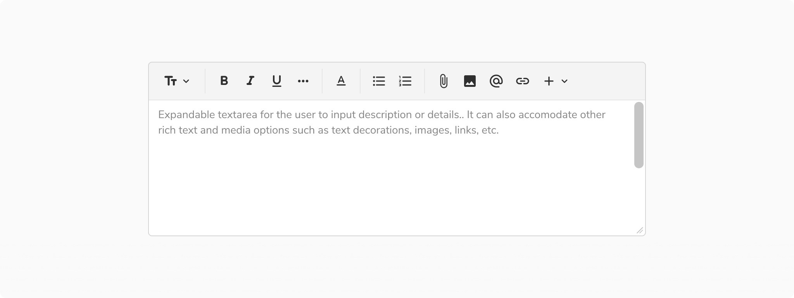
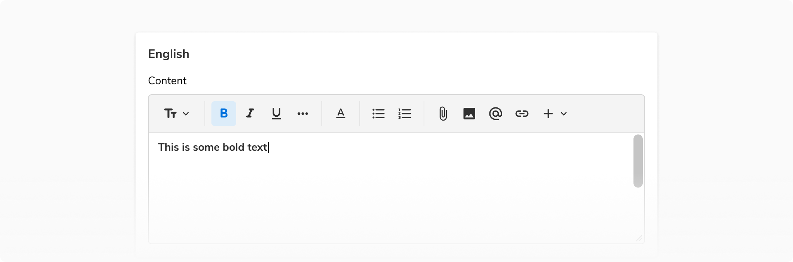
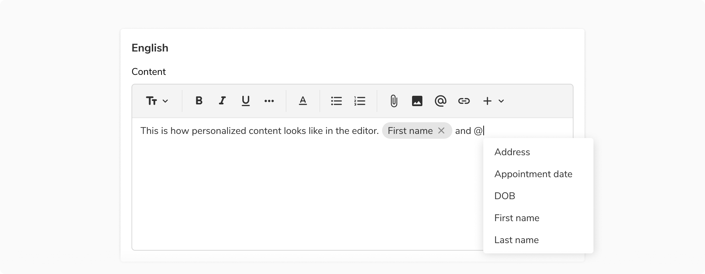
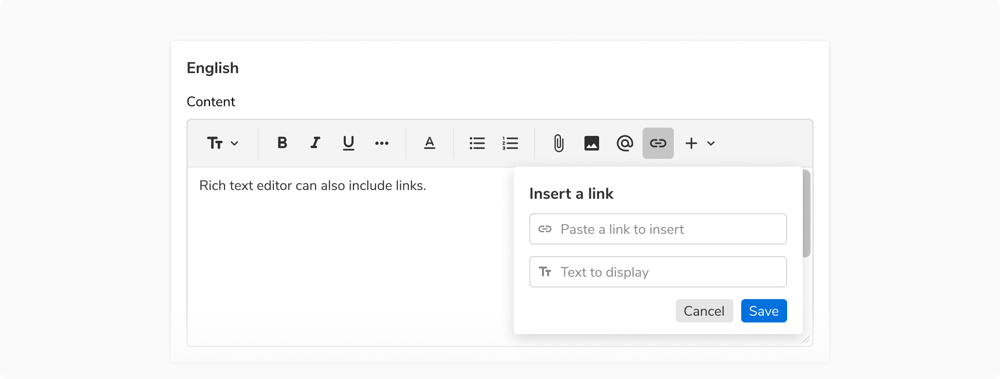

Rich text editor also provides options to add media and other useful entities such as inserting images, adding hyperlinks, etc.

### Structure

 
<table style="width: 100%">
 <tbody>
   <tr>
     <th style="width:50%; text-align: left;">Property</th>
     <th style="width:50%; text-align: left;">Value(s)</th>
   </tr>
   <tr style="vertical-align: top">
      <td>Corner radius</td>
      <td>4 px</td>
   </tr>
 </tbody>
</table>
 

### Configurations
<table style="width: 100%">
  <tbody>
    <tr>
      <th style="width:33%; text-align: left;">Property</th>
      <th style="width:33%; text-align: left;">Value(s)</th>
      <th style="width:33%; text-align: left;">Default value</th>
    </tr>
    <tr style="vertical-align: top">
      <td>Heading</td>
      <td>
        <ul>
            <li>Heading 1</li>
            <li>Heading 2</li>
            <li>Heading 3</li>
            <li>Heading 4</li>
        </ul>
      </td>
      <td>-</td>
    </tr>
    <tr style="vertical-align: top">
      <td>Text decoration</td>
      <td>
        <ul>
            <li>Bold</li>
            <li>Italics</li>
            <li>Underline</li>
            <li>Strikethrough</li>
        </ul>
      </td>
      <td>-</td>
    </tr>
    <tr style="vertical-align: top">
      <td>Text color</td>
      <td>
        <ul>
            <li>Night</li>
            <li>Stone</li>
            <li>Neem</li>
            <li>Jal</li>
            <li>Mirch</li>
            <li>Tawak</li>
        </ul>
      </td>
      <td>Night</td>
    </tr>
    <tr style="vertical-align: top">
      <td>Text alignment</td>
      <td>
        <ul>
            <li>Left</li>
            <li>Center</li>
            <li>Right</li>
        </ul>
      </td>
      <td>Left</td>
    </tr>
    <tr style="vertical-align: top">
      <td>List formatting</td>
      <td>
        <ul>
            <li>Bulleted list</li>
            <li>Numbered list</li>
            <li>Right</li>
        </ul>
      </td>
      <td>-</td>
    </tr>
    <tr style="vertical-align: top">
      <td>Insert options</td>
      <td>
        <ul>
            <li>Attachment</li>
            <li>Image</li>
            <li>Personalization</li>
            <li>Link</li>
            <li>More (extendable option)</li>
        </ul>
      </td>
      <td>-</td>
    </tr>
    <tr style="vertical-align: top">
      <td>Read only</td>
      <td>
        <ul>
            <li>True</li>
            <li>False</li>
        </ul>
      </td>
      <td>False</td>
    </tr>
  </tbody>
</table>
 

### Usage

 

#### Hover on options bar items

<Caption>  Hovering on options bar items </Caption>

 

#### Selection on options bar items

<Caption>  Selection on options bar items </Caption>

 

#### Inserting images

Users can insert images in the rich text editor using the image button from the options bar.

<Caption> Inserting images </Caption>

 

#### Deleting images

Users can delete any previously added images by **either using backspace or from the selection popover**. As the name suggests, selection popover appears when **a user clicks on the image**.

<Caption> Deleting images </Caption>

 

#### Adding personalized content

Rich text editor comes with the option to add personalized content. This can be done either 
by **using the personalize button** from the options bar **or by pressing '@' on the keyboard**. Doing 
so will open a dropdown with custom options. The selected option then appears as a chip which 
can be cleared from the editor if needed.

<Caption> Adding personalized content </Caption>

 

#### Adding hyperlinks

Users can add hyperlinks using the link button from the options bar.

<Caption> Adding hyperlinks </Caption>

 

##### Editing the hyperlink

Users can edit the hyperlink using the options popover which can be revealed by **clicking on the link**.

<Caption> Editing the hyperlink </Caption>

 

In the options popover -

-   Clicking the link opens it in a new tab.
-   Clicking on the edit button opens the same modal through which a link is added. 
-   Clicking on the delete button removes the link and the displayed text altogether.