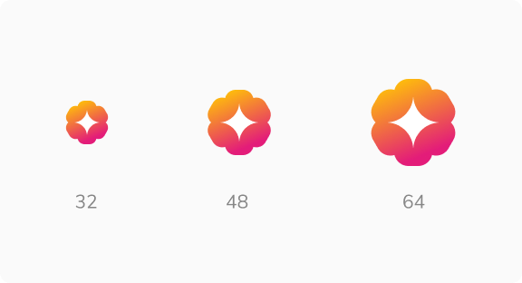
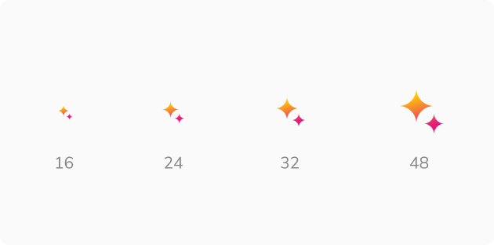
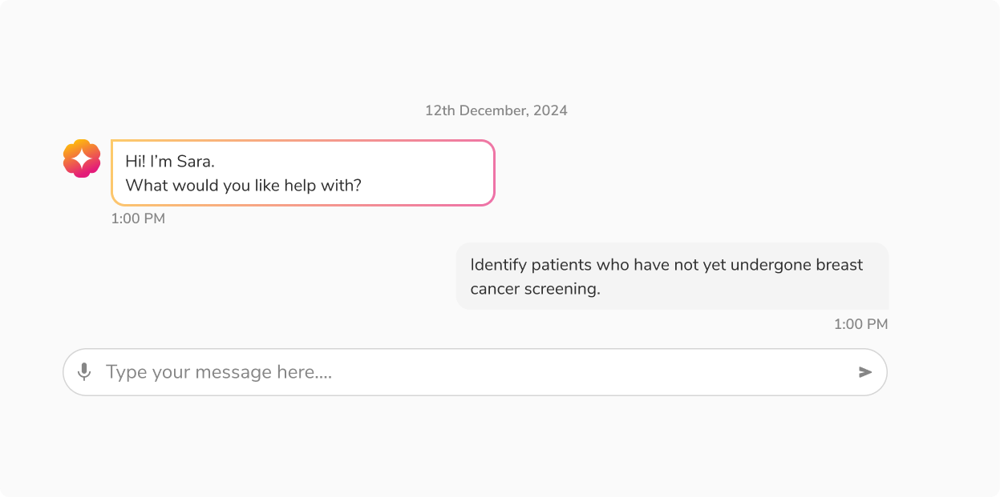
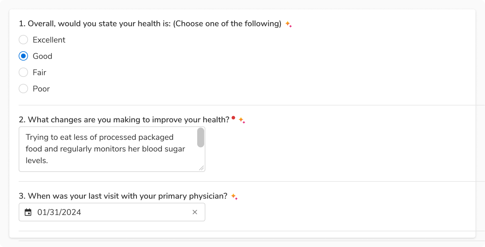
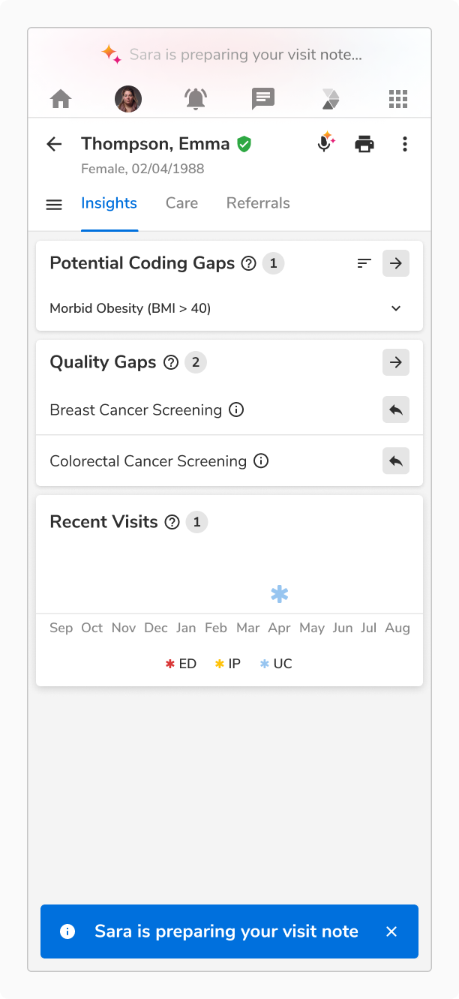
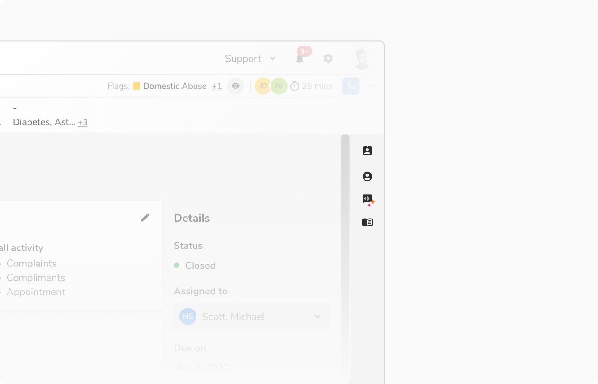
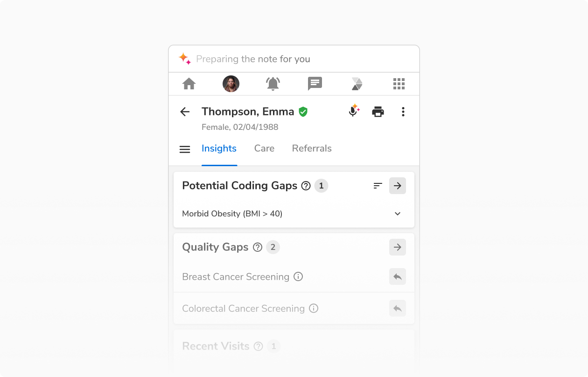

Sara can indicate the presence of AI whenever the user is directly or indirectly interacting with it.

<Preview name='components-ai-sara-all--all' />

### Types

There are 2 types that can be used based on the need.

#### Sara

Use Sara to signal direct interactions with an AI agent, such as during text or voice conversations with AI.

<Preview name='components-ai-sara-all--all' />

#### Sara Sparkle

Use Sara Sparkle to highlight actions assisted by AI or information generated by AI.

<Preview name='components-ai-sara-sparkle-all--all' />

### Sizes

#### Sara

It supports **3 pre-defined sizes** -  regular, medium and large.

**Note:** Sara’s size can be customized.

<Caption>Sizes - Sara</Caption>

#### Sara Sparkle

It supports **4 pre-defined sizes** - tiny, regular, medium and large.

**Note:** Sara Sparkle’s size can be customized.

<Caption>Sizes - Sara Sparkle</Caption>

### States

#### Sara

Sara has **2 states** - default and resting.

<Preview name='components-ai-sara-states--states' />

### Sara Sparkle

Sara Sparkle has **4 states** - default, listening, short processing and long processing.

<Preview name='components-ai-sara-sparkle-states--states' />

### Configurations

#### Sara

 
 

<table style={{width: "100%"}}>
  <tbody>
    <tr>
      <th style={{width:"33%",  textAlign: "left"}}>Property</th>
      <th style={{width:"33%",  textAlign: "left"}}>Value(s)</th>
      <th style={{width:"33%",  textAlign: "left"}}>Default value</th>
    </tr>
    <tr style={{verticalAlign: "top"}}>
      <td>Size (In px)</td>
      <td>
        <ul>
          <li>
            32
          </li>
          <li>
            48
          </li>
          <li>
            64
          </li>
          <li>
            Custom (Eg: 128)
          </li>
        </ul>
      </td>
        <td>32</td>
    </tr>
  </tbody>
</table>
 

#### Sara Sparkle

 
 

<table style={{width: "100%"}}>
  <tbody>
    <tr>
      <th style={{width:"33%",  textAlign: "left"}}>Property</th>
      <th style={{width:"33%",  textAlign: "left"}}>Value(s)</th>
      <th style={{width:"33%",  textAlign: "left"}}>Default value</th>
    </tr>
    <tr style={{verticalAlign: "top"}}>
      <td>Size (In px)</td>
      <td>
        <ul>
          <li>
            16
          </li>
          <li>
            24
          </li>
          <li>
            32
          </li>
          <li>
            48
          </li>
          <li>
            Custom (Eg: 64)
          </li>
        </ul>
      </td>
      <td>24</td>
    </tr>
  </tbody>
</table>
 

### Usage

#### Sara as agent

Use Sara where users interact directly with the AI agent, such as through chat or voice conversations.

<Caption>Sara as agent</Caption>

#### Sara Sparkle for AI assisted actions

Use Sara Sparkle for actions assisted or powered by AI like auto-filling, content generation, or modification. These actions can either be direct or indirect. 

<Caption>Sara Sparkle for AI assisted actions</Caption>

#### Sara Sparkle as Progress Indicator

The Progress Indicator provides real-time feedback on the AI's status, showing when it is listening, processing, or idle.

<Preview name='patterns-progressindicator-vertical--vertical' />

#### Horizontal vs Vertical Arrangement of progress Indicator

##### Horizontal arrangement

Horizontal arrangement is ideal for compact spaces where horizontal space is abundant, providing a clear and concise layout.

<Caption>Horizontal arrangement</Caption>

##### Vertical arrangement

Vertical arrangement is ideal for layouts where vertical space is preferred or when emphasizing the icon or progress text is necessary.

<Caption>Vertical arrangement</Caption>

#### Long Processing vs Short Processing in progress indicator

##### Long processing 

The long processing variant is used for tasks that require a substantial duration to complete.

<Caption>Long Processing</Caption>

##### Short processing

Short processing variant is used for concise processes. 

<Caption>Short Processing</Caption>
