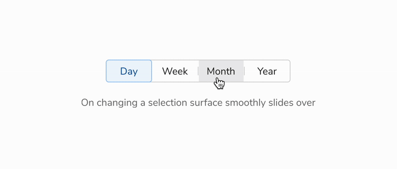

### Changing selection

<Caption>When the selection changes, the surface smoothly slides over</Caption>

### Keyboard Interactions

 
 

<table style={{width: "100%"}}>
  <tbody>
    <tr>
      <th style={{width:"33%", textAlign: "left"}}>Initial state</th>
      <th style={{width:"33%", textAlign: "left"}}>Keyboard Interaction</th>
      <th style={{width:"33%", textAlign: "left"}}>Final state</th>
    </tr>
    <tr style={{verticalAlign: "top"}}>
      <td>Any segment is selected</td>
      <td>&#60;Tab&#62;</td>
      <td>
        <ul>
          <li>Focuses on the first segment</li>
          <li>Then cycles through the segments until the last segment</li>
          <li>Skips the active and disabled segments</li>
        </ul>
      </td>
    </tr>
    <tr style={{verticalAlign: "top"}}>
      <td></td>
      <td>&#60;Enter&#62;</td>
      <td>
        Activates that segment
      </td>
    </tr>
    <tr style={{verticalAlign: "top"}}>
      <td></td>
      <td>&#60;Esc&#62;</td>
      <td>Removes focus state</td>
    </tr>
  </tbody>
</table>

 
 

### Animation Curve

 
 

<table style={{width: "100%"}}>
  <tbody>
    <tr>
      <th style={{width:"50%",  textAlign: "left"}}>Curve</th>
      <th style={{width:"50%",  textAlign: "left"}}>Duration</th>
    </tr>
    <tr style={{verticalAlign: "top"}}>
      <td>cubic-bezier(0.2, 0, 0.38, 0.9)</td>
      <td>240ms</td>
    </tr>
  </tbody>
</table>

 
