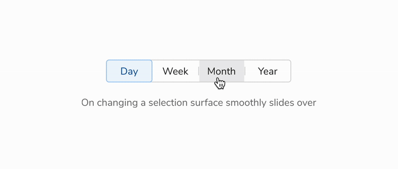

### Changing selection

<Caption>When the selection changes, the surface smoothly slides over</Caption>

### Keyboard Interactions

 
 

<table style={{width: "100%"}}>
  <tbody>
    <tr>
      <th style={{width:"33%", textAlign: "left"}}>Initial state</th>
      <th style={{width:"33%", textAlign: "left"}}>Keyboard Interaction</th>
      <th style={{width:"33%", textAlign: "left"}}>Final state</th>
    </tr>
    <tr style={{verticalAlign: "top"}}>
      <td>Default state</td>
      <td>&#60;Tab&#62;</td>
      <td>Focus shifts to the selected segment or the first enabled segment if none are selected</td>
    </tr>
    <tr style={{verticalAlign: "top"}}>
      <td>Focus is on a segment</td>
      <td>&#60;Tab&#62;</td>
      <td>Focus shifts to the next item in the page tab sequence</td>
    </tr>
    <tr style={{verticalAlign: "top"}}>
      <td></td>
      <td>&#60;Arrow Right&#62; / &#60;Arrow Down&#62;</td>
      <td>Focus shifts to the next enabled segment and activates it (wraps to the first segment after the last)</td>
    </tr>
    <tr style={{verticalAlign: "top"}}>
      <td></td>
      <td>&#60;Arrow Left&#62; / &#60;Arrow Up&#62;</td>
      <td>Focus shifts to the previous enabled segment and activates it (wraps to the last segment before the first)</td>
    </tr>
    <tr style={{verticalAlign: "top"}}>
      <td></td>
      <td>&#60;Home&#62;</td>
      <td>Focus shifts to the first enabled segment and activates it</td>
    </tr>
    <tr style={{verticalAlign: "top"}}>
      <td></td>
      <td>&#60;End&#62;</td>
      <td>Focus shifts to the last enabled segment and activates it</td>
    </tr>
  </tbody>
</table>

 
 

### Animation Curve

 
 

<table style={{width: "100%"}}>
  <tbody>
    <tr>
      <th style={{width:"50%",  textAlign: "left"}}>Curve</th>
      <th style={{width:"50%",  textAlign: "left"}}>Duration</th>
    </tr>
    <tr style={{verticalAlign: "top"}}>
      <td>cubic-bezier(0.2, 0, 0.38, 0.9)</td>
      <td>240ms</td>
    </tr>
  </tbody>
</table>

 
