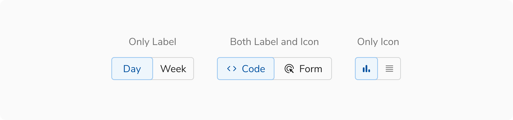
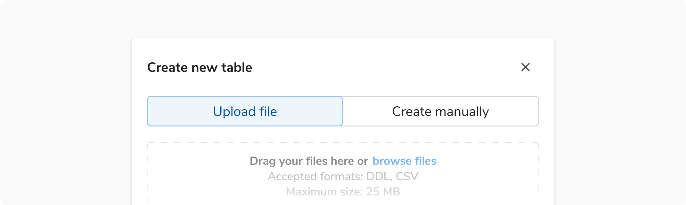
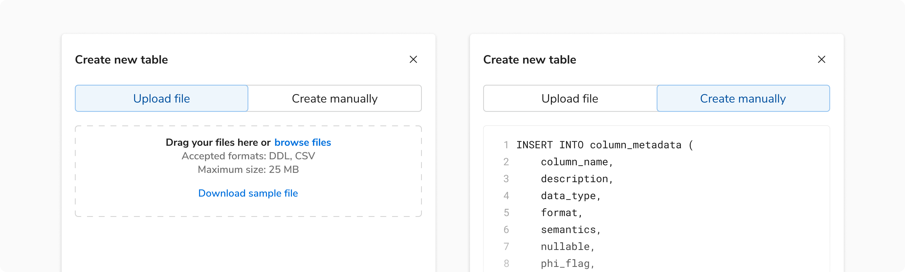
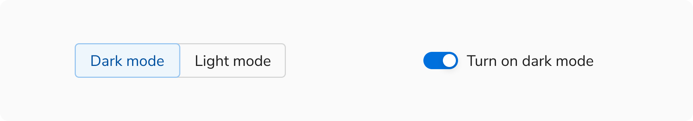

Segmented controls excel at showing a close relationship between a small set of options. Because all options are visible upfront, users can easily see what's available and switch between them quickly.

Use a segmented control when you want to:

- Change how the same content is presented, like switching between a grid view and a list view.
- Let users choose a path within a form, updating the content or fields below instantly.

While tabs and navigation elements represent different sections or locations, segmented controls are meant for switching between closely related variations within the same context.

### Sizes

Segmented controls come in three sizes: **Small**, **Regular**, and **Large**.

All segments are equal width to make the control look balanced. The longest label defines the width for the segments.

<Preview name="components-segmentedcontrol-size--size" />

<Caption>Sizes of a segmented control</Caption>

### Variants

#### Label and Icons

Segmented controls can include labels, icons, or both.

<Caption>Icon and label combinations of segmented controls</Caption>

#### Expanded segmented control

This control stretches to fill the width of its parent container. Use it in narrow containers.

<Caption>Expanded segmented control</Caption>

### Configurations

#### Segmented Control

 
 

<table style={{width: "100%"}}>
  <tbody>
    <tr>
      <th style={{width:"33%", textAlign: "left"}}>Property</th>
      <th style={{width:"33%", textAlign: "left"}}>Value(s)</th>
      <th style={{width:"33%", textAlign: "left"}}>Default value</th>
    </tr>
    <tr style={{verticalAlign: "top"}}>
      <td>size</td>
      <td>
        <ul>
          <li>Small</li>
          <li>Regular</li>
          <li>Large</li>
        </ul>
      </td>
      <td>Regular</td>
    </tr>
    <tr style={{verticalAlign: "top"}}>
      <td>expanded</td>
      <td>Boolean</td>
      <td>False</td>
    </tr>
    <tr style={{verticalAlign: "top"}}>
      <td>activeIndex</td>
      <td>Number</td>
      <td>0</td>
    </tr>
    <tr style={{verticalAlign: "top"}}>
      <td>maxWidth  </td>
      <td>Number</td>
      <td>256px</td>
    </tr>
    <tr style={{verticalAlign: "top"}}>
      <td>isEqualWidth</td>
      <td>Boolean</td>
      <td>True</td>
    </tr>
    <tr style={{verticalAlign: "top"}}>
      <td>disabled</td>
      <td>Boolean</td>
      <td>False</td>
    </tr>
  </tbody>
</table>

 

#### Segment

 
 

<table style={{width: "100%"}}>
  <tbody>
    <tr>
      <th style={{width:"33%", textAlign: "left"}}>Property</th>
      <th style={{width:"33%", textAlign: "left"}}>Value(s)</th>
      <th style={{width:"33%", textAlign: "left"}}>Default value</th>
    </tr>
    <tr style={{verticalAlign: "top"}}>
      <td>icon</td>
      <td>Icon Name</td>
      <td>-</td>
    </tr>
    <tr style={{verticalAlign: "top"}}>
      <td>label</td>
      <td>Text</td>
      <td>-</td>
    </tr>
    <tr style={{verticalAlign: "top"}}>
      <td>disabled</td>
      <td>Boolean</td>
      <td>False</td>
    </tr>
    <tr style={{verticalAlign: "top"}}>
      <td>tooltip</td>
      <td>Text</td>
      <td>-</td>
    </tr>
  </tbody>
</table>

 

### Usage

#### Limit to 5 segments

Too many segments can be hard to scan and understand. Aim for no more than five segments.

#### Using in forms

Segmented controls provide immediate, visible feedback and work best for dynamic interactions. In forms, use a segmented control as an input when the selection changes the content or structure of the form below.

Avoid using segmented controls when the choice doesn't affect other areas of the form. In those cases, simpler input types like radio buttons or choice chips are more appropriate.

<Caption>Using segmented controls to change form path</Caption>

#### Avoid using as navigation

Segmented controls are for changing views or states within the same context. Use tabs or navigation links for switching between different sections or locations.

#### Avoid using for filter views

Filter views often represent independent categories. Grouping them in a segmented control can create a false sense of connection.

#### Switch vs Segmented control

A segmented control with only two segments behaves similarly to a switch or toggle button, where tapping either segment flips the selection.

When deciding between them, consider the representation that would communicate the design intent better:

- Use a switch for on/off or enabled/disabled states.
- Use a segmented control for two distinct but related options.

<Caption>Representing the same choice as a segmented control or a switch</Caption>

#### Button group vs Segmented control

Buttons are used for actions like add, close, or save. Use button groups when several related actions need to be presented together. Segmented controls, on the other hand, are used for making selections. Avoid using segmented controls for actions.

