Select displays a list of options for users to choose from. It provides the option to let users select a single option or multiple.

<Preview name="components-select-all--all" />

 

### Variants

#### Button variants

The custom button for select comes with a few variants -

##### Standard

The standard variant consists of just text which changes its state when one or more options are selected.

<Preview name="components-select-all--all" />

##### With icon

This variant comes with an icon in the left, preceding the text to provide additional cues regarding the type of the options.

<Preview name="components-select-selectwithicon--select-with-icon" />

##### Inline label

This variant comes with a label preceding the text and can be used at places where there is a space crunch.

<Preview name="components-select-withinlinelabel--with-inline-label" />

 

#### Option variants

The options in a select can be single select or multi-select. They come with a few variants -

##### Standard

This variant comes with just text.

<Preview name="components-select-all--all" />

##### With icon

This variant comes with an icon preceding the text.

<Preview name="components-select-optionitemwithicon--option-item-with-icon" />

##### With sub info

This variant comes with sub-info beneath the text.

<Preview name="components-select-optionitemwithinfo--option-item-with-info" />

##### With checkbox

This variant comes with the support of checkboxes to select multiple options. The options here can also have sub info just like the previous variant.

<Preview name="components-select-multiselect-multiselect--multi-select" />

##### Add option

This variant allows you to add an option to the list in select.

<Preview name="components-select-addoption--add-option" />

 

### Sizes

Select trigger comes in 2 sizes - small and regular.

<Preview name="components-select-size--size" />

 

### States

#### Button states
The custom button comes in 5 states - default, hover, focus, active and disabled.

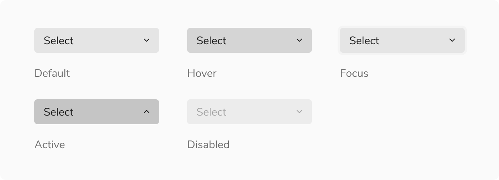

 

#### Option item states

Option items come in 5 states - default, hover, active, focus and disabled. In addition to the aforementioned states, option items also have the selected-default, selected-hover, selected-active, selected-focus and selected-disabled state.

**Note:** Users can also use the up/down arrow key to traverse the options. 

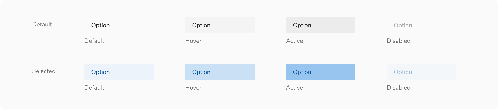

 
 

### Structure

Select is made up of 2 key components - a custom **button** which acts as a trigger and a **popover** which acts as a container for the options.

<Preview name="components-select-all--all" />

 

#### Trigger (Select button)

<Preview name="components-select-all--all" />

<table style={{width: "100%"}}>
  <tbody>
    <tr>
      <th style={{width:"50%",  textAlign: "left"}}>Property</th>
      <th style={{width:"50%",  textAlign: "left"}}>Value(s)</th>
    </tr>
    <tr style={{verticalAlign: "top"}}>
      <td>Height</td>
      <td>
        <ul>
          <li>24px (Small)</li>
          <li>32px (Regular)</li>
        </ul>
      </td>
    </tr>
    <tr style={{verticalAlign: "top"}}>
      <td>corner radius</td>
      <td>4px</td>
    </tr>
  </tbody>
</table>

 
 

#### Option item

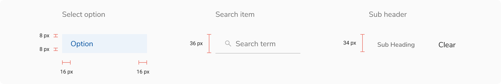

 

<table style={{width: "100%"}}>
  <tbody>
    <tr>
      <th style={{width:"50%",  textAlign: "left"}}>Padding</th>
      <th style={{width:"50%",  textAlign: "left"}}>Value(s)</th>
    </tr>
    <tr style={{verticalAlign: "top"}}>
      <td>Top and Bottom</td>
      <td>
        <ul>
          <li>4px </li>
          <li>8px </li>
          <li>12px </li>
        </ul>
      </td>
    </tr>
    <tr style={{verticalAlign: "top"}}>
      <td>Left and right</td>
      <td>16px </td>
    </tr>
  </tbody>
</table>

 
 

### Configurations

#### Trigger

<table style={{width: "100%"}}>
  <tbody>
    <tr>
      <th style={{width:"33%", textAlign: "left"}}>Property</th>
      <th style={{width:"33%", textAlign: "left"}}>Value(s)</th>
      <th style={{width:"33%", textAlign: "left"}}>Default value</th>
    </tr>
    <tr style={{verticalAlign: "top"}}>
      <td>Width</td>
      <td>&#60;Width&#62;</td>
      <td>176px (Customizable)</td>
    </tr>
    <tr style={{verticalAlign: "top"}}>
      <td>Size</td>
      <td>
        <ul>
          <li>Small</li>
          <li>Regular</li>
        </ul>
      </td>
      <td>Regular</td>
    </tr>
    <tr style={{verticalAlign: "top"}}>
      <td>Placeholder</td>
      <td>&#60;placeholder&#62;</td>
      <td> Select (Customizable)</td>
    </tr>
    <tr style={{verticalAlign: "top"}}>
      <td>Selected Value</td>
      <td>&#60;selected value&#62;</td>
      <td> 3 selected (Customizable)</td>
    </tr>
     <tr style={{verticalAlign: "top"}}>
      <td>Left icon   (optional)</td>
      <td>&#60;icon name&#62;</td>
      <td>-</td>
    </tr>
    <tr style={{verticalAlign: "top"}}>
      <td>Inline label   (optional)</td>
      <td>&#60;label&#62;</td>
      <td>-</td>
    </tr>
  </tbody>
</table>

 

#### Option item

<table style={{width: "100%"}}>
  <tbody>
    <tr>
      <th style={{width:"33%", textAlign: "left"}}>Property</th>
      <th style={{width:"33%", textAlign: "left"}}>Value(s)</th>
      <th style={{width:"33%", textAlign: "left"}}>Default value</th>
    </tr>
    <tr style={{verticalAlign: "top"}}>
      <td>Label</td>
      <td>&#60;label&#62;</td>
      <td>-</td>
    </tr>
    <tr style={{verticalAlign: "top"}}>
      <td>Size</td>
      <td>
        <ul>
          <li>Standard</li>
          <li>Compressed</li>
          <li>Tight</li>
        </ul>
      </td>
      <td>Compressed</td>
    </tr>
    <tr style={{verticalAlign: "top"}}>
      <td>Icon   (optional)</td>
      <td>&#60;icon name&#62;</td>
      <td>-</td>
    </tr>
     <tr style={{verticalAlign: "top"}}>
      <td>Sub info   (optional)</td>
      <td>&#60;sub info&#62;</td>
      <td>-</td>
    </tr>
    <tr style={{verticalAlign: "top"}}>
      <td>Checkbox   (optional)</td>
      <td>&#60;Checkbox&#62;</td>
      <td>-</td>
    </tr>
  </tbody>
</table>

 

#### Popover

<table style={{width: "100%"}}>
  <tbody>
    <tr>
      <th style={{width:"33%", textAlign: "left"}}>Property</th>
      <th style={{width:"33%", textAlign: "left"}}>Value(s)</th>
      <th style={{width:"33%", textAlign: "left"}}>Default value</th>
    </tr>
    <tr style={{verticalAlign: "top"}}>
      <td>Width </td>
      <td>&#60;width&#62;</td>
      <td>176px (Customizable)</td>
    </tr>
     <tr style={{verticalAlign: "top"}}>
      <td>Max height</td>
      <td>&#60;max_height&#62;</td>
      <td>256px (Customizable)</td>
    </tr>
    <tr style={{verticalAlign: "top"}}>
      <td>Min height</td>
      <td>&#60;min_height&#62;</td>
      <td>-</td>
    </tr>
  </tbody>
</table>

 
 

### Usage

#### Search

Select can be offered with a search functionality. In that case, the search input appears at the top.

<Preview name="components-select-withsearch--with-search" />

#### Overflow behavior

##### Trigger

If the label exceeds the available space, it will be truncated and can be seen in a tooltip upon hovering.

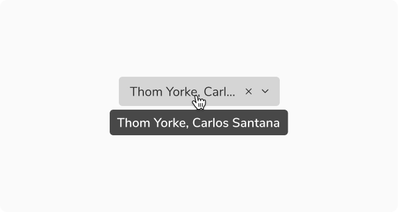
<Caption>Overflow behavior of trigger</Caption>

##### Option Items

If the label exceeds the available space, it will be truncated and can be seen in a tooltip upon hovering.

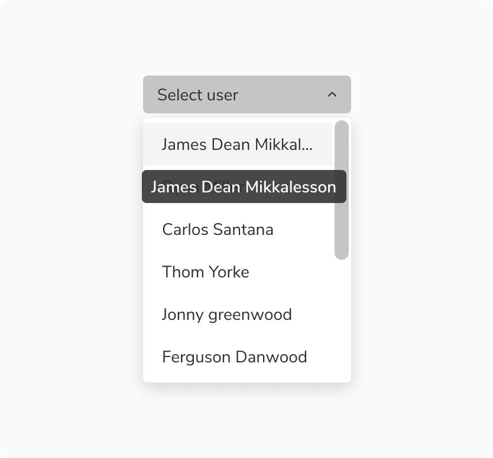
<Caption>Overflow behavior of option Items</Caption>

 

#### Width of popover

While the popover's width is flexible and can vary, it is advisable to maintain a size that is equal to or larger than the trigger of select.

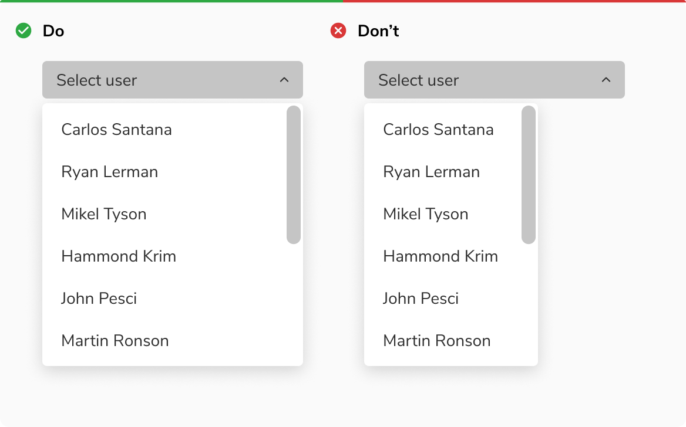
<Caption>Width of popover</Caption>

 

#### Showing items inside select

The select popover can showcase an unlimited number of items. However, for better user experience when dealing with a large number of items, it's advisable to adopt best practices such as integrating a search feature for effortless navigation to handle a large number of options efficiently.

<Preview name="components-select-withsearch--with-search" />

 

#### Grouping options

Select options can be grouped under a section using a sub header, if needed.

<Caption>Grouping options under a sub heading</Caption>

<Preview name="components-select-multiselect-withsections--with-sections" />

 

#### Label position

The label provides a better understanding of what kind of selection is expected. Labels can be placed either on the top of the select or can be placed inline with the value or placeholder of the select.

<Preview name="components-select-labelontop--label-on-top" />

<Preview name="components-select-withinlinelabel--with-inline-label" />

 

#### Help text

Help text can be provided beneath the select trigger to add context regarding the type of input required just like the input fields.

<Preview name="components-select-selectwithhelptext--select-with-helptext" />

 

#### Actions in footer

Using network resources on each checkbox selection in a select can be quite expensive. Select offers the option of incorporating actions in the footer in case of multiple selection, thereby facilitating a single API call upon clicking the Add/Apply button.

<Preview name="components-select-multiselect-withactionbutton--with-action-button" />

 

#### Custom options

Select can also accommodate custom options inside it.

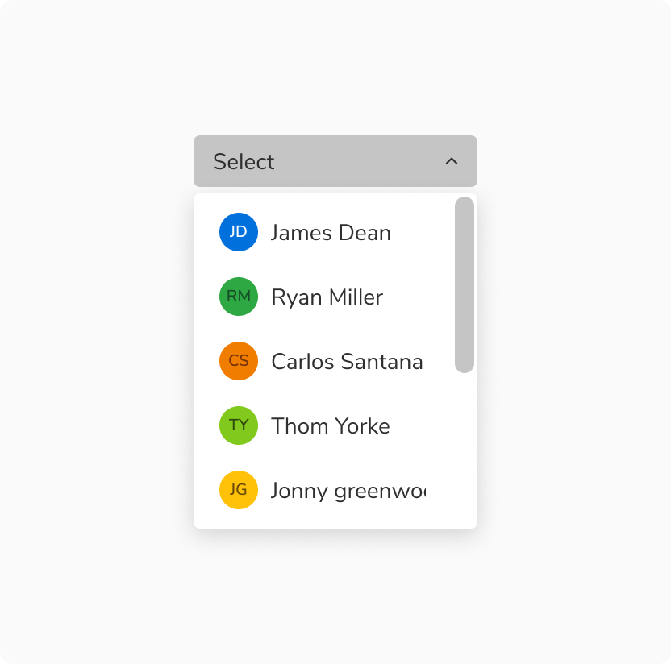
<Caption>Custom options in select</Caption>

 

#### Select vs. Checkbox

It is recommended to use select if the number of multi-select options exceeds 5 or if the space is limited, to better utilize the space. Checkboxes should be used if the options are fewer than 5 and there are no space restrictions.

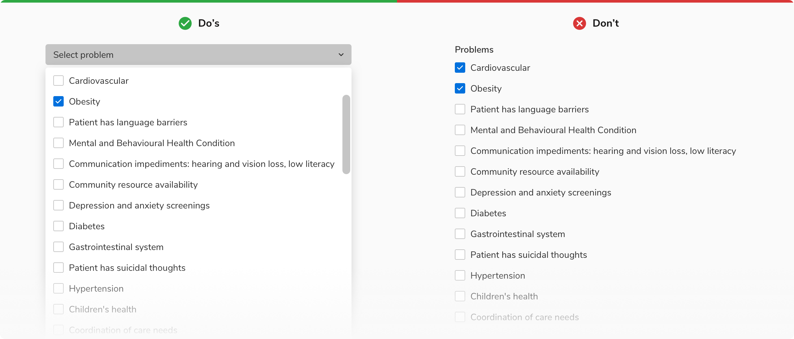

 

#### Adding option in select

In certain cases select allows you to add your own option to the list, even if it isn’t available yet but will be needed in the future.

<Caption>Adding option in select</Caption>

 

#### Adding option in select vs Input in combobox

It is recommended to use select when the users are encouraged to exercise caution and be mindful when adding options whereas in combobox the users are allowed to type in their value without any obstruction.

**Note:** Using select is a preferable choice when adding medication to a database to ensure accuracy and discourage users from creating their own abbreviations or names, promoting mindful selection.

<Caption>Created option in select vs Input in combobox</Caption>

 

#### Error & Empty States

These states are used to inform users about the status of the data that is being loaded in the select. 
**Note:** It is recommended to avoid using an image or illustration in these states due to the limited real estate available within the select.

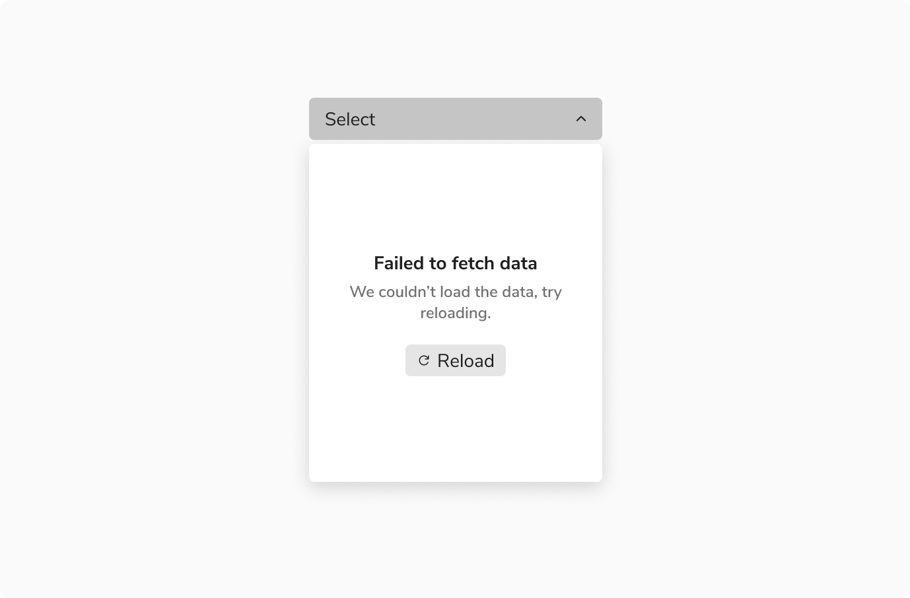
<Caption>Select having error in loading the options</Caption>

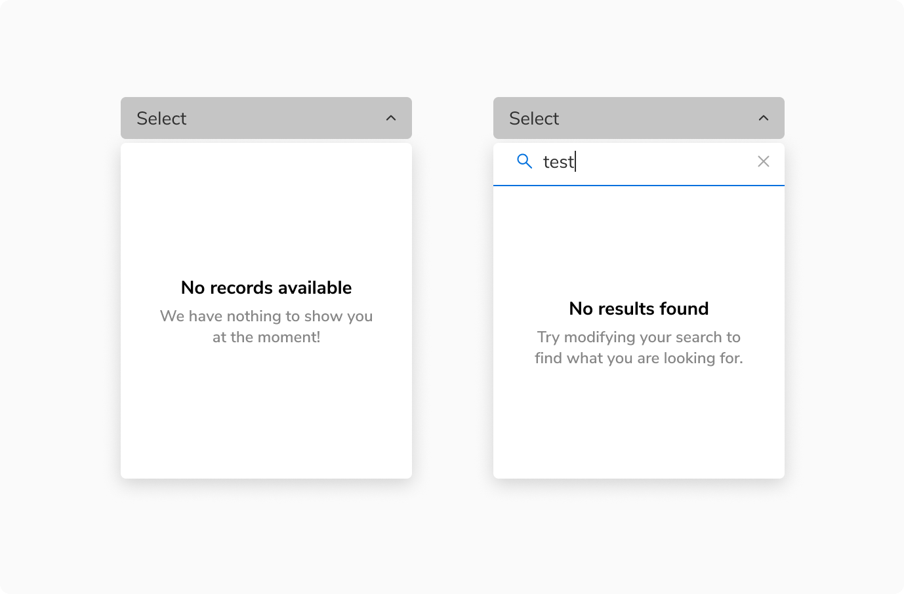
<Caption>[Left] No options vs [Right] No results found after search</Caption>

 

#### Custom Trigger in Select

Select can also be triggered by other components, primarily by buttons and icon buttons. The basic behavior of the select remains the same.

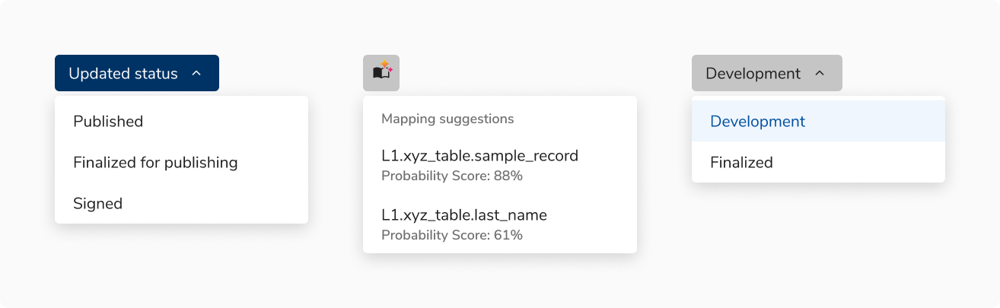
<Caption>Examples of custom triggers in select</Caption>

