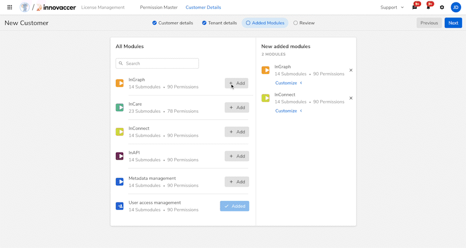
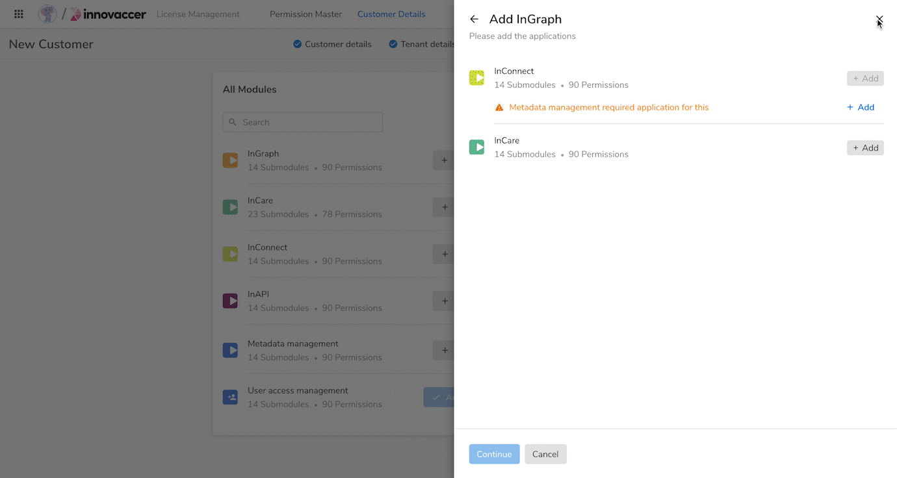
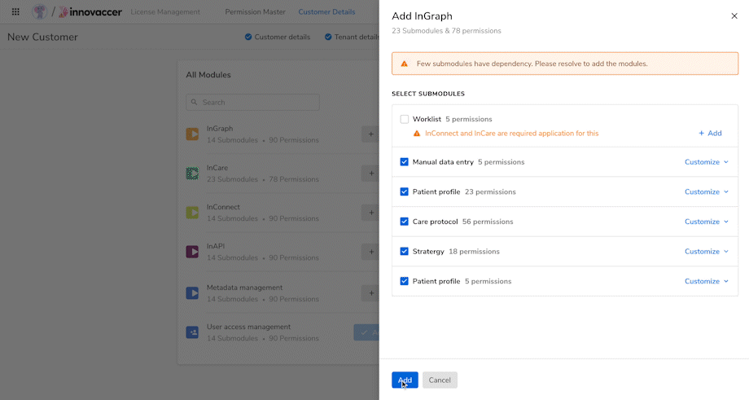

### Opening Side sheet

 

 
 

#### Side sheet

 

<Card shadow='none'>
  <Table
    showMenu={false}
    separator={true}
    data={[
      {
        Property: 'Position - Right',
        Initial: '-100%',
        Final: '0px',
      },
    ]}
    schema={[
      {
        name: 'Property',
        displayName: 'Property',
        width: '34%',
        sorting: false,
        separator: true,
        cellType: 'DEFAULT'
      },
      {
        name: 'Initial',
        displayName: 'Initial state',
        width: '33%',
        sorting: false,
        separator: true
        
      },
      {
        name: 'Final',
        displayName: 'Final state',
        width: '33%',
        sorting: false,
        separator: true
      },
    ]}
    withHeader={false}
  />
</Card>
 

**Curve**

<Card shadow='none'>
  <Table
    showMenu={false}
    separator={true}
    data={[
      {
        Curve: 'cubic-bezier(0, 0, 0.3, 1)',
        Duration: '240ms',
      }
    ]}
    schema={[
      {
        name: 'Curve',
        displayName: 'Curve',
        width: '50%',
        sorting: false,
        separator: true,
        cellRenderer: ({ data }) => {
          return <Rectangle name={data.Curve} />;
        },
      },
      {
        name: 'Duration',
        displayName: 'Duration',
        width: '50%',
        sorting: false,
        separator: true
        
      },
    ]}
    withHeader={false}
  />
</Card>
 
 

#### Overlay

 

<Card shadow='none'>
  <Table
    showMenu={false}
    separator={true}
    data={[
      {
        Property: 'Opacity',
        Initial: '0',
        Final: '100',
      },
    ]}
    schema={[
      {
        name: 'Property',
        displayName: 'Property',
        width: '34%',
        sorting: false,
        separator: true,
        cellType: 'DEFAULT'
      },
      {
        name: 'Initial',
        displayName: 'Initial state',
        width: '33%',
        sorting: false,
        separator: true
        
      },
      {
        name: 'Final',
        displayName: 'Final state',
        width: '33%',
        sorting: false,
        separator: true
      },
    ]}
    withHeader={false}
  />
</Card>
 

**Curve**

<Card shadow='none'>
  <Table
    showMenu={false}
    separator={true}
    data={[
      {
        Curve: 'cubic-bezier(0, 0, 0.3, 1)',
        Duration: '120ms',
      }
    ]}
    schema={[
      {
        name: 'Curve',
        displayName: 'Curve',
        width: '50%',
        sorting: false,
        separator: true,
        cellRenderer: ({ data }) => {
          return <Rectangle name={data.Curve} />;
        },
      },
      {
        name: 'Duration',
        displayName: 'Duration',
        width: '50%',
        sorting: false,
        separator: true
        
      },
    ]}
    withHeader={false}
  />
</Card>
 
 

### Closing Side sheet

 

 
 

#### Side sheet

 

<Card shadow='none'>
  <Table
    showMenu={false}
    separator={true}
    data={[
      {
        Property: 'Position - Right',
        Initial: '0',
        Final: '-100%',
      },
    ]}
    schema={[
      {
        name: 'Property',
        displayName: 'Property',
        width: '34%',
        sorting: false,
        separator: true,
        cellType: 'DEFAULT'
      },
      {
        name: 'Initial',
        displayName: 'Initial state',
        width: '33%',
        sorting: false,
        separator: true
        
      },
      {
        name: 'Final',
        displayName: 'Final state',
        width: '33%',
        sorting: false,
        separator: true
      },
    ]}
    withHeader={false}
  />
</Card>
 

**Curve**

<Card shadow='none'>
  <Table
    showMenu={false}
    separator={true}
    data={[
      {
        Curve: 'cubic-bezier(0.4, 0.14, 1, 1)',
        Duration: '120ms',
      }
    ]}
    schema={[
      {
        name: 'Curve',
        displayName: 'Curve',
        width: '50%',
        sorting: false,
        separator: true,
        cellRenderer: ({ data }) => {
          return <Rectangle name={data.Curve} />;
        },
      },
      {
        name: 'Duration',
        displayName: 'Duration',
        width: '50%',
        sorting: false,
        separator: true
        
      },
    ]}
    withHeader={false}
  />
</Card>
 
 

#### Overlay

 

<Card shadow='none'>
  <Table
    showMenu={false}
    separator={true}
    data={[
      {
        Property: 'Opacity',
        Initial: '100',
        Final: '0',
      },
    ]}
    schema={[
      {
        name: 'Property',
        displayName: 'Property',
        width: '34%',
        sorting: false,
        separator: true,
        cellType: 'DEFAULT'
      },
      {
        name: 'Initial',
        displayName: 'Initial state',
        width: '33%',
        sorting: false,
        separator: true
        
      },
      {
        name: 'Final',
        displayName: 'Final state',
        width: '33%',
        sorting: false,
        separator: true
      },
    ]}
    withHeader={false}
  />
</Card>
 

**Curve**

<Card shadow='none'>
  <Table
    showMenu={false}
    separator={true}
    data={[
      {
        Curve: 'cubic-bezier(0.4, 0.14, 1, 1)',
        Duration: '120ms',
      }
    ]}
    schema={[
      {
        name: 'Curve',
        displayName: 'Curve',
        width: '50%',
        sorting: false,
        separator: true,
        cellRenderer: ({ data }) => {
          return <Rectangle name={data.Curve} />;
        },
      },
      {
        name: 'Duration',
        displayName: 'Duration',
        width: '50%',
        sorting: false,
        separator: true
        
      },
    ]}
    withHeader={false}
  />
</Card>
 
 

### Progressing to the next step

 

 
 

#### Heading

 

<Card shadow='none'>
  <Table
    showMenu={false}
    separator={true}
    data={[
      {
        Property: 'Relative position X',
        Initial: '0px',
        Final: '+ 32px',
      },
    ]}
    schema={[
      {
        name: 'Property',
        displayName: 'Property',
        width: '34%',
        sorting: false,
        separator: true,
        cellType: 'DEFAULT'
      },
      {
        name: 'Initial',
        displayName: 'Initial state',
        width: '33%',
        sorting: false,
        separator: true
        
      },
      {
        name: 'Final',
        displayName: 'Final state',
        width: '33%',
        sorting: false,
        separator: true
      },
    ]}
    withHeader={false}
  />
</Card>
 

**Curve**

<Card shadow='none'>
  <Table
    showMenu={false}
    separator={true}
    data={[
      {
        Curve: 'cubic-bezier(0.2, 0, 0.38, 0.9)',
        Duration: '80ms',
      }
    ]}
    schema={[
      {
        name: 'Curve',
        displayName: 'Curve',
        width: '50%',
        sorting: false,
        separator: true,
        cellRenderer: ({ data }) => {
          return <Rectangle name={data.Curve} />;
        },
      },
      {
        name: 'Duration',
        displayName: 'Duration',
        width: '50%',
        sorting: false,
        separator: true
        
      },
    ]}
    withHeader={false}
  />
</Card>
 
 

#### Body (Content)

 

<Card shadow='none'>
  <Table
    showMenu={false}
    separator={true}
    data={[
      {
        Property: 'Opacity (Current content)',
        Initial: '100',
        Final: '0',
      },
      {
        Property: 'Opacity (Next content)',
        Initial: '0',
        Final: '100',
      },
    ]}
    schema={[
      {
        name: 'Property',
        displayName: 'Property',
        width: '34%',
        sorting: false,
        separator: true,
        cellType: 'DEFAULT'
      },
      {
        name: 'Initial',
        displayName: 'Initial state',
        width: '33%',
        sorting: false,
        separator: true
        
      },
      {
        name: 'Final',
        displayName: 'Final state',
        width: '33%',
        sorting: false,
        separator: true
      },
    ]}
    withHeader={false}
  />
</Card>
 

**Curve**

<Card shadow='none'>
  <Table
    showMenu={false}
    separator={true}
    data={[
      {
        Curve: 'cubic-bezier(0.2, 0, 0.38, 0.9)',
        Duration: '120ms',
      }
    ]}
    schema={[
      {
        name: 'Curve',
        displayName: 'Curve',
        width: '50%',
        sorting: false,
        separator: true,
        cellRenderer: ({ data }) => {
          return <Rectangle name={data.Curve} />;
        },
      },
      {
        name: 'Duration',
        displayName: 'Duration',
        width: '50%',
        sorting: false,
        separator: true
        
      },
    ]}
    withHeader={false}
  />
</Card>
 
 

### Returning to the previous step

 

 
 

#### Body (Content)

 

<Card shadow='none'>
  <Table
    showMenu={false}
    separator={true}
    data={[
      {
        Property: 'Opacity (Current content)',
        Initial: '100',
        Final: '0',
      },
      {
        Property: 'Opacity (Next content)',
        Initial: '0',
        Final: '100',
      },
    ]}
    schema={[
      {
        name: 'Property',
        displayName: 'Property',
        width: '34%',
        sorting: false,
        separator: true,
        cellType: 'DEFAULT'
      },
      {
        name: 'Initial',
        displayName: 'Initial state',
        width: '33%',
        sorting: false,
        separator: true
        
      },
      {
        name: 'Final',
        displayName: 'Final state',
        width: '33%',
        sorting: false,
        separator: true
      },
    ]}
    withHeader={false}
  />
</Card>
 

**Curve**

<Card shadow='none'>
  <Table
    showMenu={false}
    separator={true}
    data={[
      {
        Curve: 'cubic-bezier(0.4, 0.14, 0.3, 1)',
        Duration: '120ms',
      }
    ]}
    schema={[
      {
        name: 'Curve',
        displayName: 'Curve',
        width: '50%',
        sorting: false,
        separator: true,
        cellRenderer: ({ data }) => {
          return <Rectangle name={data.Curve} />;
        },
      },
      {
        name: 'Duration',
        displayName: 'Duration',
        width: '50%',
        sorting: false,
        separator: true
        
      },
    ]}
    withHeader={false}
  />
</Card>
 
 

#### Heading

 

<Card shadow='none'>
  <Table
    showMenu={false}
    separator={true}
    data={[
      {
        Property: 'Relative position X',
        Initial: '0px',
        Final: '- 32px',
      },
    ]}
    schema={[
      {
        name: 'Property',
        displayName: 'Property',
        width: '34%',
        sorting: false,
        separator: true,
        cellType: 'DEFAULT'
      },
      {
        name: 'Initial',
        displayName: 'Initial state',
        width: '33%',
        sorting: false,
        separator: true
        
      },
      {
        name: 'Final',
        displayName: 'Final state',
        width: '33%',
        sorting: false,
        separator: true
      },
    ]}
    withHeader={false}
  />
</Card>
 

**Curve**

<Card shadow='none'>
  <Table
    showMenu={false}
    separator={true}
    data={[
      {
        Curve: 'cubic-bezier(0.2, 0, 0.38, 0.9)',
        Duration: '80ms',
      }
    ]}
    schema={[
      {
        name: 'Curve',
        displayName: 'Curve',
        width: '50%',
        sorting: false,
        separator: true,
        cellRenderer: ({ data }) => {
          return <Rectangle name={data.Curve} />;
        },
      },
      {
        name: 'Duration',
        displayName: 'Duration',
        width: '50%',
        sorting: false,
        separator: true
        
      },
    ]}
    withHeader={false}
  />
</Card>
 
 

