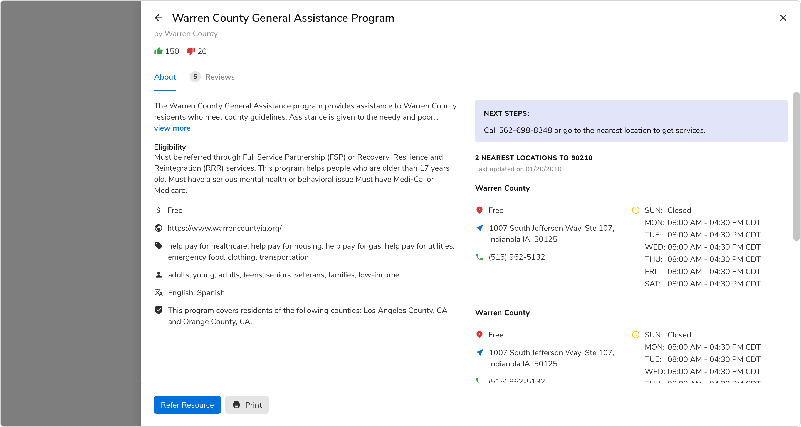
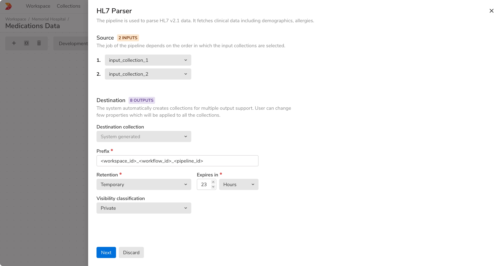
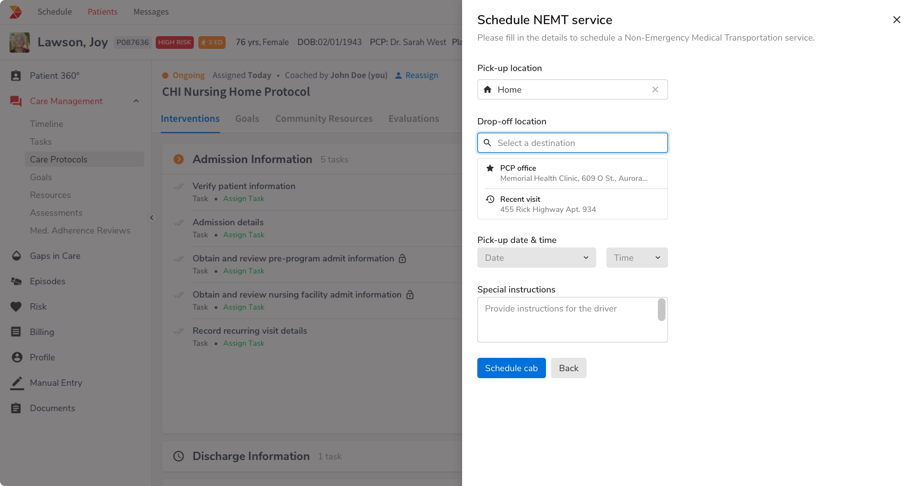
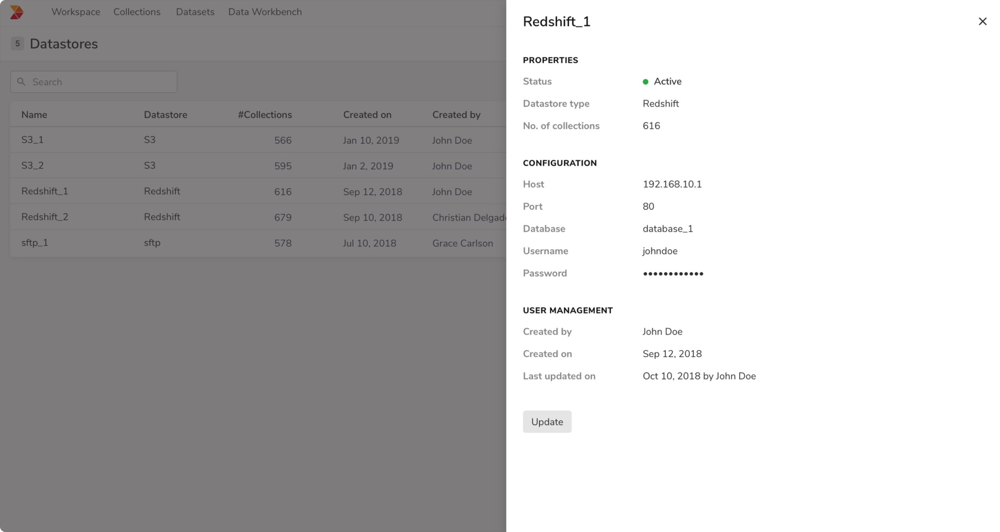
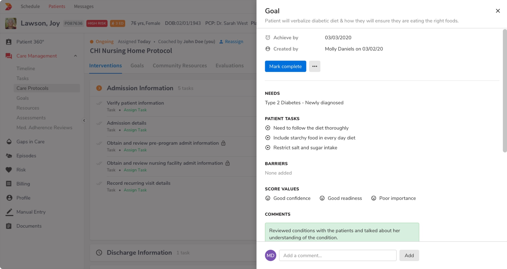

Side sheets are significantly larger than the Modals and hence they can accommodate complex informations and interactions. This way a side sheet works as a sub page in itself while maintaining the context.

### Structure

<Preview name='sidesheet-all'/>

<Card shadow='none'>
  <Table
    showMenu={false}
    separator={true}
    data={[
      {
        Property: 'Default',
        Value: '12 columns',
        Configurable: '6 columns',
      },
      {
        Property: 'Large',
        Value: '12 columns',
        Configurable: '10 columns',
      },
    ]}
    schema={[
      {
        name: 'Property',
        displayName: 'Size',
        width: '34%',
        sorting: false,
        separator: true,
        cellType: 'DEFAULT'
      },
      {
        name: 'Value',
        displayName: 'Breakpoint <= Small',
        width: '33%',
        sorting: false,
        separator: true
        
      },
      {
        name: 'Configurable',
        displayName: 'Breakpoint => Medium',
        width: '33%',
        sorting: false,
        separator: true
      },
    ]}
    withHeader={false}
  />
</Card>
 
 

### Sizes

Basis on the sizes and the amount of content they can accommodate, side sheets are of 2 types -

 

#### Default

The default side sheet takes **6 columns** in the grid and starts at just about halfway of the width of the screen.

<Preview name='sidesheet-regular'/>

#### Large

The large side sheet takes **10 columns** in the grid and starts from left side of the screen.

<Preview name='sidesheet-large'/>

### Properties
<table style="width: 100%">
  <tr>
    <th style="width:33%; text-align: left;">Property</th>
    <th style="width:33%; text-align: left;">Value(s)</th>
    <th style="width:33%; text-align: left;">Default value</th>
  </tr>
  <tr style="vertical-align: top">
    <td>Size</td>
    <td>
      <ul>
          <li>Regular</li>
          <li>Large</li>
      </ul>
    </td>
    <td>Regular</td>
  </tr>
  <tr style="vertical-align: top">
    <td>Height</td>
    <td>100%</td>
    <td>-</td>
  </tr>
  <tr style="vertical-align: top">
    <td>Margin <em>(top, right, bottom)</em></td>
    <td>0px, 0px, 0px</td>
    <td>-</td>
  </tr>
  <tr style="vertical-align: top">
    <td>Corner radius</td>
    <td>0px</td>
    <td>-</td>
  </tr>
  <tr style="vertical-align: top">
    <td>Background color</td>
    <td>Namak</td>
    <td>-</td>
  </tr>
  <tr style="vertical-align: top">
    <td>Shadow</td>
    <td>Shadow 30</td>
    <td>-</td>
  </tr>
</table>
 

### Usage

 

#### Side sheet vs Page

-   Side sheets are used to present a great amount of information as a part of users' primary task while **maintaining the context** with the background content. So if no context is required, go for a new page instead of a side sheet.
-   Side sheet should **NOT** be used as a replacement of a new page when the page needs to be accessible by a URL. Avoid showing a side sheet based on a URL.

#### Default vs Large side sheet

The default side sheet covers most of the use cases but for the cases when the content is **quite complex and needs a wider area, use the large variant**.

 

#### Position of action buttons

The action buttons appear in the **left side of the sheet** and follows the **reverse order** as the modals to keep the position of primary action predictable. Also,

-   If the content covers **>= 75%** of the side sheet measured vertically, then the actions appear in the bottom, i.e, margin-bottom for the footer is 0px.

 

-   If the content covers **< 75%** of the side sheet measured vertically, then the actions appear just beneath the content.

 

#### Dividers

Just like the modals, the dividers in the header and the footer should **ONLY** be shown when the content is **scrollable**.

-   **When content is not scrollable**

 

-   **When content is scrollable**

 

#### Closing the side sheet

Clicking outside the sheet should **NOT** cancel the current process and close it by default. 

#### Multi step workflow

Unlike modals, side sheets can have multi steps workflow. Instead of showing multiple sheets, the entire workflow happens within the scope of a single side sheet. A user can navigate through the back stack using the **Back button** at the top left.

<Preview name='sidesheet-two-steps'/>

