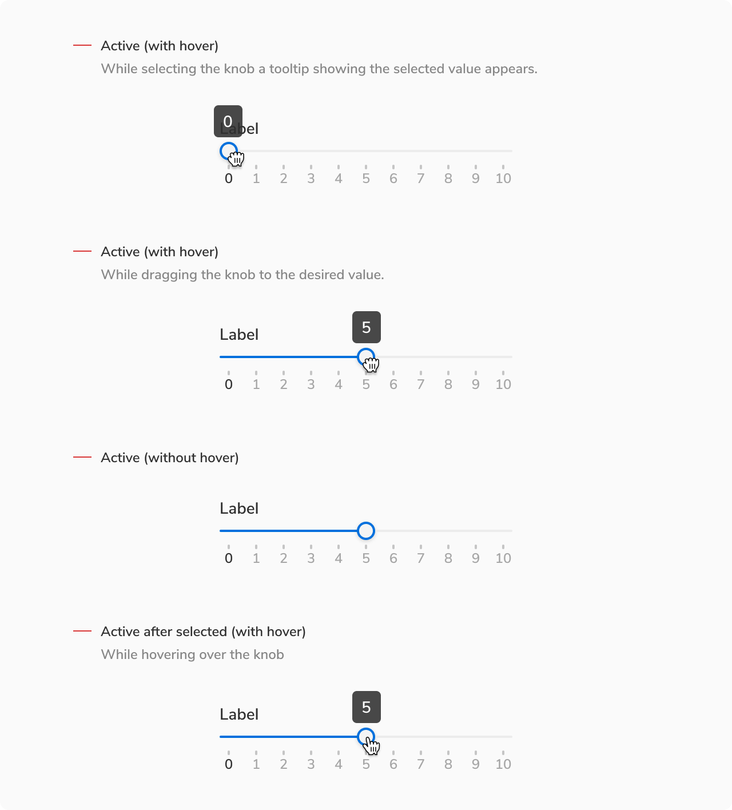

While navigating using left(←) or right(→) arrow keys, the knob will move by one unit towards the left or right.

### States

 

#### Initial Default

Initial value selected

 

#### Hover

 

 
 

#### Active

 

 
 

#### New default

When clicked outside

 
 
