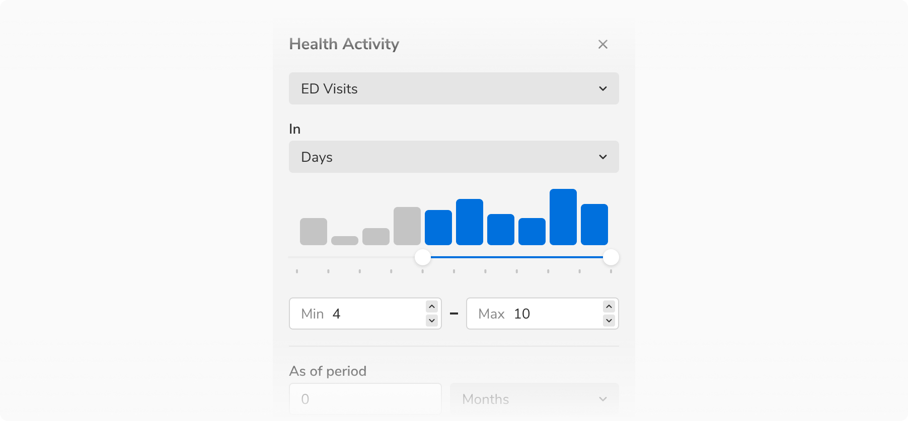

### Types

Based on usage, sliders are of two types -

#### Default slider

The default slider can be used whenever selection of a single value is required out of a range.

<Preview name='components-slider-variants-uncontrolled-slider--uncontrolled-slider'/>

#### Range slider

Range slider is used if the user wants to select a range instead of a single value.

<Preview name='components-rangeslider-variants-uncontrolled-slider--uncontrolled-slider'/>

### Variants

Based on selection, sliders have two variants -

#### Discrete slider

In the case of discrete slier, while dragging slider knob will snap from one tick mark to the other.
No values between two tick marks can be selected.

<Preview name='components-slider-variants-disctere-slider--disctere-slider'/>

#### Free slider

In the case of free slider, while dragging slider knob can move to each and every intermediate value possible. 
Values between tick marks can also be selected.

<Preview name='components-slider-variants-free-slider--free-slider'/>

### Structure
 
 

 

<table style="width: 100%">
 <tbody>
   <tr>
     <th style="width:50%; text-align: left;">Property</th>
     <th style="width:50%; text-align: left;">Value(s)</th>
   </tr>
   <tr style="vertical-align: top">
      <td>Size (knob)</td>
      <td>16x16 px</td>
   </tr>
 </tbody>
</table>
 

### Configurations
<table style="width: 100%">
  <tbody>
    <tr>
      <th style="width:33%; text-align: left;">Property</th>
      <th style="width:33%; text-align: left;">Value(s)</th>
      <th style="width:33%; text-align: left;">Default value</th>
    </tr>
    <tr style="vertical-align: top">
      <td>Label <em>(optional)</em></td>
      <td>&#60;label&#62;</td>
      <td>-</td>
    </tr>
    <tr style="vertical-align: top">
      <td>Ticks</td>
      <td>&#60;ticks&#62;</td>
      <td>-</td>
    </tr>
    <tr style="vertical-align: top">
      <td>Numbers <em>(optional)</em></td>
      <td>&#60;numbers&#62;</td>
      <td>-</td>
    </tr>
    <tr style="vertical-align: top">
      <td>Step size</td>
      <td>&#60;size&#62;</td>
      <td>1</td>
    </tr>
  </tbody>
</table>
 

### Usage

#### Pairing with metric inputs

Use slider with metric inputs for better accessibility in the case where **choosing a specific value** is important. 

<Caption> Slider paired with metrix inputs </Caption>

 
 