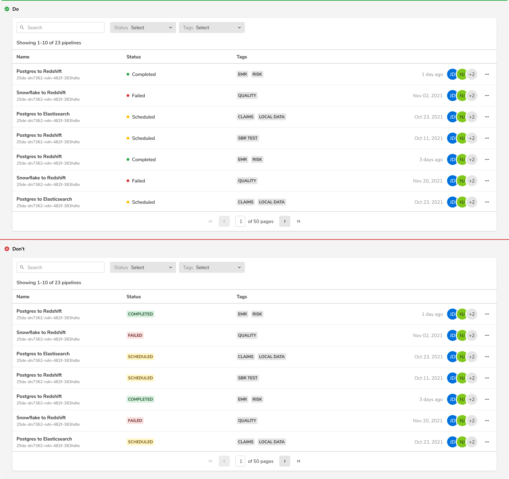

As the name suggests, Status Hints can be used to highlight the status of a resource in tables, lists, headers, etc.

### Appearance

Status hint comes in 5 Appearances -

#### Info

<Preview name='components-statushint-variants-info--info'/>

#### Warning 

<Preview name='components-statushint-variants-warning--warning'/>

#### Success

<Preview name='components-statushint-variants-success--success'/>

#### Alert

<Preview name='components-statushint-variants-alert--alert'/>

#### Default

<Preview name='components-statushint-variants-default-status-hint--default-status-hint'/>

### Structure
 
 

 

<table style="width: 100%">
 <tbody>
   <tr>
     <th style="width:50%; text-align: left;">Property</th>
     <th style="width:50%; text-align: left;">Value(s)</th>
   </tr>
   <tr style="vertical-align: top">
      <td>Spacing between Indicator and Label</td>
      <td>10 px</td>
   </tr>
   <tr style="vertical-align: top">
      <td>Size of indicator</td>
      <td>8x8 px</td>
   </tr>
 </tbody>
</table>
 

### Configurations
 
 

<table style="width: 100%">
  <tbody>
    <tr>
      <th style="width:33%; text-align: left;">Property</th>
      <th style="width:33%; text-align: left;">Value(s)</th>
      <th style="width:33%; text-align: left;">Default value</th>
    </tr>
    <tr style="vertical-align: top">
      <td>Appearance</td>
      <td>
        <ul>
            <li>Default</li>
            <li>Info</li>
            <li>Success</li>
            <li>Warning</li>
            <li>Alert</li>
        </ul>
      </td>
      <td>Default</td>
    </tr>
    <tr style="vertical-align: top">
      <td>Label</td>
      <td>&#60;label&#62;</td>
      <td>-</td>
    </tr>
  </tbody>
</table>
 

### Usage 

 

#### Status hint vs Badge

Status hint is used to display the status of a resource while a badge is used as a label to tag entities. 

<Caption> Status hint vs Badge </Caption>

 
 