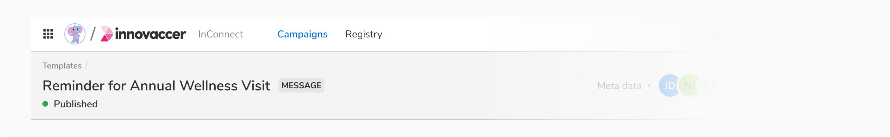

As the name suggests, Status Hints can be used to highlight the status of a resource in tables, lists, headers, etc.

### Appearance

Status hint comes in 5 Appearances -

#### Info

<Preview name='statushint-info'/>

#### Warning 

<Preview name='statushint-ongoing'/>

#### Success

<Preview name='statushint-success'/>

#### Alert

<Preview name='statushint-alert'/>

#### Default

<Preview name='statushint-default-status-hint'/>

### Properties

 

<Card shadow='none'>
  <Table
    showMenu={false}
    separator={true}
    data={[
      {
        Property: 'Label',
        Value: '<Label>',
        Configurable: '❌',
      },
      {
        Property: 'Color of status dot',
        Value: 'Color based on - Info, Warning, Success, Alert, Default',
        Configurable: '❌',
      },
    ]}
    schema={[
      {
        name: 'Property',
        displayName: 'Property',
        width: '33%',
        sorting: false,
        separator: true,
      },
      {
        name: 'Value',
        displayName: 'Value',
        width: '33%',
        sorting: false,
        separator: true
        
      },
      {
        name: 'Configurable',
        displayName: 'Configurable?',
        width: '33%',
        sorting: false,
        separator: true
      },
    ]}
    withHeader={false}
  />
</Card>
 
 

### Usage 

 

#### Status hint vs Badge

In page headers, badge is used as label while status hint is used to indicate the status of the particular entity. 

 
 