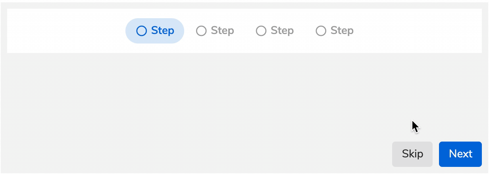
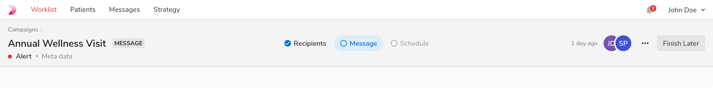
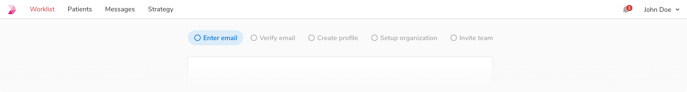
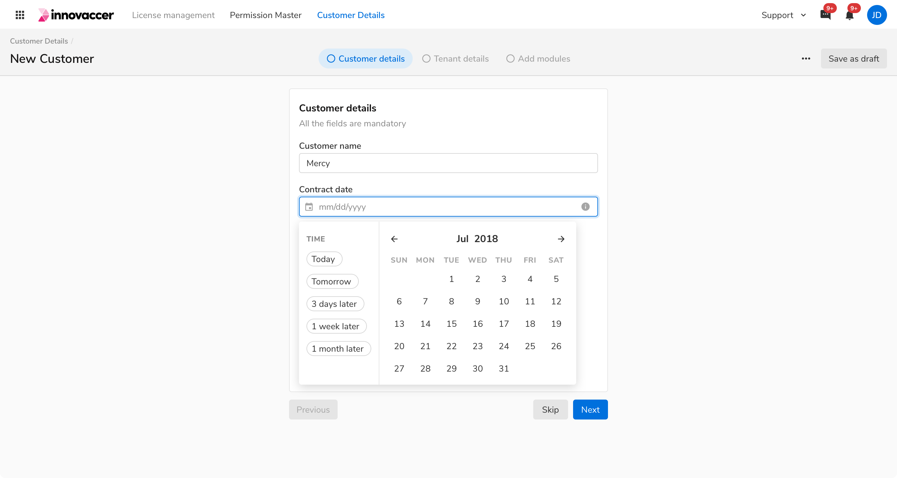
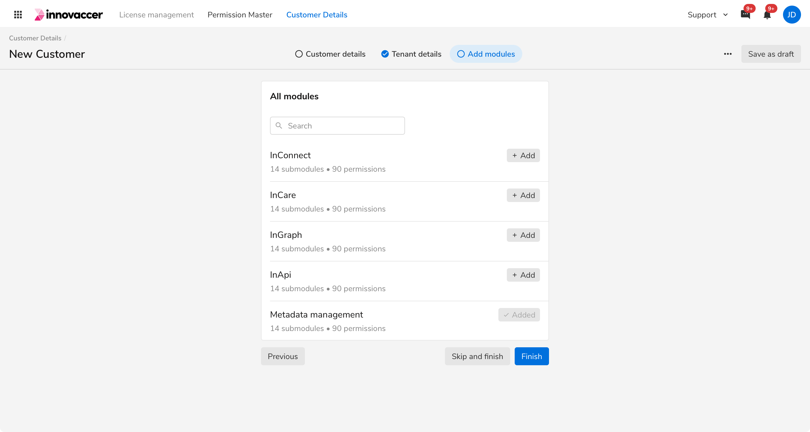

Steppers are used to help users keep track of their progress in a multi-step workflow. It is recommended to break down a long process into multiple steps using steppers to help users keep track of their progress while completing a task.

 

### Structure

The stepper can be used at different places to serve different purposes. The stepper component is a subset of the Horizontal Navigation component with its icons fixed.

<Preview name='stepper-all' />

### Properties

 

<Card shadow='none'>
  <Table
    showMenu={false}
    separator={true}
    data={[
      {
        Property: 'Height of a stepper item',
        Value: '32px',
        Configurable: '❌',
      },
      {
        Property: 'Corner radius of the active stepper item',
        Value: '16px',
        Configurable: '❌',
      },
      {
        Property: 'Margin for the item (top, right, bottom, left)',
        Value: '0px, 1px, 0px, 1px',
        Configurable: '❌',
      },
      {
        Property: 'Spacing between two stepper items',
        Value: '0px',
        Configurable: '❌',
      },
      {
        Property: 'Leading Icon',
        Value: 'Depending upon the state of a step, the icon can take any one of the following values: check_circle OR radio_button_unchecked',
        Configurable: '❌',
      },
      {
        Property: 'Label',
        Value: '<Label>',
        Configurable: '-',
      },
    ]}
    schema={[
      {
        name: 'Property',
        displayName: 'Property',
        width: '34%',
        sorting: false,
        separator: true,
        cellType: 'DEFAULT'
      },
      {
        name: 'Value',
        displayName: 'Value',
        width: '33%',
        sorting: false,
        separator: true
        
      },
      {
        name: 'Configurable',
        displayName: 'Configurable?',
        width: '33%',
        sorting: false,
        separator: true
      },
    ]}
    withHeader={false}
  />
</Card>
 
 

### Usage

 

#### Navigating through steps

Users cannot visit any upcoming steps however they can visit any previous steps given the step was done or skipped.

 
 
 

#### Placement

 

##### In Page Headers

Steppers are commonly used in page headers. Any action which is used collectively for the whole process e.g. Finish Later etc. should be accommodated in the header while the step related actions such as Next, Skip, etc. should be accommodated in the body.

 
 

##### Standalone

Steppers can also be used separately without the page header. The actions will be at the bottom of the layout. This variant is commonly used for onboarding.

 
 

#### Actions Placement

The actions specific to any step will be located at the bottom of the content of that step, while if there is any action that is for the whole process it will be accommodated in the page header itself. 

<Card shadow='none'>
  <Table
    showMenu={false}
    separator={true}
    data={[
      {
        Property: 'Step specific action',
        Value: 'Next, Cancel, Previous, or Skip',
        Configurable: 'in Body',
      },
      {
        Property: 'Collective action',
        Value: 'Finish later, Save as draft',
        Configurable: 'in Page Header',
      },
    ]}
    schema={[
      {
        name: 'Property',
        displayName: 'Action',
        width: '34%',
        sorting: false,
        separator: true,
        cellType: 'DEFAULT'
      },
      {
        name: 'Value',
        displayName: 'Examples',
        width: '33%',
        sorting: false,
        separator: true
        
      },
      {
        name: 'Configurable',
        displayName: 'Position',
        width: '33%',
        sorting: false,
        separator: true
      },
    ]}
    withHeader={false}
  />
</Card>
 

 
 

#### Skipping a step

A stepper can also have a skippable/optional step. Users can skip the step for the time being and can navigate back to it, to fill it again before completing the progress. 

In case of an optional step, an additional step-specific action "Skip" gets added on the left of the primary action. 

 
 

##### Skipping the last step

In case the last step is supposed to be optional, relabel the Skip button to **Skip** and **Finish**.

 
 

