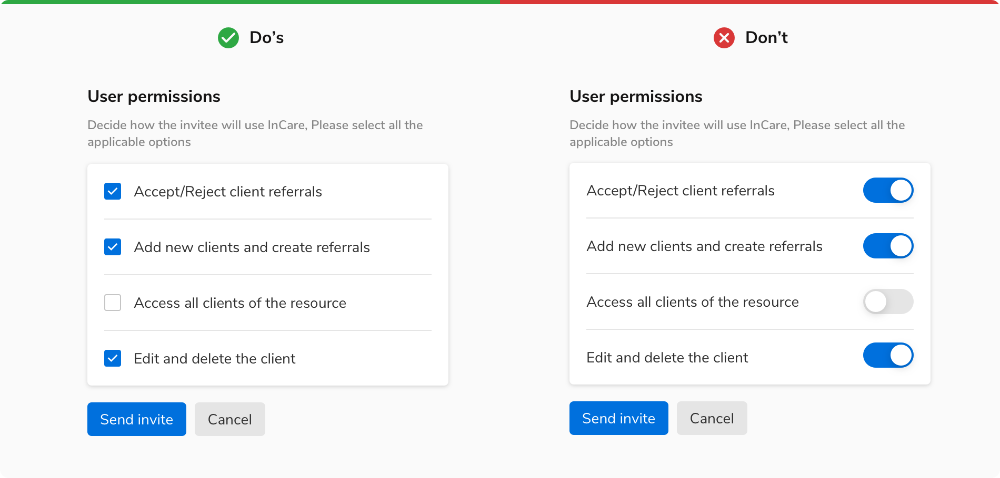

<Preview name='components-switch-default-switch--default-switch' />

### Sizes

Switch comes in **2 sizes** based on height and width - small and regular.
<Preview name='components-switch-variants-size--size' />

### Structure
 
 

 

<table style="width: 100%">
 <tbody>
   <tr>
     <th style="width:50%; text-align: left;">Property</th>
     <th style="width:50%; text-align: left;">Value(s)</th>
   </tr>
   <tr style="vertical-align: top">
     <td>Size</td>
     <td>
         <ul>
             <li>24x48 px <em>(Small)</em></li>
             <li>16x32 px <em>(Regular)</em></li>
         </ul>
     </td>
   </tr>
   <tr style="vertical-align: top">
     <td>Size of knob</td>
     <td>
         <ul>
             <li>12x12 px px <em>(Small)</em></li>
             <li>20x20 px <em>(Regular)</em></li>
         </ul>
     </td>
   </tr>
   <tr style="vertical-align: top">
     <td>Padding  <em>(top, right, bottom, left)</em></td>
     <td>2 px, 2px, 2 px, 2 px </td>
   </tr>
 </tbody>
</table>
 

### Configurations
<table style="width: 100%">
  <tbody>
    <tr>
      <th style="width:33%; text-align: left;">Property</th>
      <th style="width:33%; text-align: left;">Value(s)</th>
      <th style="width:33%; text-align: left;">Default value</th>
    </tr>
    <tr style="vertical-align: top">
      <td>Size</td>
      <td>
        <ul>
            <li>Regular</li>
            <li>Tiny</li>
        </ul>
      </td>
      <td>Regular</td>
    </tr>
  </tbody>
</table>
 

### Usage

 

#### Switch size

The size of the switch depends on the other components appearing around it. If other components are regular in size, then the regular variant of switch should be used. The same goes for the tiny variant.

<Caption> Switch size </Caption>

 

#### Switch vs Checkbox

 

<ul>
<li> Tapping a switch is a two-step action: selection and execution. </li>
<li> Whereas checkbox is just a selection of an option(s) and its execution requires another control, usually a button. </li>
</ul>

##### Instant response

The options that require an instant response are best selected using a switch.

<Caption> Instant response </Caption>

 

##### Multiple choices

Checkboxes are preferred over switches when multiple options are available and the user has to select one or more options from them. Clicking multiple switches one by one and waiting to see results after each click takes extra time.

<Caption> Multiple choices </Caption>

 

##### Confirmation

Checkboxes are preferred when an explicit action is required to confirm settings.

<Caption> Confirmation </Caption>

 
 
