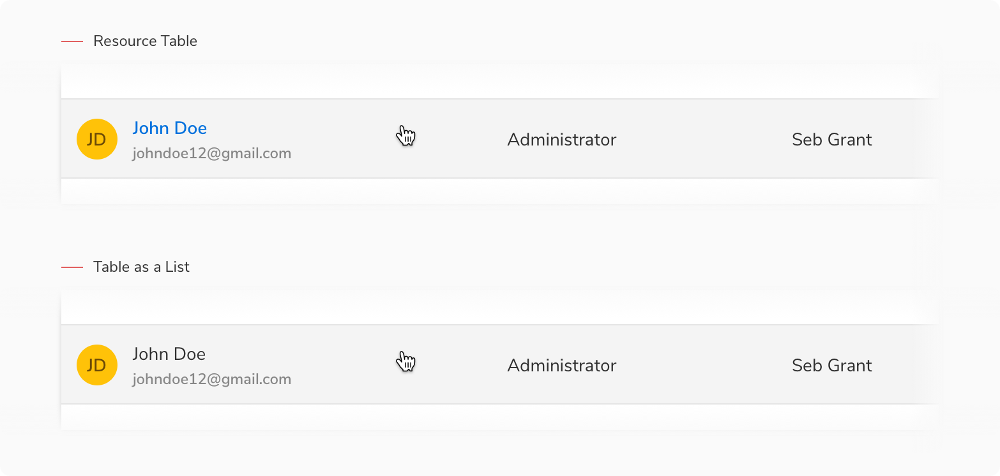
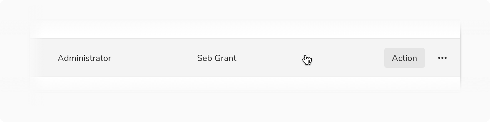
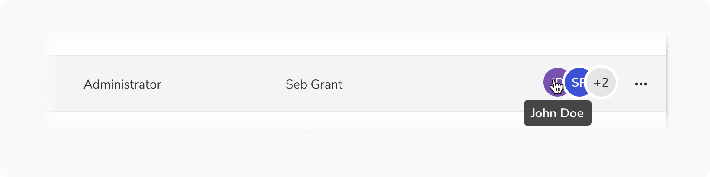
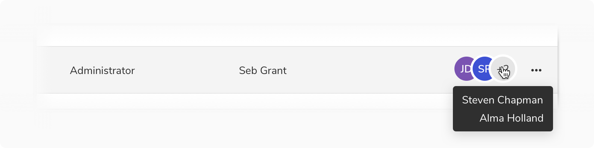
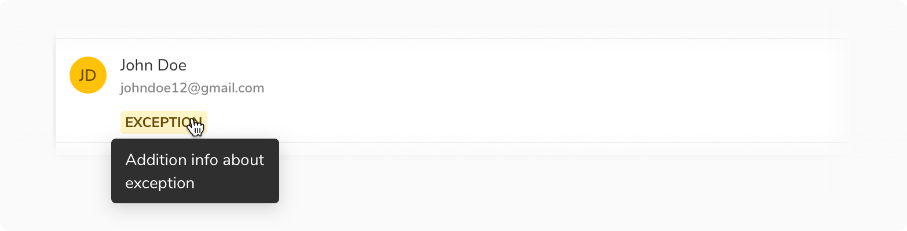
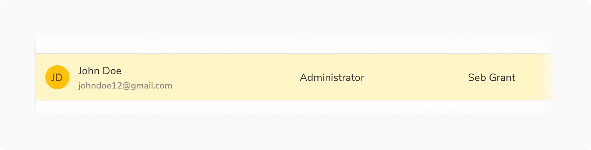
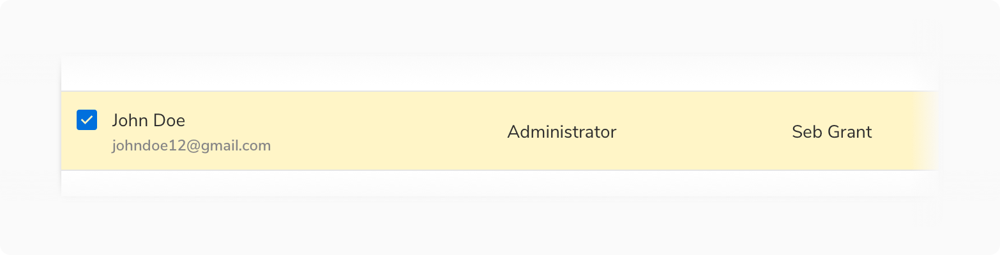
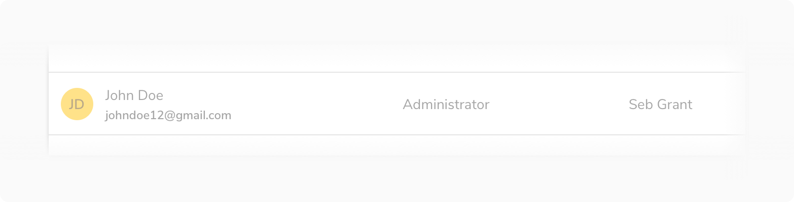

#### Hover

 

##### Resource vs Option

For Resource Table, since it opens the detail page of the item, on hover changes the text to Primary color along with the change in background.
While for the Options List, the text color remains the same.

 
Hover state doesn’t apply to a data table or a description list.

 
 

##### List item

There can be instances when you want to show a specific action on hover when the table is used as a list. In that case, a button can be shown at the end.

*Note: Never use the primary button for this type of use case.*

 

##### Author

The name of an author is shown using a tooltip. This is the default behavior of an Avatar and already taken care of in that component. 

 

##### Exception

A Popover is used to show additional information about an exception.

 
 

#### States

 

##### Active state

 

 

##### Selected state 

 

 

##### Focused state

 

 

##### Disabled state

Disable items individually except the action icon button. 
*Not yet available in components.*

 
 

