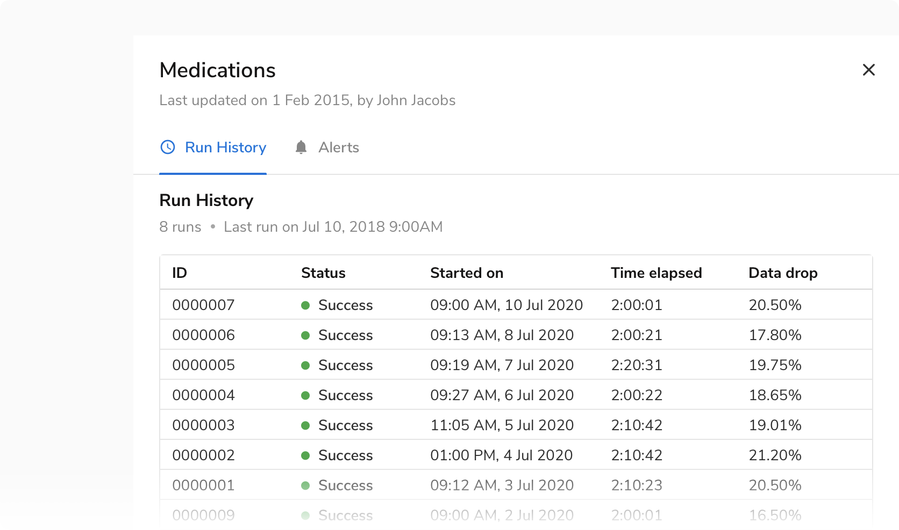
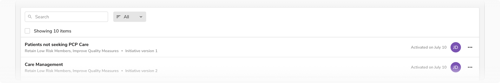

#### Types

 

##### Resource table

A table of resources where **a resource is an object in itself and has a detailed view linked to it.** 

Usually, there is only one resource table on a page. Think of a resource as - a campaign, a measure, a workspace, etc.

To reduce noise, a resource table doesn’t have column dividers.
<Preview name='resource-table' />

##### Data table

A data table is only meant for information consumption. It can occasionally contain minor actions such as copy, edit, remove, etc. Since the data can be dense, it can also have column dividers for subtle distinctions among columns. This way a data table also resembles spreadsheet-like tools which users are already familiar with.

If in some rare cases the data in a cell needs to be edited, it is recommended to use inline editable fields in those cases.

<Preview name='data-table' />

##### Table as a list

The table component can also be used to generate a list that has a simple structure than a table. A list is a subset of a table in a way that it does not contain the header row (and hence no columns). It comes in two options -

###### Option list

A list of options where an option is an entity that a user can select/pick.

<Preview name='table-as-option-list' />

###### Description list

A list of items containing simple information which is meant for consumption only.

It can occasionally contain minor actions such as copy, edit, remove, etc.

<Preview name='table-as-description-list' />

#### Sizes 

There are 3 types of sizes available for use which only differ in the vertical padding and header row height -

 

<Card shadow='none'>
  <Table
    showMenu={false}
    separator={true}
    data={[
      {
        type: 'Standard',
        header: '40px',
        bodyv: '12px',
        bodyh:'12px',
      },
      {
        type: 'Compressed',
        header: '32px',
        bodyv: '8px',
        bodyh:'12px',
      },
      {
        type: 'Tight',
        header: '32px',
        bodyv: '4px',
        bodyh:'12px',
      },
    ]}
    schema={[
      {
        name: 'type',
        displayName: 'Type',
        width: '20%',
        sorting: false,
        separator: true,
        cellType: 'DEFAULT'
      },
      {
        name: 'header',
        displayName: 'Header row height',
        width: '20%',
        sorting: false,
        separator: true
        
      },
      {
        name: 'bodyv',
        displayName: 'Body row padding (vertical)',
        width: '30%',
        sorting: false,
        separator: true
      },
      {
        name: 'bodyh',
        displayName: 'Body row padding (horizontal)',
        width: '30%',
        sorting: false,
        separator: true
      },
    ]}
    withHeader={false}
  />
</Card>
 
 

##### Standard table

 

<Preview name='standard-table' />

##### Compressed table

 

<Preview name='compressed-table' />

##### Tight table

This size is typically suited for information-dense data tables.

<Preview name='tight-table' />

 

#### Usage

 

##### Table background

###### Default Card

The table is typically laid out on the default card, which helps in differentiating it from the background gray color.

###### Flat card

There can be cases when the table has to be used on a side sheet or a full-screen modal where the background is white. In that case, flat card is used instead of the default card.

##### Nested table

###### With column extension

<Preview name='nested-rows' />

###### With nested card

<Preview name='nested-table-with-nested-cards' />

##### Table header

The position of the header is fixed at the top so that the rows scroll between the header and footer.

###### Resource and Data table

The headers for these tables have a ‘Showing x items’ label and optional ‘Search’ input, filtering options.

###### Table as a list

Checkbox precedes the 'Showing x items' label in the header row when using the table as a list since it doesn't have the column header row.
As there are no columns, hence there is no option to Sort. In that case, use the Search + Sort variant of the header where there is a dropdown for sorting following the search input.

##### Exception in a row

An exception may be added to a specific row such as a failure or a warning. In that case, use the **Subtle badge component** and resize the list to have **8px** padding from the bottom. 

This behavior is not available out of the box and hence a custom cell should be used to design and build this.

##### Custom cell

Standard table cells cover the most frequent use cases. For the other use cases, a custom cell can be created by using the **Emply Cell component**. Minimum padding of **12px** from either side of the empty cell is maintained.

##### Alignment in table cells

###### Center aligned

Content in table cells should be aligned to the center of the row in cases where the **height of content is similar** in cells across the same row. 

###### Top aligned

Content in table cells should be aligned to the top of the row in cases where the **height of content is different** in cells across the same row. 

##### Column actions

 

###### Show/Hide columns

This action appears in the extreme right just above the header row.

###### Sorting a column

Another way to offer column sorting is by clicking on the column name.

<Card shadow='none'>
  <Table
    showMenu={false}
    separator={true}
    data={[
      {
        click: 'On 2nd click',
        sort: 'sort descending',
      },
      {
        click: 'On 3rd click',
        sort: 'reset sorting',
      },
    ]}
    schema={[
      {
        name: 'click',
        displayName: 'On 1st click',
        width: '50%',
        sorting: false,
        separator: true,
        cellType: 'DEFAULT'
      },
      {
        name: 'sort',
        displayName: 'sort ascending',
        width: '50%',
        sorting: false,
        separator: true
      },
    ]}
    withHeader={false}
  />
</Card>
 
 
###### 
