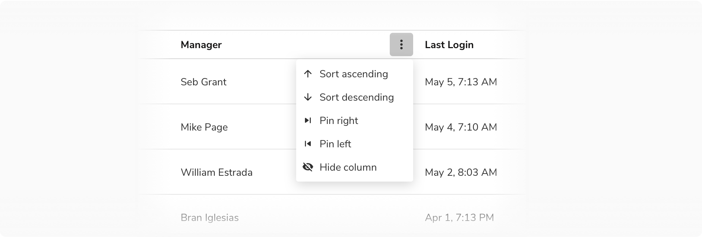

import table11 from './images/table-11.gif'

### Types
#### Resource Table

A table of resources where **a resource is an object in itself and has a detailed view linked to it.** 

Usually, there is only one resource table on a page. Think of a resource as - a campaign, a measure, a workspace, etc.

To reduce noise, a resource table doesn’t have column dividers.
<Preview name='components-table-types-resource-table--resource-table' />

#### Data Table
A data table is only meant for information consumption. It can occasionally contain minor actions such as copy, edit, remove, etc. Since the data can be dense, it can also have column dividers for subtle distinctions among columns. This way a data table also resembles spreadsheet-like tools which users are already familiar with.

If in some rare cases the data in a cell needs to be edited, it is recommended to use inline editable fields in those cases.

<Preview name='components-table-types-data-table--data-table' />

### Sizes
There are 3 types of sizes available for use which differ in the vertical padding and header row height -
 

<Card shadow='none'>
  <Table
    showMenu={false}
    separator={true}
    data={[
      {
        type: 'Standard',
        header: '40px',
        bodyv: '12px',
        bodyh:'12px',
      },
      {
        type: 'Compressed',
        header: '32px',
        bodyv: '8px',
        bodyh:'12px',
      },
      {
        type: 'Tight',
        header: '32px',
        bodyv: '4px',
        bodyh:'12px',
      },
    ]}
    schema={[
      {
        name: 'type',
        displayName: 'Type',
        width: '20%',
        sorting: false,
        separator: true,
        cellType: 'DEFAULT'
      },
      {
        name: 'header',
        displayName: 'Header row height',
        width: '20%',
        sorting: false,
        separator: true
        
      },
      {
        name: 'bodyv',
        displayName: 'Body row padding (vertical)',
        width: '30%',
        sorting: false,
        separator: true
      },
      {
        name: 'bodyh',
        displayName: 'Body row padding (horizontal)',
        width: '30%',
        sorting: false,
        separator: true
      },
    ]}
    withHeader={false}
  />
</Card>
 
 

#### Standard Table
<Preview name='components-table-sizes-standard-table--standard-table' />

#### Compressed Table
<Preview name='components-table-sizes-compressed-table--compressed-table' />

#### Tight Table
This size is typically suited for information-dense data tables
<Preview name='components-table-sizes-tight-table--tight-table' />

 

### States

The rows in the Resource Table can have various states, including hover, focus, active, activated, disabled, selected, selected-hover, selected-activated, and selected-disabled.

**Note:** Since the Data Table is designed to display data rather than facilitate interaction, it does not have any interactive states.

<Caption>States of Resource Table</Caption>

<ul>
  <li>**Activated State:** When the view associated with the row is currently displayed.</li>
  <li>**Selected State:** When the row is selected</li>
  <li>**Selected - Activated State:** When the view associated to a selected row is currently displayed.</li>
</ul>

For more information, please refer to the [states](https://design.innovaccer.com/foundations/states/) page.

### Usage
#### Table Background
##### Default Card
The table is typically laid out on the default card, which helps in differentiating it from the background gray color.

<Caption>Table on a default card</Caption>
 

##### Flat Card
There can be cases when the table has to be used on a side sheet or a full-screen modal where the background is white. In that case, flat card should be used instead of the default card.

<Caption>Flat card should be used in case of table on a white background</Caption>
 

#### Nested Table
##### With Column Extension
<Preview name='components-table-nesting-with-nested-rows--with-nested-rows' />

##### With Nested Card
<Preview name='components-table-nesting-with-nested-cards--with-nested-cards' />

#### Table Header
The position of the header is fixed at the top so that the rows scroll between the header and footer.

##### Resource and Data Table
The headers for these tables have a ‘Showing x items’ label and optional ‘Search’ input, filtering options.

<Caption>Table header in resource and data table</Caption>
 

##### Table as a List
Checkbox precedes the 'Showing x items' label in the header row when using the table as a list since it doesn't have the column header row.
As there are no columns, hence there is no option to Sort. In that case, use the Search + Sort variant of the header where there is a dropdown for sorting following the search input.

<Caption>Table header in table as a list</Caption>
 

#### Disabled Row in a Table
To indicate a row is not interactive, the opacity of the row should be reduced to 40%.

> Disabled state is kept at 40% opacity since it is closest to the disabled state of other components.

 

<Caption> Disabled row in a table</Caption>

 

#### Opening Child View Using Table Row

Table rows can open an associated view either by default or when clicked. The row item will appear in activated state to show that its associated view is currently open.

**Note:** A row can be both selected and in an activated state simultaneously.

<Caption>Clicking on table row opens up a child view</Caption>

 

#### Exception in a Row
An exception may be added to a specific row such as a failure or a warning. In that case, use the **Subtle badge component** and resize the list to have **8px** padding from the bottom. 

This behavior is not available out of the box and hence a custom cell should be used to design and build this.

<Caption>Showing exception in a row using the badge component</Caption>
 

#### Custom Cell
Standard table cells cover the most frequent use cases. For the other use cases, a custom cell can be created by using the **Emply Cell component**. Minimum padding of **12px** from either side of the empty cell is maintained.

<Caption>Custom cell in the table</Caption>
 

#### Alignment in Table Cells
##### Center Aligned
Table cell content should be center-aligned when the content is short and uniform or when all cells in the row have similar heights.

<Caption>Content aligned centrally in a row</Caption>
 

##### Top Aligned
Table cell content should be top-aligned when cells in the same row have varying content heights or when a cell includes multiple lines of text or a combination of text and visuals.

<Caption>Content aligned to the top in a row</Caption>
 

#### Column Actions
##### Show/Hide Columns
This action appears in the extreme right just above the header row.

<Caption>Show/hide and reorder options for columns</Caption>
 

##### Sorting a Column

<Caption>Sorting and pinning options column</Caption>
 

Another way to offer column sorting is by clicking on the column name.

<Card shadow='none'>
  <Table
    showMenu={false}
    separator={true}
    data={[
      {
        click: 'On 1st click',
        sort: 'sort ascending',
      },
      {
        click: 'On 2nd click',
        sort: 'sort descending',
      },
      {
        click: 'On 3rd click',
        sort: 'reset sorting',
      },
    ]}
    schema={[
      {
        name: 'click',
        displayName: 'Number of clicks',
        width: '50%',
        sorting: false,
        separator: true,
        cellType: 'DEFAULT'
      },
      {
        name: 'sort',
        displayName: 'Sorting behaviour',
        width: '50%',
        sorting: false,
        separator: true
      },
    ]}
    withHeader={false}
  />
</Card>
 
 

 
 

##### Filtering a Column
Although filters in a table are applied using dropdowns, there is a provision to apply filters in a specific column.

<Caption>Filtering a column</Caption>
 

##### Reordering a Column
The cursor changes to Pointing Hand when hovering on a header cell indicating that the column can be picked and moved.

<Caption>Reordering a column</Caption>
 

#### Pinned Column(s)
**Pinned column divider** is used to pin columns to the left so that they get fixed and do not scroll along with the rest of the columns. It is quite handy when the no. of columns is too many and all of them are not visible without scrolling. In that case, the pinning can help freeze the crucial columns in order to maintain the context.
<Preview name='components-table-pinned-columns--pinned-columns' />

#### Selection

##### Default Selection

**No items selected**

<Caption>When no item is selected</Caption>

**A few items selected**

When a row is selected, the number of selected items is shown in the header.
The selection is **preserved** in case of - pagination, filters and search.

<Caption>When a few items are selected</Caption>

**All items selected**

An option to select all the items across all pages is presented in the header.

<Caption>When all items are selected</Caption>

**Clear selection**

An option to clear selection is presented in the header.

<Caption>Clear Selection</Caption>

#### Scrolling
Table header remains fixed when scrolling so as to maintain the connection of the values in the cells with the column headers which helps easy understanding of data.

<Caption>Table header should remain fixed while scrolling</Caption>
 

#### Pagination vs. Infinite Scroll
Use pagination over infinite scroll so that the user can navigate to an item’s detail page and return back to the same page. Retaining the scroll position in a long list of items can be resource-intensive and hence infinite scroll is avoided and Pagination is used.

#### Filtering

To read all about table filters visit [Table Filters](https://design.innovaccer.com/patterns/tableFilters/usage/)

 

#### Data Alignment

<Caption>Data alignment in tables</Caption>

##### Textual Data
Textual data is easier to read when aligned to the **left**.

**Note:** For cases where the content can span across multiple lines( description, subtitle, etc.), align the content at the top for better readability.
 

##### Numerical Data
**Right align**  
Numerical data indicating size or quantity of an entity (such as count, score, percent, etc) is easier to read and compare when aligned to the **right**.

**Note:** In case of decimal numbers, use the same number of decimal places( append/ remove trailing zeros after decimal place if needed) and align on the decimal point.
 

**Left align** 
Numerical data indicating non-quantitative data (such as zip-code, id, version number, etc) should align to the **left**.
 

#### Selection With Search/Filters

##### No Selection Before Search/Filters

In case of no previous selection, the “Showing x items” displays the number of the search or filter results. 

<Caption>When no item is selected before applying filters</Caption>

 
 

##### A Few Items Selected Before Search/Filters

In this case, the previous selection is preserved and ‘Selected n items’ persists, while “Select x items” button updates to show the number of search or filter results. 

<Caption>When a few items item are selected before applying filters</Caption>

 
 

##### A Few Items Selected After Search/Filters

When a row is selected, “Selected n items” is updated to display the number of selected items.

<Caption>When a few items are selected with applied filters</Caption>

 
 

##### All Items Selected After Search/Filters

When all the search and filter results are selected, the “Select x items” button is disabled until the selection is modified. 

**Note:** The “Select x items” displays the count of search or filter results, hence clicking that will only select the search or filter results. 

<Caption>When all items are selected with applied filters</Caption>

 
 

#### Bulk Actions In Table

##### Global Bulk Actions

Global bulk actions are used to perform actions on all the items of a table at once, they are a permanent part of the interface and aligned with the search input and filters. It is recommended to use **basic button** and **icon button** to display global bulk actions in a table. 

**Note:** In case of filtering in table, global bulk actions only impact the result that matches the applied filters. 

<Caption>Global bulk actions in table</Caption>

 
 

##### Selection Bulk Actions

Selection bulk actions allow users to perform the same operation on multiple selected items at once. They appear right next to the selection options with a divider in between separating the two. It is recommended to use **basic button** and **basic icon button** to display selection bulk actions in a table.

<Caption>Selection bulk actions in table</Caption>

 
 

#### Primary Button As A Bulk Action

It is recommended to use primary button as a bulk action only when it serves as the primary action on the page.

<Caption>Primary button as a bulk action</Caption>

 
 

#### Bulk Actions In Case of A Space Constraint

It is recommended to use **basic icon buttons** or **menu** for showing bulk actions in case of a space constraint. 

<Caption>Bulk actions in case of a space constraint</Caption>

 
 

#### Bulk Actions In Table vs Actions In Page Header

Bulk actions in table are used to bring changes to the table and actions in page header are used for prominent page actions like creating a new entity, etc . 

<Caption>Bulk actions in table vs Actions in page header</Caption>

 

#### Highlight in Table Search

Table search can highlight relevant information for better visibility and focus.

<Caption>Highlight in Search</Caption>

 

#### Infinite Scrolling

Infinite scrolling in tables dynamically loads rows as the user scrolls, improving performance and user experience for large datasets by removing the need for pagination.

**Note:** Always display the count of loaded rows versus total rows to help users track their current position in the dataset.

##### When to use?

Infinite scroll is ideal when:

<ul>
  <li>Users require a seamless experience.</li>
  <li>The primary goal is exploration.</li>
  <li>The dataset is very large.</li>
  <li>Returning to specific information is not essential.</li>
  <li>Users need to compare items in an extended list.</li>
</ul>

<Caption>Infinite scroll in tables</Caption>

#### Pagination

Pagination in tables divides large datasets into smaller chunks across multiple pages, letting users manually navigate through a specific number of rows at a time instead of displaying all rows at once. 

##### When to use?

Pagination is ideal when:
<ul>
  <li>Users are searching for a specific item or row.</li>
  <li>Returning to previously viewed data is important.</li>
</ul>

<Caption>Pagination in tables</Caption>
