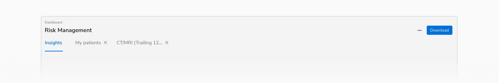
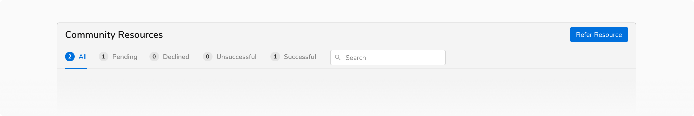
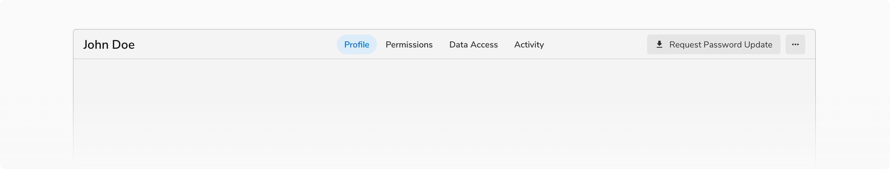
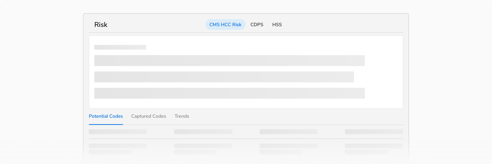
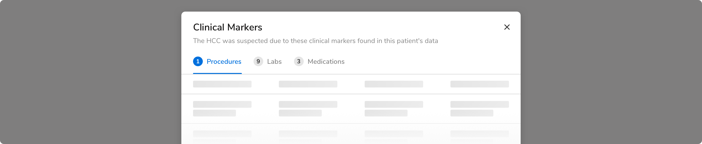
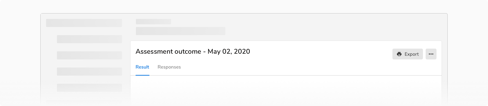

### Variants

 

#### Basic tabs

This variation consists of only a label. 

<Preview name='basic-tabs'/>

#### Tabs with Count

This variation uses the Pill component to display the count along with the label.

<Preview name='tabs-tabs-with-count'/>

#### Tabs with Icon

This variant consists of an icon along with the label. Icons should only be used when they add additional value to the label. 

For example, with the help of icons, one can easily see the status without actually navigating to each and every tab.

<Preview name='tabs-tabs-with-icon'/>

#### Dismissible Tabs

This variant consists of a Close Icon Button along with the label. It supports the dismissal of the tabs. These tabs can be triggered through an action button. In case the tab is already open on the screen, the action to re-open the tab should be known to the user.

 
 

### Properties

 

<Card shadow='none'>
  <Table
    showMenu={false}
    separator={true}
    data={[
      {
        Property: 'Minimum width of a tab item',
        Value: '64px',
        Configurable: '❌',
      },
      {
        Property: 'Height',
        Value: '48px',
        Configurable: '❌',
      },
      {
        Property: 'Maximum no. of tabs',
        Value: '5',
        Configurable: '❌',
      },
      {
        Property: 'Additional options',
        Value: 'One of these- Leading pill Leading icon Trailing close icon button',
        Configurable: 'Optional',
      },
      {
        Property: 'Label',
        Value: '<Label>',
        Configurable: '-',
      },
      {
        Property: 'Horizontal spacing between tabs',
        Value: '0px',
        Configurable: '❌',
      },
    ]}
    schema={[
      {
        name: 'Property',
        displayName: 'Property',
        width: '34%',
        sorting: false,
        separator: true,
        cellType: 'DEFAULT'
      },
      {
        name: 'Value',
        displayName: 'Value',
        width: '33%',
        sorting: false,
        separator: true
        
      },
      {
        name: 'Configurable',
        displayName: 'Configurable?',
        width: '33%',
        sorting: false,
        separator: true
      },
    ]}
    withHeader={false}
  />
</Card>
 
 

### Usage

 

#### Tabs vs Navigation

Tabs have similar kind of content and act as filters. Don’t use tabs to group content that is dissimilar.

 

On the other hand, navigation menu items are generally used to group independent pages.

 

If **navigation items and tabs** are used on the same page make sure to use them in such a way that while switching between multiple tabs, the user stays on the same page and sees relative data whereas while switching between multiple navigation items, the user is taken to a new page which may or may not be relative.

 

#### Tabs within other components

Tabs are usually paired with components like headers or nested in components like cards, modals, and sidesheets.

 

 

 

#### Tab Label

Tabs should have short and scannable labels, generally limited to a single word. 

#### Maximum Tabs

Too many tabs can unnecessarily clutter the UI. Hence it is recommended **not to use more than 5 tabs** at once.

