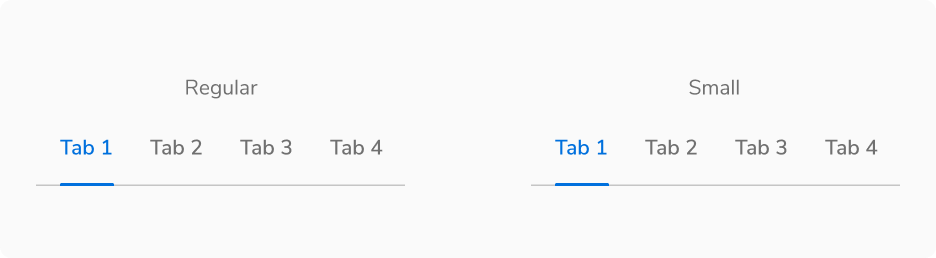
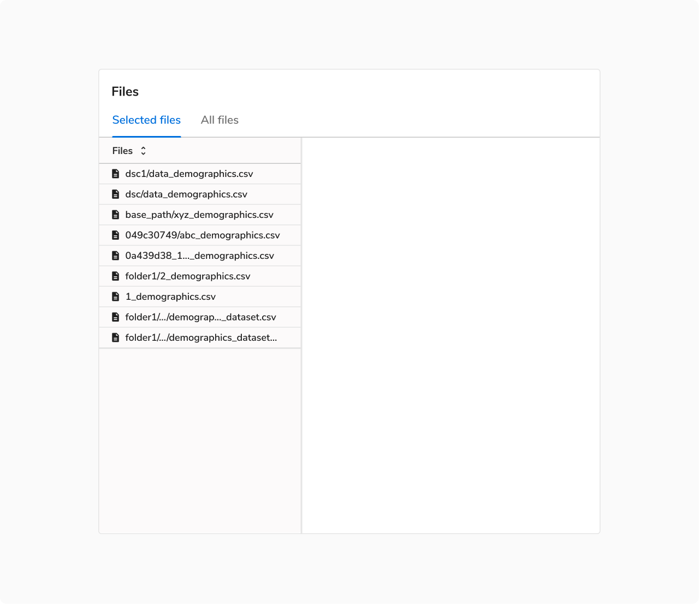

Tabs segregate similar kind of content and allow users to navigate between them without switching the context.

<Preview name="components-tabs-all--all" />

### Variants

#### Basic Tabs

This variation consists of only a label.

<Preview name="components-tabs-basic-tabs--basic-tabs" />

#### Tabs With Count

This variation uses the Pill component to display the count along with the label.

<Preview name="components-tabs-tabs-with-count--tabs-with-count" />

#### Tabs With Icon

This variant consists of an icon along with the label. Icons should only be used when they add additional value to the label.
For example, with the help of icons, one can easily see the status without actually navigating to each and every tab.

<Preview name="components-tabs-tabs-with-icon--tabs-with-icon" />

#### Dismissible Tabs

This variant consists of a Close Icon Button along with the label. It supports the dismissal of the tabs. These tabs can be triggered through an action button. In case the tab is already open on the screen, the action to re-open the tab should be known to the user.

<Caption>Dismissible tabs</Caption>
 

### Sizes

Tabs come in **2 sizes** - regular and small.

<Caption>Regular vs Small Tabs</Caption>
 

### Structure

 
 

#### Basic Tabs

 

##### Regular

 

<Caption>Structure of Regular Tab</Caption>

 

<table style={{ width: '100%' }}>
  <tbody>
    <tr>
      <th style={{ width: '50%', textAlign: 'left' }}>Property</th>
      <th style={{ width: '50%', textAlign: 'left' }}>Value(s)</th>
    </tr>
    <tr style={{ verticalAlign: 'top' }}>
      <td>Height (of active indicator)</td>
      <td>2 px</td>
    </tr>
    <tr style={{ verticalAlign: 'top' }}>
      <td>Padding (top, right, bottom, left)</td>
      <td>12 px, 12 px, 16 px, 12 px</td>
    </tr>
    <tr style={{ verticalAlign: 'top' }}>
      <td>Spacing between tabs</td>
      <td>0 px</td>
    </tr>
    <tr style={{ verticalAlign: 'top' }}>
      <td>Minimum width (of a tab item)</td>
      <td>64 px</td>
    </tr>
  </tbody>
</table>
 

##### Small

<Caption>Structure of Small Tab</Caption>

 

<table style={{ width: '100%' }}>
  <tbody>
    <tr>
      <th style={{ width: '50%', textAlign: 'left' }}>Property</th>
      <th style={{ width: '50%', textAlign: 'left' }}>Value(s)</th>
    </tr>
    <tr style={{ verticalAlign: 'top' }}>
      <td>Height (of active indicator)</td>
      <td>2 px</td>
    </tr>
    <tr style={{ verticalAlign: 'top' }}>
      <td>Padding (top, right, bottom, left)</td>
      <td>8 px, 12 px, 12 px, 12 px</td>
    </tr>
    <tr style={{ verticalAlign: 'top' }}>
      <td>Spacing between tabs</td>
      <td>0 px</td>
    </tr>
    <tr style={{ verticalAlign: 'top' }}>
      <td>Minimum width (of a tab item)</td>
      <td>64 px</td>
    </tr>
  </tbody>
</table>
 

#### Tabs With Count

##### Regular

 

<table style={{ width: '100%' }}>
  <tbody>
    <tr>
      <th style={{ width: '50%', textAlign: 'left' }}>Property</th>
      <th style={{ width: '50%', textAlign: 'left' }}>Value(s)</th>
    </tr>
    <tr style={{ verticalAlign: 'top' }}>
      <td>Padding (top, right, bottom, left)</td>
      <td>12 px, 12 px, 16 px, 12 px</td>
    </tr>
    <tr style={{ verticalAlign: 'top' }}>
      <td>Spacing between pill and label</td>
      <td>8 px</td>
    </tr>
    <tr style={{ verticalAlign: 'top' }}>
      <td>Spacing between tabs</td>
      <td>0 px</td>
    </tr>
    <tr style={{ verticalAlign: 'top' }}>
      <td>Minimum width (of a tab item)</td>
      <td>64 px</td>
    </tr>
  </tbody>
</table>
 

##### Small

 

<table style={{ width: '100%' }}>
  <tbody>
    <tr>
      <th style={{ width: '50%', textAlign: 'left' }}>Property</th>
      <th style={{ width: '50%', textAlign: 'left' }}>Value(s)</th>
    </tr>
    <tr style={{ verticalAlign: 'top' }}>
      <td>Padding (top, right, bottom, left)</td>
      <td>8 px, 12 px, 12 px, 12 px</td>
    </tr>
    <tr style={{ verticalAlign: 'top' }}>
      <td>Spacing between pill and label</td>
      <td>8 px</td>
    </tr>
    <tr style={{ verticalAlign: 'top' }}>
      <td>Spacing between tabs</td>
      <td>0 px</td>
    </tr>
    <tr style={{ verticalAlign: 'top' }}>
      <td>Minimum width (of a tab item)</td>
      <td>64 px</td>
    </tr>
  </tbody>
</table>
 

#### Tabs With Icon

##### Regular

 

<table style={{ width: '100%' }}>
  <tbody>
    <tr>
      <th style={{ width: '50%', textAlign: 'left' }}>Property</th>
      <th style={{ width: '50%', textAlign: 'left' }}>Value(s)</th>
    </tr>
    <tr style={{ verticalAlign: 'top' }}>
      <td>Padding (top, right, bottom, left)</td>
      <td>12 px, 12 px, 16 px, 12 px</td>
    </tr>
    <tr style={{ verticalAlign: 'top' }}>
      <td>Size of icon</td>
      <td>16x16 px</td>
    </tr>
    <tr style={{ verticalAlign: 'top' }}>
      <td>Spacing between icon and label</td>
      <td>8 px</td>
    </tr>
    <tr style={{ verticalAlign: 'top' }}>
      <td>Spacing between tabs</td>
      <td>0 px</td>
    </tr>
    <tr style={{ verticalAlign: 'top' }}>
      <td>Minimum width (of a tab item)</td>
      <td>64 px</td>
    </tr>
  </tbody>
</table>
 

##### Small

 

<table style={{ width: '100%' }}>
  <tbody>
    <tr>
      <th style={{ width: '50%', textAlign: 'left' }}>Property</th>
      <th style={{ width: '50%', textAlign: 'left' }}>Value(s)</th>
    </tr>
    <tr style={{ verticalAlign: 'top' }}>
      <td>Padding (top, right, bottom, left)</td>
      <td>8 px, 12 px, 12 px, 12 px</td>
    </tr>
    <tr style={{ verticalAlign: 'top' }}>
      <td>Size of icon</td>
      <td>16x16 px</td>
    </tr>
    <tr style={{ verticalAlign: 'top' }}>
      <td>Spacing between tabs</td>
      <td>0 px</td>
    </tr>
    <tr style={{ verticalAlign: 'top' }}>
      <td>Minimum width (of a tab item)</td>
      <td>64 px</td>
    </tr>
  </tbody>
</table>
 

#### Dismissible Tabs

##### Regular

 

<table style={{ width: '100%' }}>
  <tbody>
    <tr>
      <th style={{ width: '50%', textAlign: 'left' }}>Property</th>
      <th style={{ width: '50%', textAlign: 'left' }}>Value(s)</th>
    </tr>
    <tr style={{ verticalAlign: 'top' }}>
      <td>Padding (top, right, bottom, left)</td>
      <td>12 px, 12 px, 16 px, 0 px</td>
    </tr>
    <tr style={{ verticalAlign: 'top' }}>
      <td>Size of drag indicator</td>
      <td>16x16 px</td>
    </tr>
    <tr style={{ verticalAlign: 'top' }}>
      <td>Size of close button</td>
      <td>20x20 px</td>
    </tr>
    <tr style={{ verticalAlign: 'top' }}>
      <td>Spacing between drag indicator and label</td>
      <td>2 px</td>
    </tr>
    <tr style={{ verticalAlign: 'top' }}>
      <td>Spacing between label and close button</td>
      <td>2 px</td>
    </tr>
    <tr style={{ verticalAlign: 'top' }}>
      <td>Spacing between tabs</td>
      <td>0 px</td>
    </tr>
    <tr style={{ verticalAlign: 'top' }}>
      <td>Minimum width (of a tab item)</td>
      <td>64 px</td>
    </tr>
  </tbody>
</table>
 

##### Small

 

<table style={{ width: '100%' }}>
  <tbody>
    <tr>
      <th style={{ width: '50%', textAlign: 'left' }}>Property</th>
      <th style={{ width: '50%', textAlign: 'left' }}>Value(s)</th>
    </tr>
    <tr style={{ verticalAlign: 'top' }}>
      <td>Padding (top, right, bottom, left)</td>
      <td>8 px, 12 px, 12 px, 0 px</td>
    </tr>
    <tr style={{ verticalAlign: 'top' }}>
      <td>Size of drag indicator</td>
      <td>16x16 px</td>
    </tr>
    <tr style={{ verticalAlign: 'top' }}>
      <td>Size of close button</td>
      <td>20x20 px</td>
    </tr>
    <tr style={{ verticalAlign: 'top' }}>
      <td>Spacing between drag indicator and label</td>
      <td>2 px</td>
    </tr>
    <tr style={{ verticalAlign: 'top' }}>
      <td>Spacing between label and close button</td>
      <td>2 px</td>
    </tr>
    <tr style={{ verticalAlign: 'top' }}>
      <td>Spacing between tabs</td>
      <td>0 px</td>
    </tr>
    <tr style={{ verticalAlign: 'top' }}>
      <td>Minimum width (of a tab item)</td>
      <td>64 px</td>
    </tr>
  </tbody>
</table>
 

### Configurations

<table style={{ width: '100%' }}>
  <tbody>
    <tr>
      <th style={{ width: '33%', textAlign: 'left' }}>Property</th>
      <th style={{ width: '33%', textAlign: 'left' }}>Value(s)</th>
      <th style={{ width: '33%', textAlign: 'left' }}>Default value</th>
    </tr>
    <tr style={{ verticalAlign: 'top' }}>
      <td>Size</td>
      <td>
        <ul>
          <li>Regular</li>
          <li>Small</li>
        </ul>
      </td>
      <td>Regular</td>
    </tr>
    <tr style={{ verticalAlign: 'top' }}>
      <td>Label</td>
      <td>&#60;label&#62;</td>
      <td>-</td>
    </tr>
    <tr style={{ verticalAlign: 'top' }}>
      <td>
        Add-on  
        <em>(optional)</em>
      </td>
      <td>
        <ul>
          <li>Leading pill</li>
          <li>Leading icon</li>
        </ul>
      </td>
      <td>-</td>
    </tr>
    <tr style={{ verticalAlign: 'top' }}>
      <td>Dismissible tab</td>
      <td>
        <ul>
          <li>True</li>
          <li>False</li>
        </ul>
      </td>
      <td>False</td>
    </tr>
  </tbody>
</table>
 

### Usage

 

#### Tabs vs Navigation

Tabs have similar kind of content and act as filters. Don’t use tabs to group content that is dissimilar.

<Caption>Tabs have similar kind of content and act as filters</Caption>
 

On the other hand, navigation menu items are generally used to group independent pages.

<Caption>Navigation represents independent pages</Caption>
 

If **navigation items and tabs** are used on the same page make sure to use them in such a way that while switching between multiple tabs, the user stays on the same page and sees relative data whereas while switching between multiple navigation items, the user is taken to a new page which may or may not be relative.

<Caption>Tabs and navigation on the same page</Caption>
 

#### Tabs Within Other Components

Tabs are usually paired with components like headers or nested in components like cards, modals, and sidesheets.

<Caption>Tabs in a page header</Caption>
 

<Caption>Tabs in a modal</Caption>
 

<Caption>Tabs in a card</Caption>
 

#### Maximum Width of a Tab

Tabs should have short, scannable labels, typically a single word. If labels are too long, the tabs will be truncated after a maximum width of 256px.

<Caption>Maximum width of a tab, i.e. 256px</Caption>

#### Maximum Tabs

Too many tabs can unnecessarily clutter the UI. Hence it is recommended **not to use more than 5 tabs** at once.

#### When to Use Small Tabs

It is recommended to use small tabs in case of a space constraint or high data density.

<Caption>When to use small tabs</Caption>

#### Opening Behavior of Dismissible Tabs

Dismissible tabs are opened as the right-most tab in a tab group. They stack up towards the right in the order they are opened.

<Caption>Dismissible tabs are opened as the right-most tab in a tab group</Caption>
 

#### Closing Behavior of Dismissible Tabs

All tabs can be dismissible if they are used inside a container like card, modal, sidesheet, etc. Closing the last tab will close the container.

Though in most of the cases, the dismissible tabs are opened from basic tabs and hence there is no need for closing the container in those cases.
