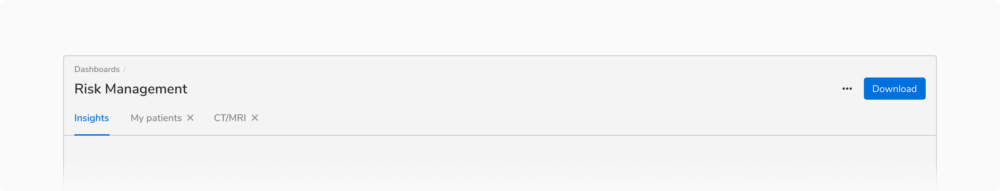

### Variants
#### Basic tabs
This variation consists of only a label. 
<Preview name='components-tabs-basic-tabs--basic-tabs'/>

#### Tabs with Count
This variation uses the Pill component to display the count along with the label.
<Preview name='components-tabs-tabs-with-count--tabs-with-count'/>

#### Tabs with Icon
This variant consists of an icon along with the label. Icons should only be used when they add additional value to the label.
For example, with the help of icons, one can easily see the status without actually navigating to each and every tab.
<Preview name='components-tabs-tabs-with-icon--tabs-with-icon'/>

#### Dismissible Tabs
This variant consists of a Close Icon Button along with the label. It supports the dismissal of the tabs. These tabs can be triggered through an action button. In case the tab is already open on the screen, the action to re-open the tab should be known to the user.

<Caption>Dismissible tabs</Caption>
 

### Structure
 
 

 

<table style="width: 100%">
 <tbody>
   <tr>
     <th style="width:50%; text-align: left;">Property</th>
     <th style="width:50%; text-align: left;">Value(s)</th>
   </tr>
   <tr style="vertical-align: top">
     <td>Height (of active indicator)</td>
     <td>2 px</td>
   </tr>
   <tr style="vertical-align: top">
     <td>Padding (top, right, bottom, left)</td>
     <td>12 px, 12 px, 16 px, 12 px</td>
   </tr>
   <tr style="vertical-align: top">
     <td>Spacing between tabs</td>
      <td>0 px</td>
   </tr>
    <tr style="vertical-align: top">
     <td>Minimum width (of a tab item)</td>
      <td>64 px</td>
   </tr>
 </tbody>
</table>
 

### Configurations

<table style="width: 100%">
  <tbody>
    <tr>
      <th style="width:33%; text-align: left;">Property</th>
      <th style="width:33%; text-align: left;">Value(s)</th>
      <th style="width:33%; text-align: left;">Default value</th>
    </tr>
    <tr style="vertical-align: top">
      <td>Label</td>
      <td>&#60;label&#62;</td>
      <td>-</td>
    </tr>
    <tr style="vertical-align: top">
      <td>Add-on <em>(optional)</em></td>
      <td>
          <ul>
              <li>Leading pill</li>
              <li>Leading icon</li>
              <li>Trailing close icon button</li>
          </ul>
      </td>
      <td>-</td>
    </tr>
    <tr style="vertical-align: top">
      <td>Dismissble icon</td>
      <td><ul>
              <li>True</li>
              <li>False</li>
          </ul></td>
      <td>False</td>
    </tr>
  </tbody>
</table>
 

### Usage
 

#### Tabs vs Navigation
Tabs have similar kind of content and act as filters. Don’t use tabs to group content that is dissimilar.

<Caption>Tabs have similar kind of content and act as filters</Caption>
 

On the other hand, navigation menu items are generally used to group independent pages.

<Caption>Navigation represents independent pages</Caption>
 

If **navigation items and tabs** are used on the same page make sure to use them in such a way that while switching between multiple tabs, the user stays on the same page and sees relative data whereas while switching between multiple navigation items, the user is taken to a new page which may or may not be relative.

<Caption>Tabs and navigation on the same page</Caption>
 

#### Tabs within other components
Tabs are usually paired with components like headers or nested in components like cards, modals, and sidesheets.

<Caption>Tabs in a page header</Caption>
 

<Caption>Tabs in a modal</Caption>
 

<Caption>Tabs in a card</Caption>
 

#### Tab label
Tabs should have short and scannable labels, generally limited to a single word.

#### Maximum tabs
Too many tabs can unnecessarily clutter the UI. Hence it is recommended **not to use more than 5 tabs** at once.

#### Opening behavior of dismissible tabs
Dismissible tabs are opened as the right-most tab in a tab group. They stack up towards the right in the order they are opened.

<Caption>Dismissible tabs are opened as the right-most tab in a tab group</Caption>
 

#### Closing behavior of dismissible tabs
All tabs can be dismissible if they are used inside a container like card, modal, sidesheet, etc. Closing the last tab will close the container.

Though in most of the cases, the dismissible tabs are opened from basic tabs and hence there is no need for closing the container in those cases.

#### Reordering behavior of dismissible tabs
Dismissible tabs can be reordered through drag and drop. The order of basic tabs cannot be changed in any case though.

<Caption>Reordering of a dismissible tab</Caption>
 

#### Tabs overflow
In case of overflow, the additional tabs are shown in an overflow menu. When a tab is selected from the overflow menu, it replaces the last visible tab from the tab group.

<Caption>Overflowing in a tab group</Caption>
 