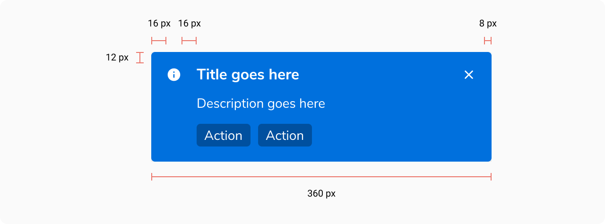
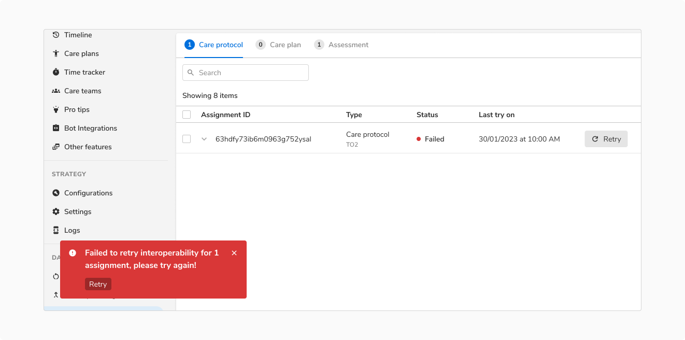
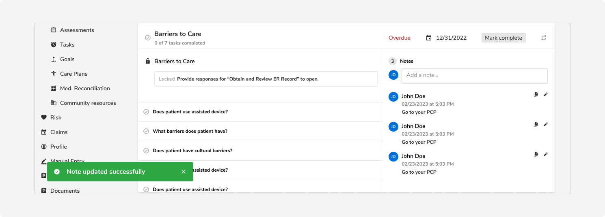

<Preview name="indicators-toast-toast-with-actions--toast-with-actions" />

### Appearances

The appearances of our toast are goal oriented.

 

#### Alert

Alert variant is used to convey an error state or failure which blocks a process. It should be used when the goal of the user hasn't been met.

The error may be generic like - ‘User not found', or failure of a process like - ‘Could
not create users’, ‘File items could not be uploaded’, and more.

<Preview name="indicators-toast-alert-toast--alert-toast" />

#### Info

Info variant is used to convey information to the users. This information is neutral in tone and is not associated with a connotation.

This info may be generic like - ‘In progress’, or ‘new updates available’, and more.

<Preview name="indicators-toast-info-toast--info-toast" />

#### Success

Success variant is used to convey the success state of a task/process. It should be used when the goal of the user has been met.

Successful completion may be in the form of - ‘Mail sent successfuly’, ‘User deleted successfully’, ‘Mobile number verified successfully’, ‘Meeting scheduled successfully’, and more.

<Preview name="indicators-toast-success-toast--success-toast" />

#### Warning

Warning variant is used to convey an interrupted state which delays or partially prevents a process from completion.

The warning may be generic like - ‘1 file could not be downloaded out of 50’, or ‘80 assignments uploaded out of 100’, and more.

<Preview name="indicators-toast-warning-toast--warning-toast" />

 

### Structure

 
 

 

<table style="width: 100%">
  <tbody>
    <tr>
      <th style="width:50%; text-align: left;">Property</th>
      <th style="width:50%; text-align: left;">Value(s)</th>
    </tr>
    <tr style="vertical-align: top">
      <td>Width</td>
      <td>360 px</td>
    </tr>
    <tr style="vertical-align: top">
      <td>Corner radius</td>
      <td>4 px</td>
    </tr>
    <tr style="vertical-align: top">
      <td>
        Padding
         
        <em>(top, right, bottom, left)</em>
      </td>
      <td>12 px, 8 px, 16 px, 16 px</td>
    </tr>
    <tr style="vertical-align: top">
      <td>Spacing between actions</td>
      <td>8 px</td>
    </tr>
    <tr style="vertical-align: top">
      <td>
        Margin
         
        <em>(bottom, left)</em>
      </td>
      <td>32 px, 32 px</td>
    </tr>
  </tbody>
</table>
 

### Configurations

<table style="width: 100%">
  <tbody>
    <tr>
      <th style="width:33%; text-align: left;">Property</th>
      <th style="width:33%; text-align: left;">Value(s)</th>
      <th style="width:33%; text-align: left;">Default value</th>
    </tr>
    <tr style="vertical-align: top">
      <td>Appearance</td>
      <td>
        <ul>
          <li>Info</li>
          <li>Success</li>
          <li>Warning</li>
          <li>Alert</li>
        </ul>
      </td>
      <td>Info</td>
    </tr>
    <tr style="vertical-align: top">
      <td>Title</td>
      <td>&#60;title&#62;</td>
      <td>-</td>
    </tr>
    <tr style="vertical-align: top">
      <td>
        Description
         
        <em>(optional)</em>
      </td>
      <td>&#60;description&#62;</td>
      <td>-</td>
    </tr>
    <tr style="vertical-align: top">
      <td>
        Actions
         
        <em>(optional)</em>
      </td>
      <td>
        <ul>
          <li>Action 1</li>
          <li>Action 2</li>
        </ul>
      </td>
      <td>-</td>
    </tr>
  </tbody>
</table>
 

### Usage

 

#### Positioning of toast

They appear at the bottom left of the screen and overlay any content.

<Caption>Positioning of toast</Caption>
 
 

#### Timeout

Toasts will close when the close button is clicked, or after a timeout – the default is 5 seconds.

 

#### Toasts with actions

Use toast with actions when you want the users to take an action after reading the message. Also, make sure the same actions are also available elsewhere on the page.

<Caption>
  Here the action in the toast is also available in the table row so that users can take the action comfortably even if
  they clone the toast.
</Caption>

#### Toast without description

<Preview name="indicators-toast-toast-with-description--toast-with-description" />

#### Multiple Toasts

Only one toast is displayed at a time. Subsequent toasts get stacked with a **margin of 16px** with the latest one on top.

<!--  -->

 
 

#### Overuse of toasts

It is recommended to not use toasts when the user interface is enough to provide feedback.

<Caption>Toast is not needed here because users can already see the updated note in the right section.</Caption>
