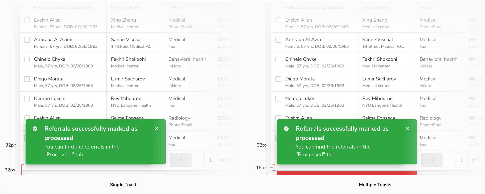
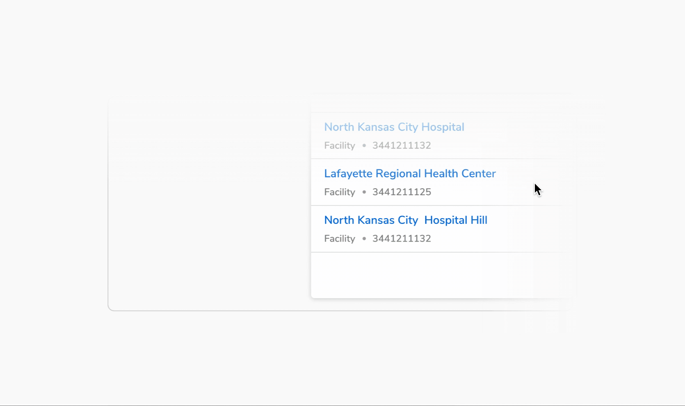

#### Types

 

##### Alert

Alert variant is used to convey an error state or failure which blocks a process. The error may be generic like - ‘User not found', ‘Mobile number already registered’, or failure of a process like - ‘Could not create users’, ‘File items could not be uploaded’, and more.

<Preview name='alert-toast' />

##### Info

Info variant is used to convey information to the users. Information may be generic like - ‘New updates available’, ‘Your consent was recorded’ or convey an in-between state of a process like - ‘Export is in process’, ‘Uploading file items’, and more.

<Preview name='info-toast' />

##### Success

Success variant is used to convey success state of a task/process. Successful completion may be in the form of - ‘Mail sent’, ‘User deleted’, ‘Mobile number verified’, ‘Meeting scheduled’, and more.

<Preview name='success-toast' />

##### Warning

Warning variant is used to convey an interrupted state which delays or prevents a process from completion. Interruption may be in the form - ‘2 permissions denied to Joy Lawson’, ‘1 file could not be downloaded’, and more.

<Preview name='warning-toast' />

 

#### Configurations

 

<Card shadow='none'>
  <Table
    showMenu={false}
    separator={true}
    data={[
      {
        Property: 'Icon',
        Value: 'Icons based on Alert Info Success Warning',
        Configurable: '❌',
      },
      {
        Property: 'Title',
        Value: '<Title>',
        Configurable: '❌',
      },
      {
        Property: 'Description',
        Value: '<Description>',
        Configurable: 'Optional',
      },
      {
        Property: 'Action 1',
        Value: '<Action 1>',
        Configurable: 'Optional',
      },
      {
        Property: 'Action 2',
        Value: '<Action 2>',
        Configurable: 'Optional',
      },
      {
        Property: 'Width',
        Value: '360px',
        Configurable: '❌',
      },
      {
        Property: 'Margin from left',
        Value: '32px',
        Configurable: '❌',
      },
      {
        Property: 'Margin from left',
        Value: '32px',
        Configurable: '❌',
      },
    ]}
    schema={[
      {
        name: 'Property',
        displayName: 'Property',
        width: '34%',
        sorting: false,
        separator: true,
        cellType: 'DEFAULT'
      },
      {
        name: 'Value',
        displayName: 'Value',
        width: '33%',
        sorting: false,
        separator: true
        
      },
      {
        name: 'Configurable',
        displayName: 'Configurable?',
        width: '33%',
        sorting: false,
        separator: true
      },
    ]}
    withHeader={false}
  />
</Card>
 
 

#### Usage

 

##### Positioning of toast

They appear at the bottom left of the screen and overlay any content. 

 
 

##### Timeout

Toasts will close when the close button is clicked, or after a timeout – the default is 5 seconds.
 

##### Toast with actions

Use toast with actions when you want the users to take an action after reading the message.

<Preview name='toast-with-actions' />

##### Toast without description

<Preview name='toast-with-description' />

##### Multiple Toasts

Only one toast is displayed at a time. Subsequent toasts get stacked with a **margin of 16px** with the latest one on top.

<!--  -->

 