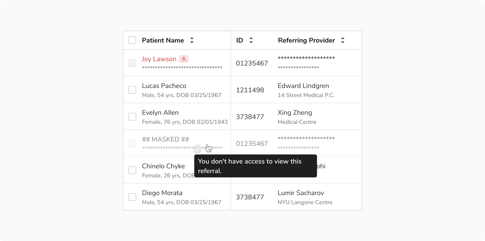
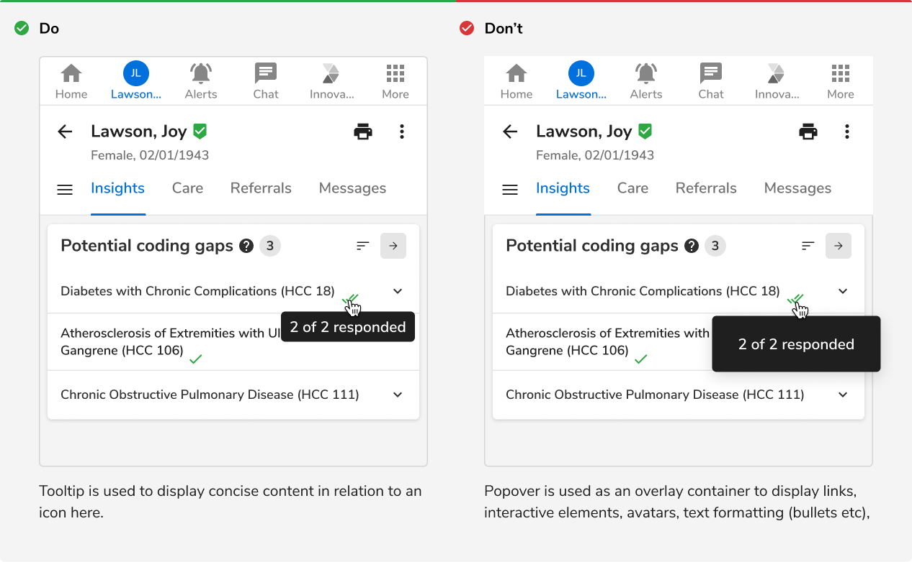

<Preview name='components-tooltip-all--all' />

### Structure
 
 

 

<table style="width: 100%">
 <tbody>
   <tr>
     <th style="width:50%; text-align: left;">Property</th>
     <th style="width:50%; text-align: left;">Value(s)</th>
   </tr>
   <tr style="vertical-align: top">
     <td>Padding <em>(top, right, bottom, left)</em></td>
      <td>4 px, 8 px, 4 px, 8 px</td>
   </tr>
   <tr style="vertical-align: top">
     <td>Spacing from trigger</td>
      <td>4 px</td>
   </tr>
   <tr style="vertical-align: top">
     <td>Maximum width</td>
      <td>256 px</td>
   </tr>
 </tbody>
</table>
 

### Configurations
<table style="width: 100%">
  <tbody>
    <tr>
      <th style="width:33%; text-align: left;">Property</th>
      <th style="width:33%; text-align: left;">Value(s)</th>
      <th style="width:33%; text-align: left;">Default value</th>
    </tr>
    <tr style="vertical-align: top">
      <td>Position</td>
      <td>
        <ul>
            <li>Top</li>
            <li>Right</li>
            <li>Bottom</li>
            <li>Left</li>
        </ul>
      </td>
      <td>Bottom</td>
    </tr>
  </tbody>
</table>
 

### Usage

 

#### Positioning

<Preview name='components-tooltip-variants-position--position' />
 

#### Default position

The preferred and default side of tooltip is the bottom of the trigger.

<Caption> Default position </Caption>
 

#### Tooltip overflow

Tooltips should be as concise and clear as possible. Exceeding the max width will make it wrap to form another line.

<Caption>Tooltip overflow</Caption>
 

#### Tooltip vs Popover

Tooltip is used to display concise information in relation to a target whereas popover is an overlay container used for displaying links, interactive elements, avatars, text formatting (bullets etc), meta data.

<Caption>Tooltip vs Popover</Caption>
 

#### Avoid errors in tooltips

Tooltip should not be used to provide essential information and collective feedback like errors, warnings, etc that require the immediate attention of the users.

 
 