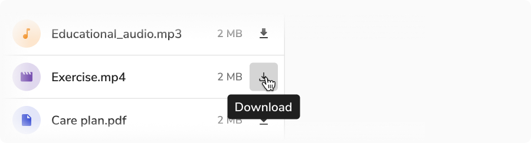

#### Structure

<Preview name='button-icon-button' />

#### Properties

 

<Card shadow='none'>
  <Table
    showMenu={false}
    separator={true}
    data={[
      {
        Property: 'Maximum width',
        Value: '256px, after which the text wraps',
        Configurable: '❌',
      },
      {
        Property: 'Padding from trigger',
        Value: '4px',
        Configurable: '❌',
      },
    ]}
    schema={[
      {
        name: 'Property',
        displayName: 'Property',
        width: '34%',
        sorting: false,
        separator: true,
        cellType: 'DEFAULT'
      },
      {
        name: 'Value',
        displayName: 'Value',
        width: '33%',
        sorting: false,
        separator: true
        
      },
      {
        name: 'Configurable',
        displayName: 'Configurable?',
        width: '33%',
        sorting: false,
        separator: true
      },
    ]}
    withHeader={false}
  />
</Card>
 
 

#### Usage

 

##### Positioning

<Preview name='tooltip-variants-position' />

##### Default position

The preferred and default side of tooltip is the bottom of the trigger.

 
 