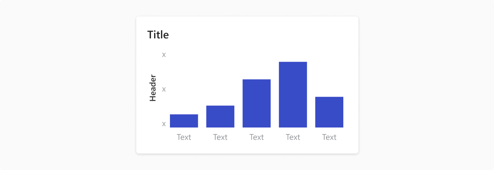
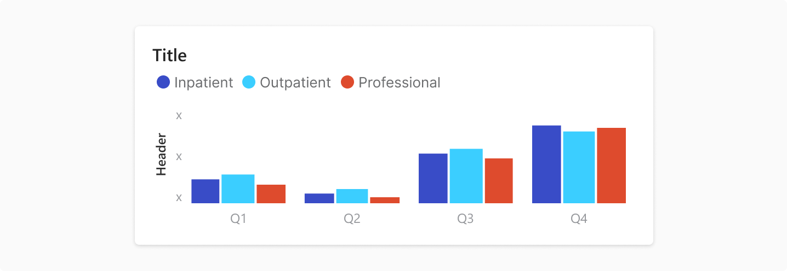
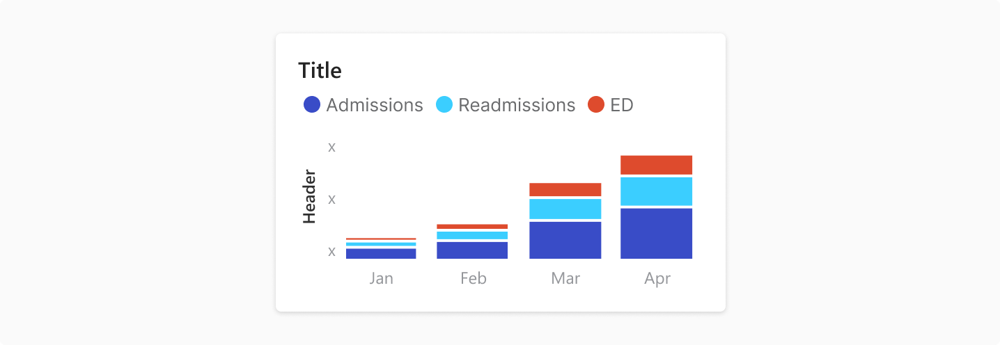
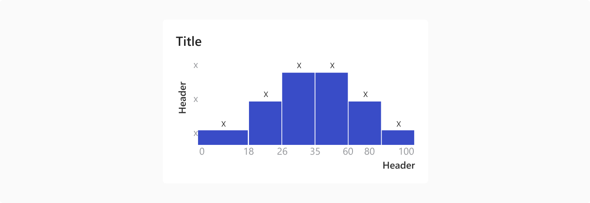
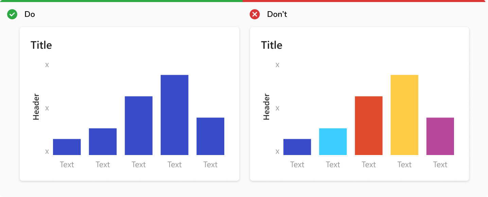
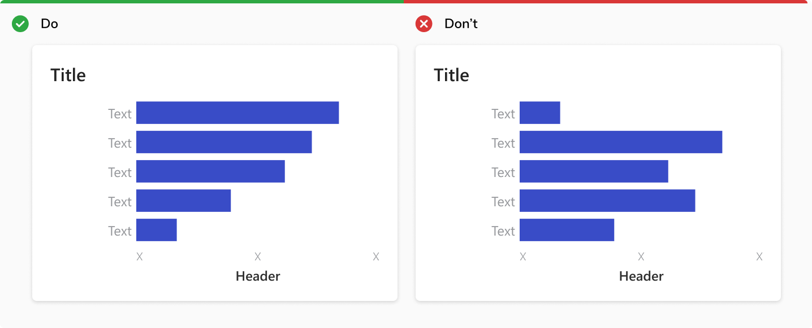
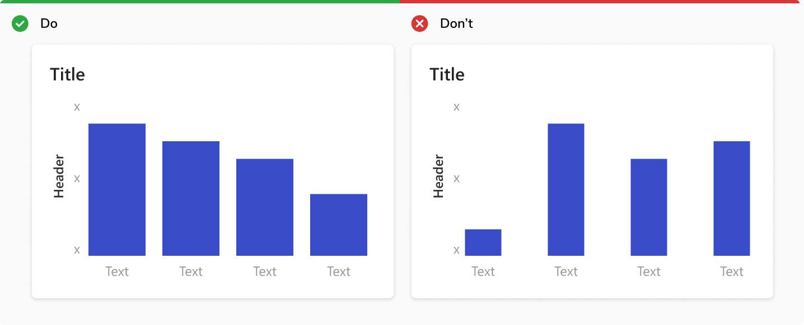

A bar chart is a chart with rectangular bars with lengths proportional to the values that they represent. One axis of the chart shows the specific categories being compared, and the other axis represents a discrete value.

##### Used for
<ul>
    <li> Compare discrete data </li>
    <li> Show trends over time </li>
    <li> Change over time </li>
    <li> To express larger variations in data, how individual data points relate to a whole, comparisons, and ranking </li>
</ul>

### Orientation

#### Horizontal bars
Horizontal bars are mostly used to show <b>Nominal/Categorical</b> datasets. These are generally datasets which can be arranged in any order. 
Sorting the data can be helpful to bring attention to lowest/highest values. 

 
 

#### Vertical bars
Vertical bars are mostly used to show <b>Ordinal/Sequential</b> datasets. These are generally datasets which follow a natural progression or order. 
These show the change in values w.r.t. the progression/time.

 
 

### Type

#### Bar chart
It presents datasets with rectangular bars with heights or lengths proportional to the values that they represent.

 
 

#### Clustered bar chart
It presents two or more data sets displayed side-by-side and grouped together under categories on the same axis.
<b> Note:</b> Use Line chart to compare for trend analysis between categories. Guideline

 
 

#### Stacked bar chart
It presents larger category divided into smaller categories and their relations to the total.

 
 

#### Histogram
It presents a grouped frequency distribution with continuous classes. It groups numeric data into bins, displaying the bins as segmented columns. They’re used to depict the distribution of a dataset: how often values fall into ranges. 

 
 

<b>Note:</b> Histogram only has vertical orientation.

### Usage

#### Use single color for single data set
If all the bars measure the same variable, make them all the same color. Different shades have no relevance to the data.

 
 

#### Show nominal/categorical data in ascending or descending order
Sort data sets to make it easier to understand and visualize.

 
 

#### Make the width of each bar about twice as wide as the space between them

 
 