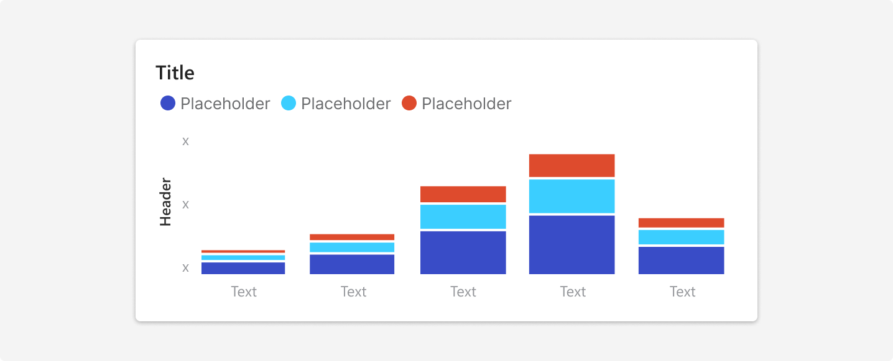
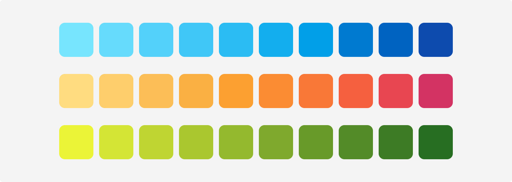
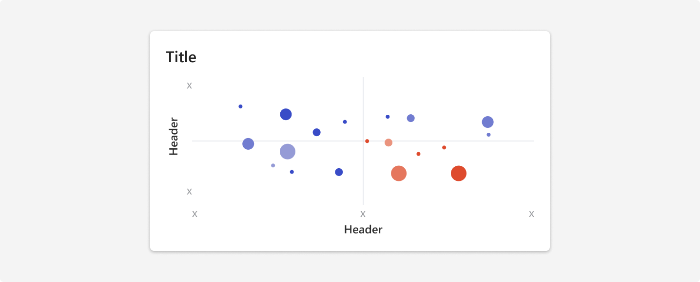
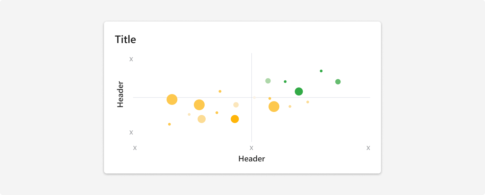
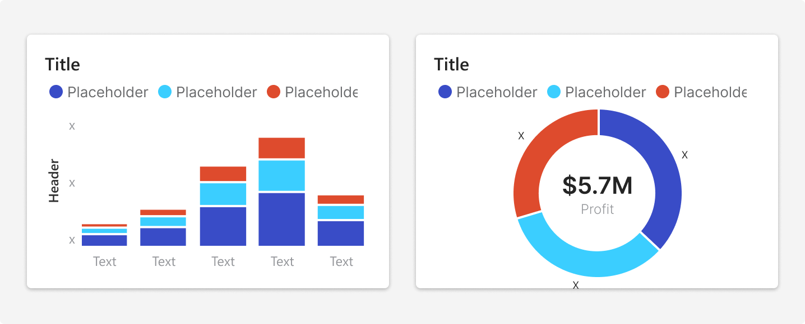
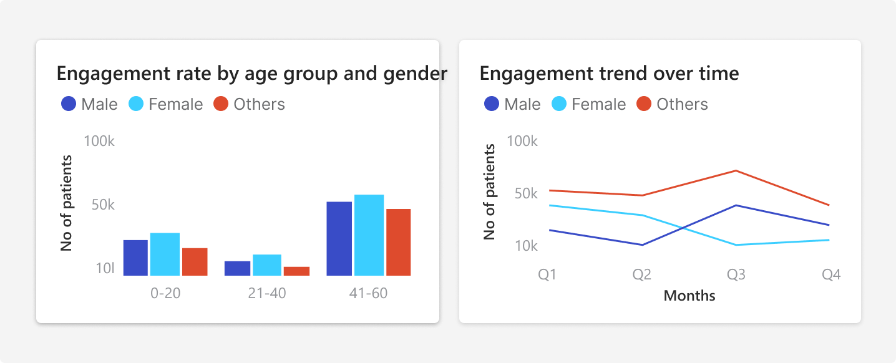
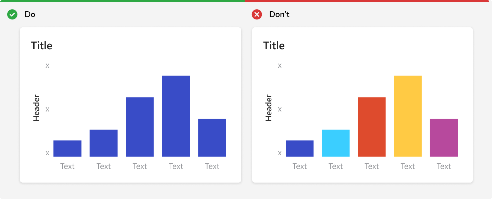
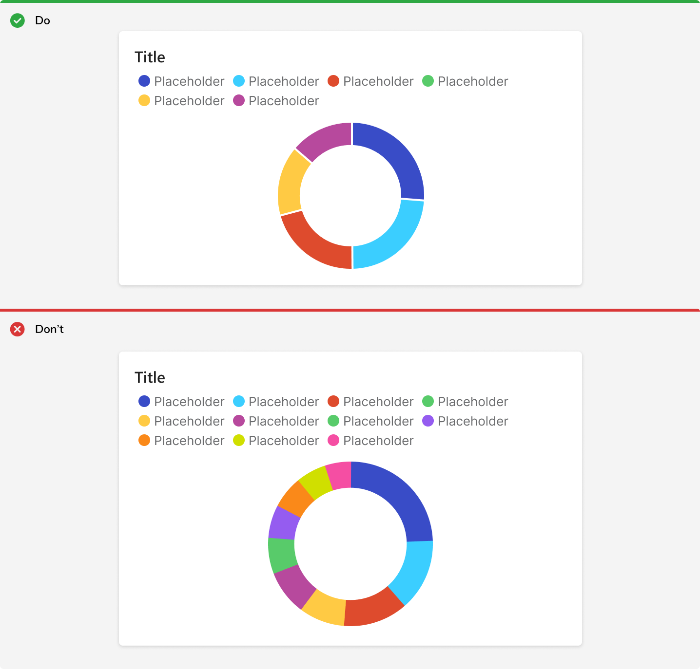
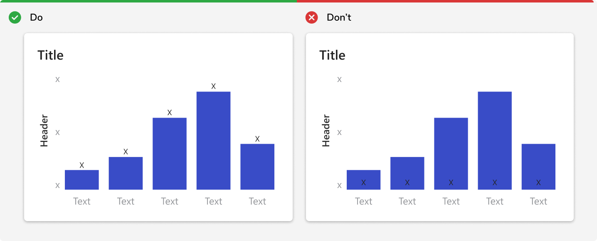

Data visualization is the representation of information in pictorial or graphical format, such as charts, graphs, maps, and diagrams. 
Because color can affect our perception of information, the appropriate use of color is critical in making a data visualization successful.

### Assigning colors
Use color tokens according to the usage guidelines to achieve appropriate color contrasts.

#### Categorical palette

Categorical palette consists of 10 colors shown below. The order of the colors should not be changed under any circumstance.
<b>Note:</b> Follow the same sequence as the numbers in the token names. This ensures each color is visually distinct from its neighbors across all color deficiencies. 

 

<Caption> Categorical palette </Caption>
 
 

<Caption> Using categorical palette </Caption>

 
 

#### Multi hue palette

##### Sequential palette
Sequential palette is used to illustrate a continuous or sequential change in values from low to high.

<Caption> Sequential palette </Caption>
 
 

##### Diverging palette
Diverging palette is used when dealing with negative values or ranges that have two extremes with a baseline in the middle. 
Diverging colors are ordered. Use these for ordinal and ratio scales, especially when there is a meaningful middle value. These may also be used for interval scales. Do not use these for categorical scales.

###### Blue - Red palette
Depending on the visual outcome of the chart, if the negative sentiment is to be highlighted then use Blue - Red palette. 

<Caption> Blue - Red palette </Caption>
 
 

<Caption> Using Blue - Red palette </Caption>
 
 

###### Yellow - Green palette
Depending on the visual outcome of the chart, if the positive sentiment is to be highlighted then use Yellow - Green palette. 

<Caption> Yellow - Green palette </Caption>
 
 

<Caption> Using Yellow - Green palette </Caption>
 
 

### Usage

#### Apply a border or space between adjacent colors
While the color tokens pass 3:1 contrast ratios against backgrounds, they might not against each other. To comply with WCAG 2.0, apply a space or border as a visual separator between data elements.

<Caption> White border between adjacent bars and slices to comply with WCAG 2.0 AA </Caption>
 
 

#### Be consistent with color
If a color is used to represent a category in one chart, all other charts should use that color for the same category.
This should only be done when the category has significant importance and repeats itself in two or more charts.
<b>Note:</b> When a color is used to depict a specific category across charts, it should not be used in the categorical palette.

<Caption> White border between adjacent bars and slices to comply with WCAG 2.0 AA </Caption>
 
 

#### Don't use sequential color with categorical data
Sequential colors are optimized for numeric meaning. Using these colors for dimensions can undermine the numeric association and lead users to misunderstand visualizations.

 
 

#### Don’t use categorical with single data series or sequential data
Categorical colors are optimized for maximum differentiation. Using them for sequences (ordinal, interval, or ratio scales), even when arranged by hue, makes it more difficult for users to understand.

 
 

#### Use upto 6 categorical colors
Categorical colors become more difficult to comprehend starting at 6 colors, and extremely difficult to understand at 12. If you have a need for more than 6 colors, try alternative charts or table.

 
 

#### Don't place text on chart colors
All color tokens don’t support accessible pairings with text, i.e. 4.5:1 contrast. Consider placing text next to the chart element instead.

 
 