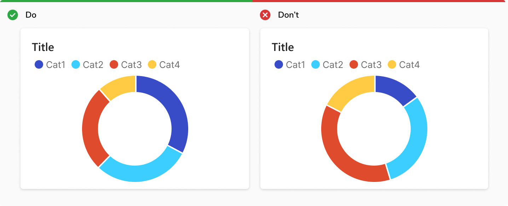
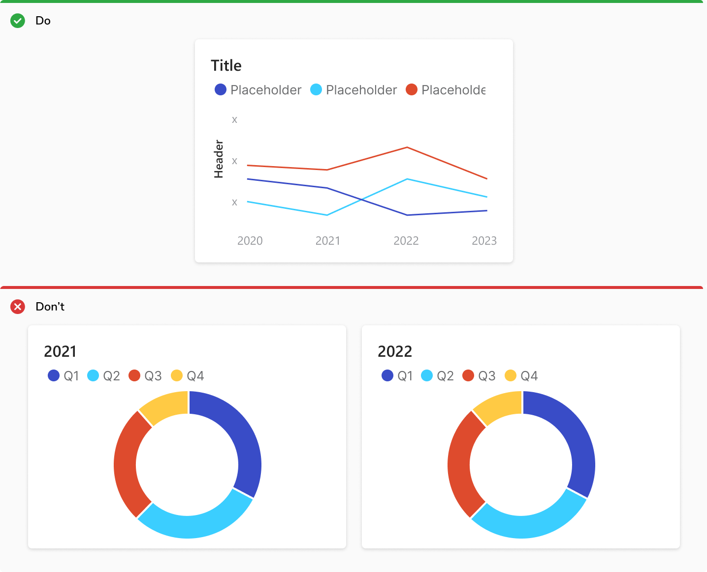
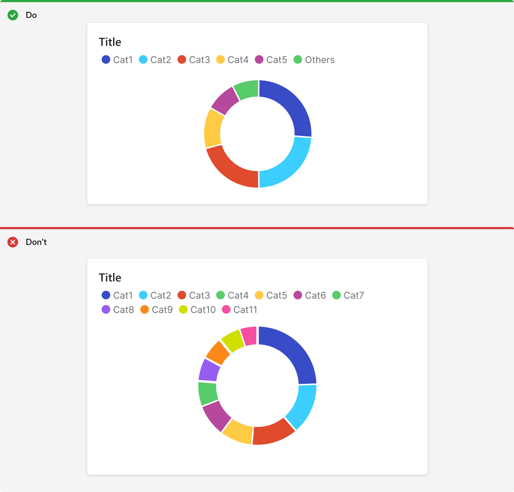

A donut chart is a variant of a pie chart with its center removed. The empty area in the centre of this chart is used to display a metric corresponding to the sum or net value of all metrics visualized in the chart.

##### Used For
<ul>
    <li> Used to show percentage or proportional data </li>
    <li> Show the relative relationship between two or three categories </li>
</ul>

### Usage

#### Sort Data in Descending Order
Show data in descending order, starting at the 12 o'clock point and moving clockwise.

 
 

#### Don't Use a Donut Chart to Visualize Time Series.
Donut chart shows the relative relationship between two or more categories. 
Don’t use multiple pie charts to show changes over time. It’s difficult to compare the difference in size across each segment of the circle. <b>Use a bar chart or line chart instead.</b>

 
 

#### Use Upto 6 Categories
Categorical colors become more difficult to comprehend starting at 6 colors, and extremely difficult to understand at 12.
If you have a need for more than 6 categories, try grouping categories beyond 5 under ‘Others’, or use alternative charts or table.

 
 

#### Use Donut Charts Sparingly
It is difficult to visually judge the size of circle segments. Use Bar chart instead.