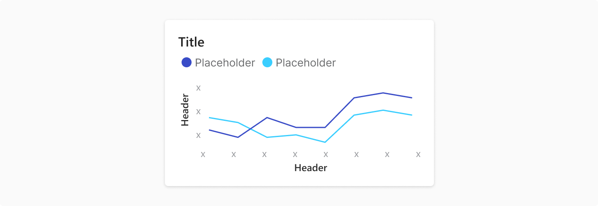
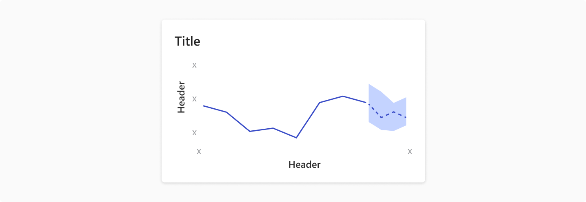
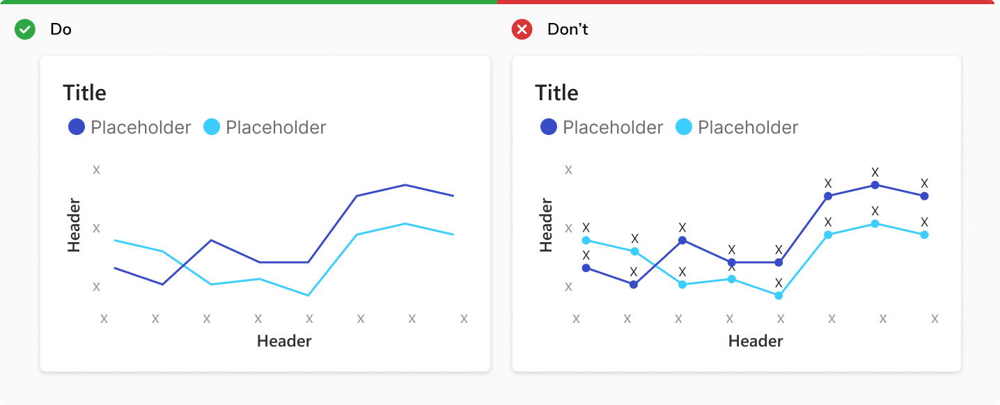
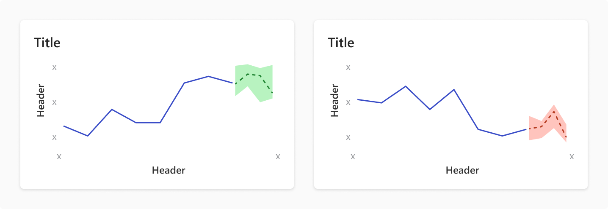
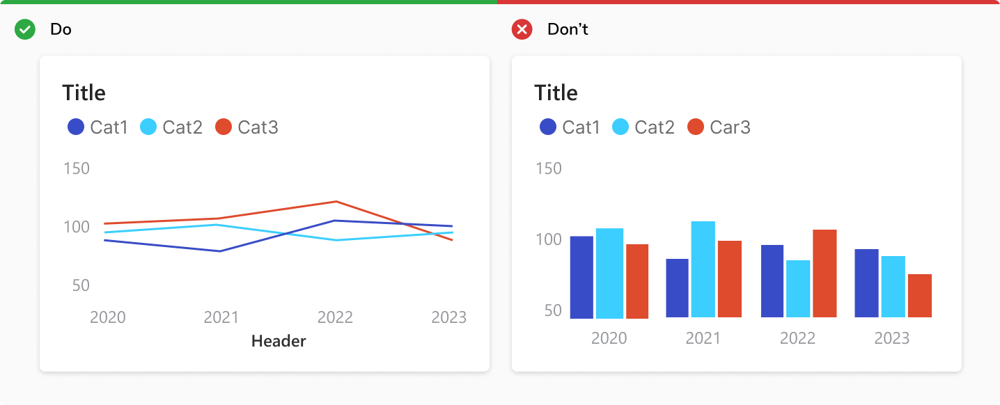

A line chart is used to show information that changes over time. Line charts are created by plotting a series of several points and connecting them with a straight line. 

##### Used For
<ul>
    <li> Show trends over time and compare several continous data sets </li>
    <li> Plot data at regular intervals connected by lines </li>
    <li> Track changes over short and long periods </li>
</ul>

### Type

#### Line Chart

 
 

#### Line Chart With Forecast
It joins a line graph for observed past data, and a range area chart for future predictions.

 
 

### Usage

#### Avoid Individual Data Markers With Numbers
Showing individual data markers can reduce the readability of the chart. 

 
 

#### Use Maximum Three Categories
Plotting too many lines on the same chart gives a confusing picture and defeats the purpose.

 
 

#### Using Secondary Y-Axis
Incase of secondary Y-axis, following guidelines should be followed:
<ul>
    <li> Secondary Y-axis should only be used if the type of values is different </li>
    <li> If the range of both the axes is close to each other, use proportional intervals </li>
</ul>

<b>Note: </b> Secondary Y-axis should be used sparsely as interpreting data to different axes might be confusing and difficult. 

 
 

#### Showing Trend With Sentiment
The trend line can have sentiment colors to show positive and negative values. 

 
 

#### Line Chart vs. Bar Chart
Line chart is preferred over bar chart to 
<ul>
    <li> Compare changes over the same period of time for multiple categories </li>
    <li> Compare trend line for multiple categories </li>
</ul>

 
 