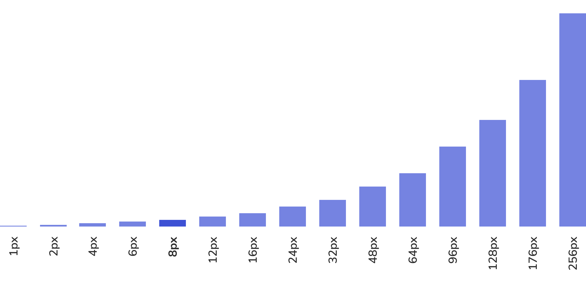
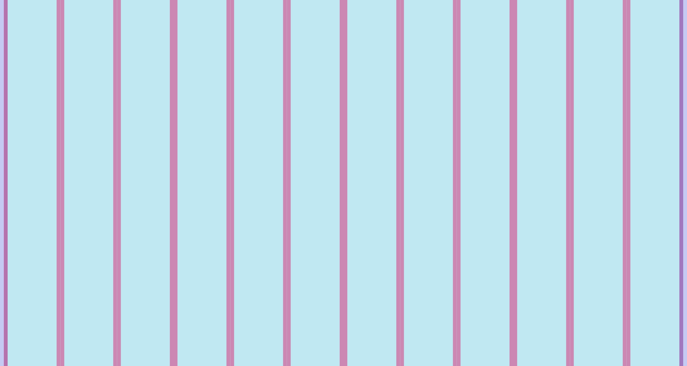
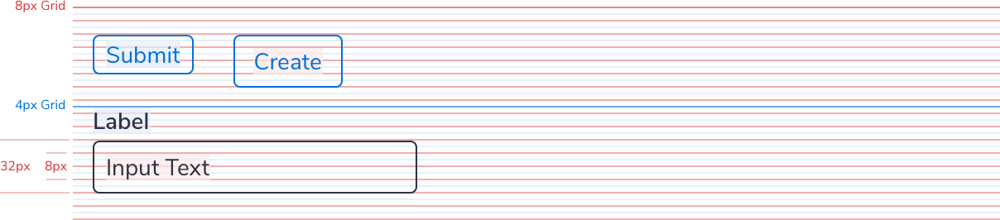
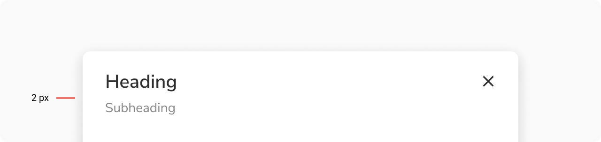
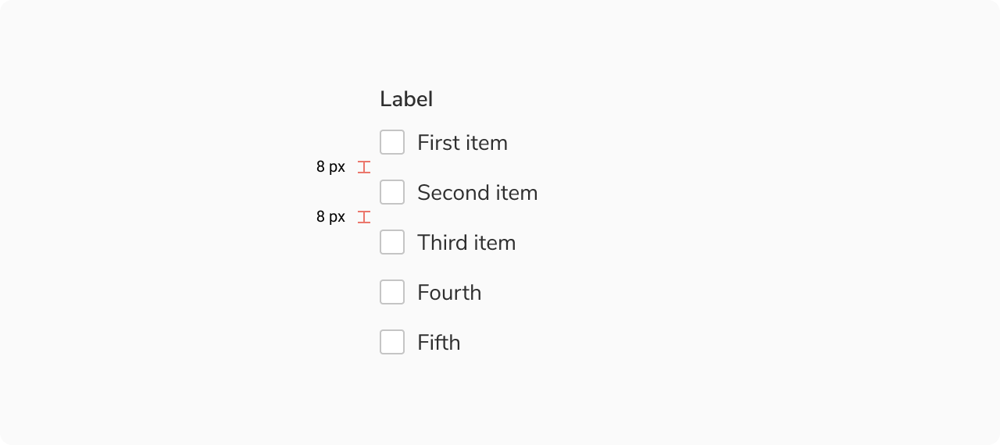
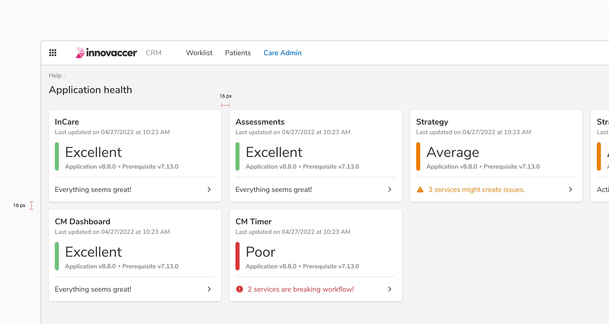

### Spacing

We use 8px as the base unit for our spacial system. The spacing system has been roughly generated by multiplying eight with even numbers.

<Message
  appearance='info'
  description='12px is an outlier to the rule. This special padding amount allows for better alignment of stacked items while giving elements enough room to breathe.'
/>

 

 
 
 

### Grid

Using a baseline grid creates a consistent rhythm between the components and typography. We use a 12-columns grid.

 

#### Types

##### Regular Grid
 
 

<table style="width: 100%">
  <tbody>
    <tr>
      <th style="width:50%; text-align: left;">Property</th>
      <th style="width:50%; text-align: left;">Value</th>
    </tr>
    <tr style="vertical-align: top">
      <td>Left padding</td>
      <td>8px</td>
    </tr>
    <tr style="vertical-align: top">
      <td>Right padding</td>
      <td>
          8px
      </td>
    </tr>
    <tr style="vertical-align: top">
      <td>Gutter</td>
      <td>16px</td>
    </tr>
  </tbody>
</table>

 

 

##### Grid with margin

For the outermost grid, this component is used. This can
also be nested subsequently if a 16px padding is required
on both sides.

<table style="width: 100%">
  <tbody>
    <tr>
      <th style="width:50%; text-align: left;">Property</th>
      <th style="width:50%; text-align: left;">Value</th>
    </tr>
    <tr style="vertical-align: top">
      <td>Left padding</td>
      <td>8 + 8px</td>
    </tr>
    <tr style="vertical-align: top">
      <td>Right padding</td>
      <td>8 + 8px </td>
    </tr>
    <tr style="vertical-align: top">
      <td>Gutter</td>
      <td>16px</td>
    </tr>
  </tbody>
</table>

 

 
 

#### Columns

The column includes the padding at the inside, 8 px each side. This way the gutter becomes 16px for adjacent columns.

 
 

#### Components

We use a 8px baseline grid. All UI components including paddings and margins are created in multiples of eight so that everything aligns to the pixel grid.
When text is used within a UI element, set the line-height to be consistent with the baseline grid.

 
 

#### Typography

All typography aligns to a 4px baseline grid. This allows for readable line heights at all sizes.

### Spacing guidelines

#### 2 px token
Spacing between related elements.

**e.g.** Spacing between heading and subheading.

<Caption> Spacing between heading and subheading </Caption>

 
 

#### 4 px token
Spacing between group of elements.

**e.g.** Spacing between badges, buttons.

<Caption> Spacing between buttons </Caption>

 
 

#### 8 px token
Spacing between group of elements.

**e.g.** Spacing within checkbox group, radio group.

<Caption> Spacing within checkbox group </Caption>

 
 

#### 12 px token
Spacing within a section.

**e.g.** Spacing between sections within a modal, sections within a form.

<Caption> Spacing between sections within a modal </Caption>

 
 

#### 16 px token
Spacing between different sections

**e.g.** Spacing between cards.

<Caption> Spacing between card </Caption>

