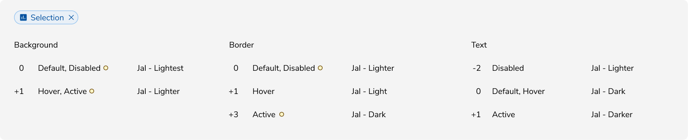

**Note:** 'Component' used below implies 'interactive component'.
 

### Types of States

#### Default
A component is in default state when it is not interacted with.

##### State Logic
Consider it as 0 for reference point.

<Caption> Default state </Caption>

 
 

#### Hover
A component transitions into hover state when the cursor is placed over it.

##### State Logic

+1 (slightly darker) for background color and content such as text (wherever applicable). 

<Caption> Hover state </Caption>

 
 

#### Active
A component transitions into active state when it is being pressed.

##### State Logic

+2 (moderately darker) for background color.

<Caption> Active state </Caption>

 
 

#### Focus
A component transitions into focus state when it is highlighted by the user using a mouse, keyboard or voice input. This state indicates that the component is ready to interact with.

##### State Logic

Focus ring of 3px border, outside.

<Caption> Focus state </Caption>

 
 

#### Disabled
A component transitions into disabled state when it cannot be interacted with.

##### State Logic

-2 (moderately lighter) for background.

<Caption> Disabled state </Caption>

 
 

#### Loading
A component transitions into loading state if the action needs to be processed before proceeding.

##### State Logic

-2 (moderately lighter) for background and spinner in place of content.

<Caption> Loading state </Caption>

 
 

#### Selected
A component transitions into selected state when it is selected as an option out of many. The selected state should have medium emphasis so that it’s noticeable but not distracting. 

##### State Logic

Jal/Lightest at 48% opacity for background color and Jal/Dark for text(wherever applicable)

<Caption> Selected state </Caption>

 
 

#### Activated
A component transitions into activated state when a view associated with it is currently being viewed.

##### State Logic

Jal/Lightest for background color and Jal/Dark for text(wherever applicable)

<Caption> Activated state </Caption>

 
 

#### Dragged
A component transitions into dragged state when it is picked to move around.

<Caption> Dragged state </Caption>

 
 
 

### Examples
 
 

<Caption> Interactive states of Basic button </Caption>

 
 

<Caption> Interactive states of Primary button </Caption>

 
 

<Caption> Interactive states of Selection chip in default state </Caption>

 
 

<Caption> Interactive states of Selection chip in selected state </Caption>

 
 