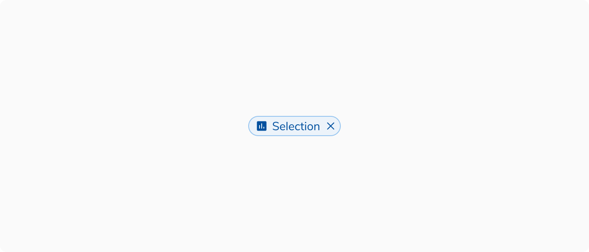
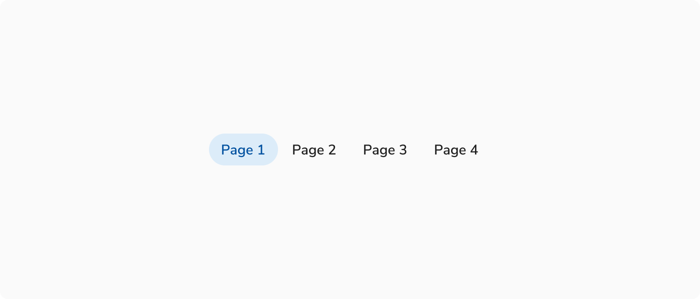
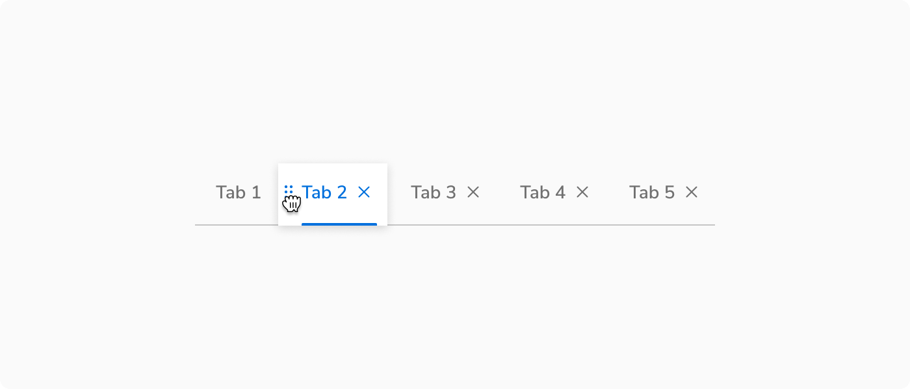
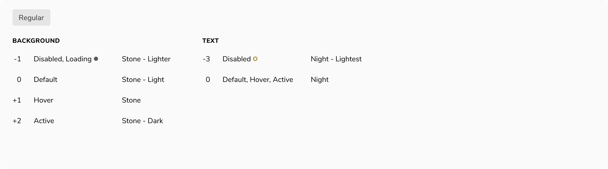
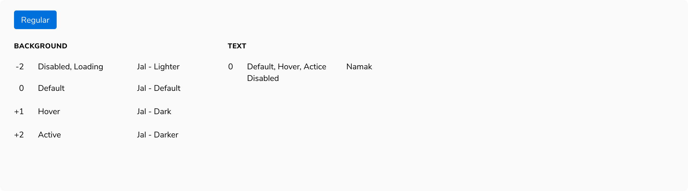
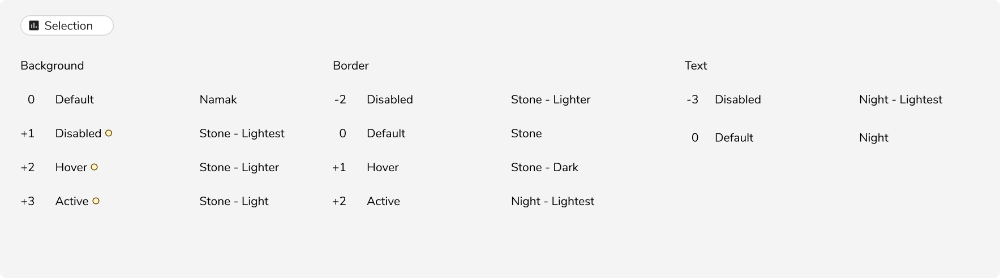
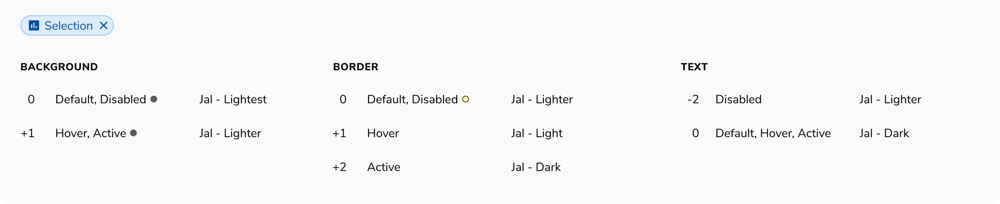

**Note:** 'Component' used below implies 'interactive component'.
 

### Types of states

#### Default
A component is in default state when it is not interacted with.

##### State logic
Consider it as 0 for reference point.

<Caption> Default state </Caption>

 
 

#### Hover
A component is in default state when it is not interacted with.

##### State logic

+1 (slightly darker) for background color and content such as text (wherever applicable). 

<Caption> Hover state </Caption>

 
 

#### Active
A component is in default state when it is not interacted with.

##### State logic

+2 (moderately darker) for background color.

<Caption> Active state </Caption>

 
 

#### Focus
A component is in default state when it is not interacted with.

##### State logic

Focus ring of 3px border, outside.

<Caption> Focus state </Caption>

 
 

#### Disabled
A component is in default state when it is not interacted with.

##### State logic

-2 (moderately lighter) for background.

<Caption> Disabled state </Caption>

 
 

#### Loading
A component is in default state when it is not interacted with.

##### State logic

-2 (moderately lighter) for background and spinner in place of content.

<Caption> Loading state </Caption>

 
 

#### Selected
A component is in default state when it is not interacted with.

<Caption> Selected state </Caption>

 
 

#### Activated
A component is in default state when it is not interacted with.

<Caption> Activated state </Caption>

 
 

#### Dragged
A component is in default state when it is not interacted with.

<Caption> Dragged state </Caption>

 
 
 

### Examples
 
 

<Caption> Interactive states of Basic button </Caption>

 
 

<Caption> Interactive states of Primary button </Caption>

 
 

<Caption> Interactive states of Selection chip in default state </Caption>

 
 

<Caption> Interactive states of Selection chip in selected state </Caption>

 
 

> * = Updated from foundation because the color does not have more lighter/darker variations or there is no sufficient contrast.