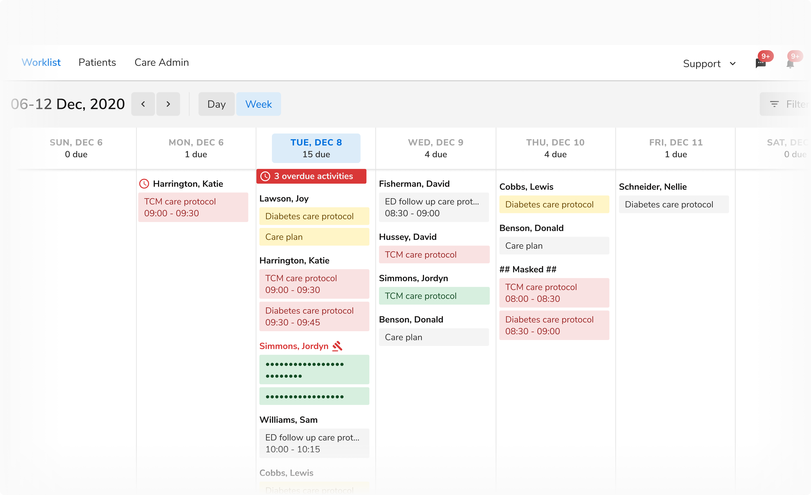

### Text styles
The design system has many built in tokens to easily solve most common use cases surrounding text and its formatting.

 

#### Title
 
 

<table style="width: 100%">
  <tbody>
    <tr>
      <th style="width:20%; text-align: left;">Name</th>
      <th style="width:20%; text-align: left;">Family</th>
      <th style="width:20%; text-align: left;">Size</th>
      <th style="width:20%; text-align: left;">Weight</th>
      <th style="width:20%; text-align: left;">Line height</th>
    </tr>
    <tr style="vertical-align: top">
      <td>Default</td>
      <td>Nunito Sans</td>
      <td>16px</td>
      <td>700</td>
      <td>24px</td>
    </tr>
    <tr style="vertical-align: top">
      <td>Medium</td>
      <td>Nunito Sans</td>
      <td>20px</td>
      <td>600</td>
      <td>32px</td>
    </tr>
    <tr style="vertical-align: top">
      <td>Large</td>
      <td>Nunito Sans</td>
      <td>28px</td>
      <td>400</td>
      <td>40px</td>
    </tr>
    <tr style="vertical-align: top">
      <td>X-Large</td>
      <td>Nunito Sans</td>
      <td>32px</td>
      <td>600</td>
      <td>48px</td>
    </tr>
    <tr style="vertical-align: top">
      <td>XX-Large</td>
      <td>Nunito Sans</td>
      <td>40px</td>
      <td>400</td>
      <td>48px</td>
    </tr>
  </tbody>
</table>
 
 

#### Body
 
 

<table style="width: 100%">
  <tbody>
    <tr>
      <th style="width:20%; text-align: left;">Name</th>
      <th style="width:20%; text-align: left;">Family</th>
      <th style="width:20%; text-align: left;">Size</th>
      <th style="width:20%; text-align: left;">Weight</th>
      <th style="width:20%; text-align: left;">Line height</th>
    </tr>
    <tr style="vertical-align: top">
      <td>Default</td>
      <td>Nunito Sans</td>
      <td>14px</td>
      <td>400, 600, 700</td>
      <td>20px</td>
    </tr>
    <tr style="vertical-align: top">
      <td>Large</td>
      <td>Nunito Sans</td>
      <td>16px</td>
      <td>400, 600</td>
      <td>24px</td>
    </tr>
    <tr style="vertical-align: top">
      <td>Small</td>
      <td>Nunito Sans</td>
      <td>12px</td>
      <td>600, 700</td>
      <td>16px</td>
    </tr>
  </tbody>
</table>
 
 

#### Subheading
 
 

<table style="width: 100%">
  <tbody>
    <tr>
      <th style="width:20%; text-align: left;">Name</th>
      <th style="width:20%; text-align: left;">Family</th>
      <th style="width:20%; text-align: left;">Size</th>
      <th style="width:20%; text-align: left;">Weight</th>
      <th style="width:20%; text-align: left;">Line height</th>
    </tr>
    <tr style="vertical-align: top">
      <td>Default</td>
      <td>Nunito Sans</td>
      <td>12px</td>
      <td>600</td>
      <td>24px</td>
    </tr>
  </tbody>
</table>
 
 

#### Link
 
 

<table style="width: 100%">
  <tbody>
    <tr>
      <th style="width:20%; text-align: left;">Name</th>
      <th style="width:20%; text-align: left;">Family</th>
      <th style="width:20%; text-align: left;">Size</th>
      <th style="width:20%; text-align: left;">Weight</th>
      <th style="width:20%; text-align: left;">Line height</th>
    </tr>
    <tr style="vertical-align: top">
      <td>Default</td>
      <td>Nunito Sans</td>
      <td>14px</td>
      <td>400</td>
      <td>20px</td>
    </tr>
  </tbody>
</table>
 

#### Label

<table style="width: 100%">
  <tbody>
    <tr>
      <th style="width:20%; text-align: left;">Name</th>
      <th style="width:20%; text-align: left;">Family</th>
      <th style="width:20%; text-align: left;">Size</th>
      <th style="width:20%; text-align: left;">Weight</th>
      <th style="width:20%; text-align: left;">Line height</th>
    </tr>
    <tr style="vertical-align: top">
      <td>Default</td>
      <td>Nunito Sans</td>
      <td>14px</td>
      <td>600</td>
      <td>16px</td>
    </tr>
  </tbody>
</table>
 
 

### Colors

The text styles can be combined with any color token. 

<b> Note: </b>To achieve barrier-free design, follow the WCAG 2.0 standard, which maintains an AA level of contrast ratio, i.e. 4.5:1 or more between body text, title, and background color.

  
  

<Caption>Using different color tokens</Caption>

 

<Caption>Contrast between background and text according to WCAG 2.0 AA level</Caption>
