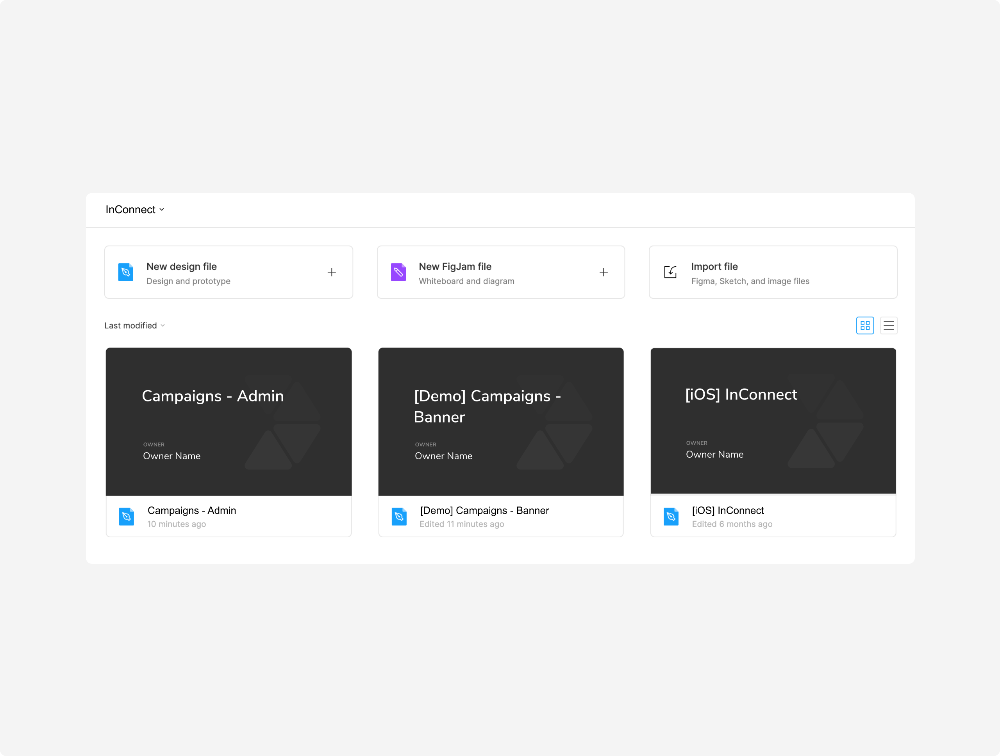
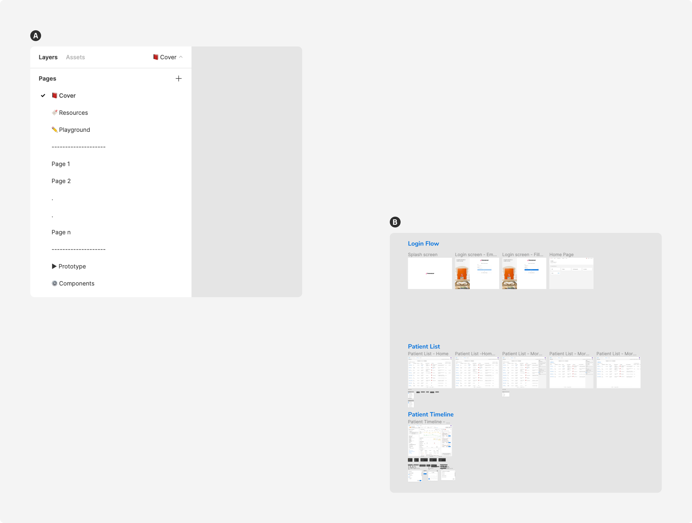
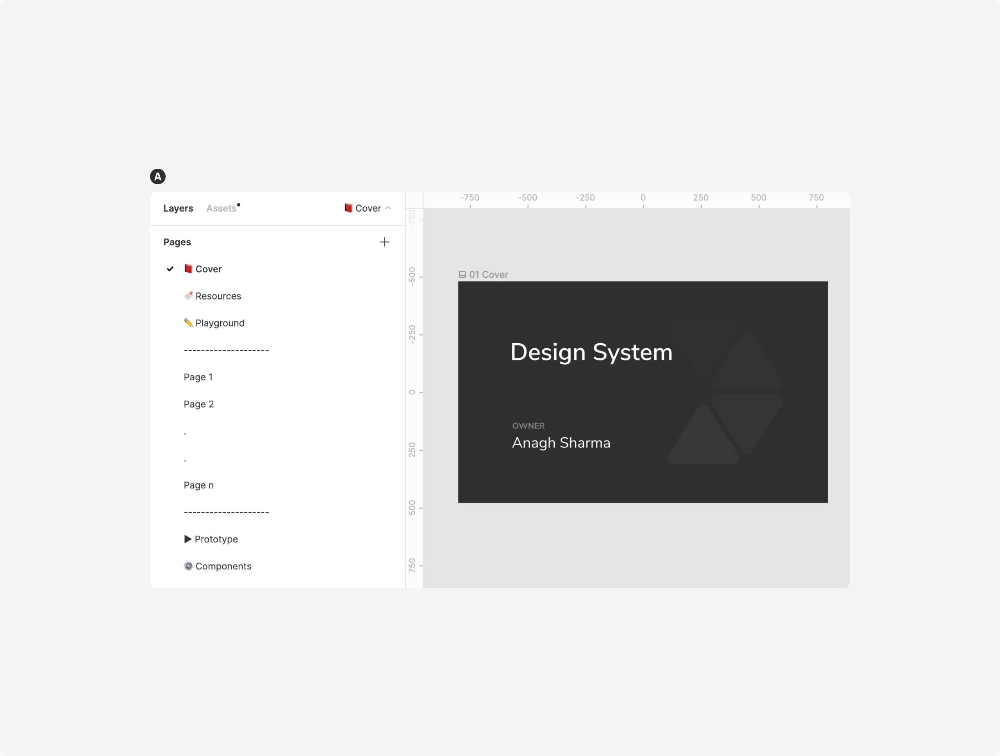
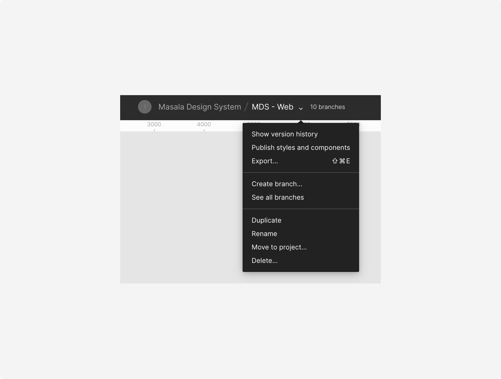
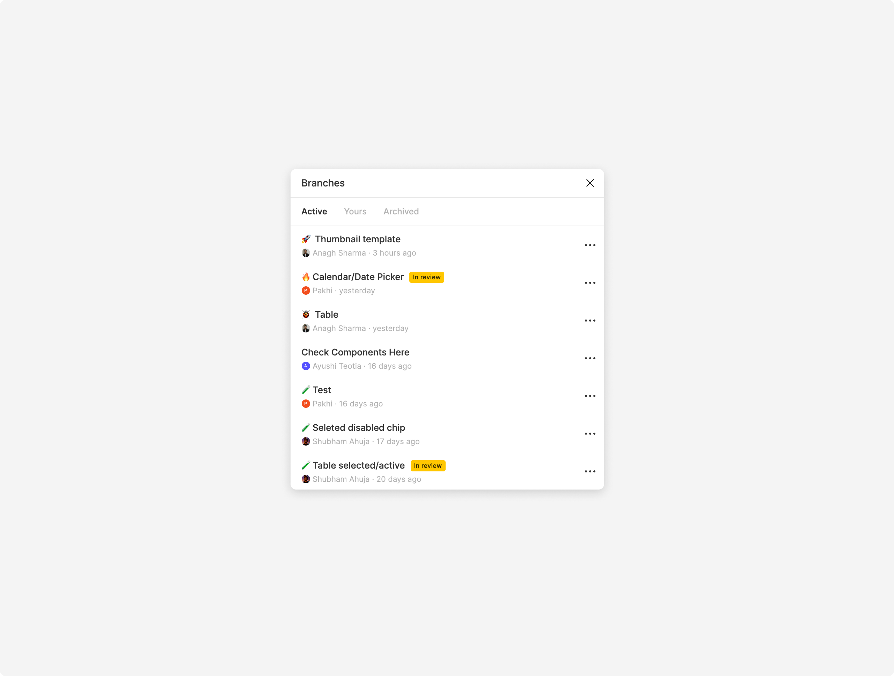
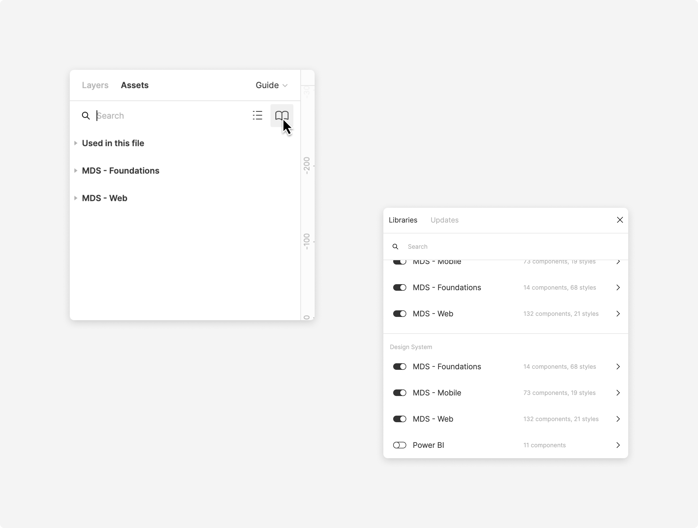

### Getting access
 

#### Using within Innovaccer
If you do not have access to Figma already, feel free to reach out to get the invitation.

##### Signing up
Once you get the invite, sign up using your Innovaccer account to get access to Innovaccer org in Figma. It is highly recommended to add a profile picture so that it is easy to identify you across Figma.

##### Inviting other stakeholders
You can invite the product managers, developers, and other stakeholders from your team to a particular project/file using the Share feature of Figma.

Make sure the access permission is set to **‘can view’** when sharing unless you want them to edit the file. Please note that editors are paid seats in Figma.

 
 

##### Guests
Guests are folks who are not part of our organization; however, you can still share your work with them. You may give them **‘can view’** or **‘can edit’** access but be wary that they are not part of Innovaccer Inc.
 

#### Using within your own organization
If you want to use the Masala Design System in your own organization in Figma, you can download the files from the community and then publish each of them as a library.

* [Masala Design System - Branding](https://www.figma.com/community/file/1075022843491691382)
* [Masala Design System - Web Guidelines](https://www.figma.com/community/file/974368355920553546)

**Note:** You will not be able to get real-time updates in this case.
 

### Teams
The root level in Figma is an organization which in our case is Innovaccer Inc. An organization can have many teams depending on how it operates. We have a predefined set of teams and projects to begin with.

#### Joining an existing team
Once you sign up, you will be able to see all the teams in Innovaccer Inc. You can easily become a member of a team by just clicking on the respective **Join** button.
 

 
 

#### Requesting edit access
When you join a team, the permission is set to **‘Can view’** by default. You’ll need to contact the owner or the admin of the team to get **‘Can edit’** access.
 

### Projects
Projects help you group similar files. A team in Figma can have as many projects as you would want. However, to avoid overcrowding it is recommended to follow the predefined projects as shared earlier.

#### Files in a project
A project can have multiple files. You can create different files within a project as per the requirements. If a feature or workflow is too large or complex to fit in a single file, it should be in a separate file.

For example, the project InNote can have the following files-
* InNote
* InNote - Referrals

#### Naming files in a project
A file should be tagged using a prefix, if needed, for easy identification. Tagging is also helpful when two or more files have the same name but serve different purposes.

InConnect can have the following files, for example -
* Campaigns - Admin
* [Demo] Campaigns - Banner
* [iOS] InConnect
* [mWeb] InConnect

 

 
 

### Files
It is recommended to maintain and respect file hygiene so that if someone visits your file they should be able to get a rough idea of the workflow.

#### Divide content into pages
In a single file, categorize parts of your projects into Pages as shown. This helps in keeping the file organized and easy to understand for others.

#### Organizing content within a page
* If there are a lot of screens in a single page, break them into non-assorted groups as per their functions. Use large and bold titles to identify groups easily when zoomed out.
* Arrange your workflow and hence the frames in the Left→Right (maximum of 10 frames) and Top→Bottom direction, like character ‘Z’. This helps in easy scanning of a page/workflow.
* Name your frames/artboards in such a way that they represent what the screen is all about. The recommended arrangement is - **Primary occurrence - Secondary occurrence - Tertiary occurrence** and so on.

Example: Patient List - Filters - ICU Applied. This name indicates that the screen contains a list of patients. There are filters present to filter the list. The ‘ICU’ filter has been applied to that list.
 

 

### Pages
In a single file, categorize parts of your projects into pages as shown. This helps in keeping the file organized and easy to understand for others.

 

#### Cover
You should have a separate page for cover, typically the first one. You can set a frame as thumbnail which acts as a cover for your projects outside the canvas for easy identification.

To ease this process, we are providing a Cover component in Design Library (can be found in Utility). 
* In the 📕 Cover page, draw a 1600 x 960 frame.
* Drop 01 Cover from Design Library -> Utility.
* Add project and owner name. Right click and choose -> Set as Thumbnail.

On top of this, you may also add frames for intro, personas, etc. in this page.
 

#### Resources
* Anything related to your research should go inside this page.
* If you have imported a file from Sketch for reference, make sure to move the required frames/artboards to this page.

 

#### Playground*
As the name suggests, this page acts as a playground for your project. Anything that you want to try out goes here.
 

#### Regular pages
* These are the pages where your UI mockups will live. This is where most of your project resides.
* To make sure the file is well organized, you can have as many such pages as you want albeit it is suggested to divide the content into pages sensibly.
 

#### Prototype*
If you need to show a short and quick workflow out of your project to an external stakeholder, this is the place. Keeping these sorts of prototypes in a separate page helps in keeping the main prototype (present in Page 1, Page 2, etc.) clean and organized.
 

#### Components*
Any local symbols/components you create in your file go in this page.

***=optional**
 

### Version control
#### Creating a branch
Figma has started offering version control recently. You can create branches just like Abstract and request for review. This feature is not as expansive as Abstract though.

##### When should you create a branch
Just like Abstract, you should create a branch for -
* Sprint Stories
* New Features
* Bug Fixes
* Quick Improvements

This way the main file which is shared with the developers and other stakeholders, stays unaltered until the designs have been finalized and merged into it.

**P.S.:** Avoid making changes in your main file if you do not want the developers/stakeholders to act surprised of the changes every time they open the file.

##### Creating a branch
* Make sure nothing is selected on the canvas.
* Click on the Down arrow where the file name is (top-center).
* Click Create branch...

 
 

#### Branch nomenclature
Following good naming practices helps understand what a branch is all about at a glance.

##### Naming your branch
A typical branching nomenclature is as follows -

**{PREFIX} {ISSUE-ID or MODULE NAME} - {FEATURE NAME or DESCRIPTION}**

Prefix make it easier to identify and understand the purpose behind your branch.
 

 
 

##### Types of prefixes
* Feature indicated by 🚀
* Quick fix indicated by 🔥
* Bug fix indicated by 🐞
* Lab/Test indicated by 🧪

##### Examples
* Sprint stories - 🚀 Sprint 22.04.1 - Dismissible Tabs
* Features - 🚀 Global Search - Section Title - Behavior
* Bug fix - 🐞 NCR-1320 - Global Search - Sections

 

### Start designing
#### Enabling design libraries
You can enable a specific design library by going to Assets panel and clicking on the **‘Open book’** icon.

 
 

#### Jump on the canvas
* Create a new file within a project and name it properly.
* Create pages as recommended earlier.
* Make sure to have a frame in Cover page to be used as a thumbnail.
* Target frames of size 1440 X 1024.
* Use the shortcut Shift + I to insert components from a design library.
* Create local components when needed or create a library if you anticipate a component to be used across multiple projects.
* Use plugins from the right click menu.
 