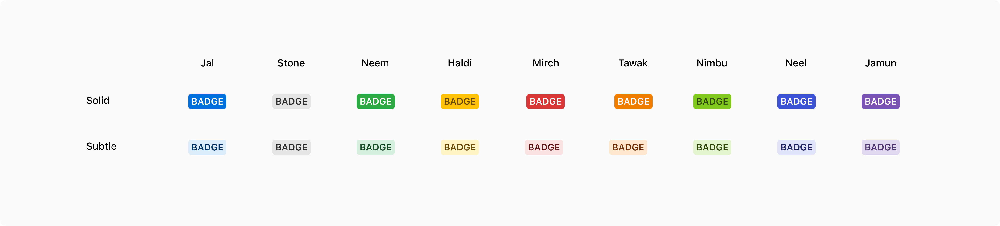

Badges contain short labels that help in 'tagging' entities. The container of a badge is rounded at the corners.
 

### Types
 

#### Solid

Solid badges are used to highlight important information on the page so that they can be recognized easily. They use solid color to easily pop out in a page.

#### Subtle

Subtle badges are used when a lot of entities on a single page need tagging/labeling. In that case, using solid badges becomes a bit overwhelming e.g. tags in a list. This is why subtle badges use the lightest shade of the colors.

 

### Appearances
A badge comes in 9 appearances.

 

### Properties
<table style="width: 100%">
  <tbody>
    <tr>
      <th style="width:33%; text-align: left;">Property</th>
      <th style="width:33%; text-align: left;">Value(s)</th>
      <th style="width:33%; text-align: left;">Default value</th>
    </tr>
    <tr style="vertical-align: top">
      <td>Appearance</td>
      <td>
          <ul>
              <li>Jal</li>
              <li>Stone</li>
              <li>Neem</li>
              <li>Haldi</li>
              <li>Mirch</li>
              <li>Tawak</li>
              <li>Nimbu</li>
              <li>Neel</li>
              <li>Jamun</li>
          </ul>
      </td>
      <td>-</td>
    </tr>
    <tr style="vertical-align: top">
      <td>Subtle <em>(optional)</em></td>
      <td>
          <ul>
              <li>True</li>
              <li>False</li>
          </ul>
      </td>
      <td>-</td>
    </tr>
    <tr style="vertical-align: top">
      <td>Max width</td>
      <td>160px</td>
      <td>-</td>
    </tr>
    <tr style="vertical-align: top">
      <td>Corner radius</td>
      <td>3px</td>
      <td>-</td>
    </tr>
    <tr style="vertical-align: top">
      <td>Padding <em>(top, right, bottom, left)</em></td>
      <td>2px, 4px, 2px, 4px</td>
      <td>-</td>
    </tr>
  </tbody>
</table>
 

### Usage
 

#### Badges vs. Pills
Badges are used for tagging entities while pills are very specifically used to display the count of entities.

 

#### Badge vs. Status hint
A badge is used to tag the entities whereas a status hint is used to indicate the status of an entity. 

