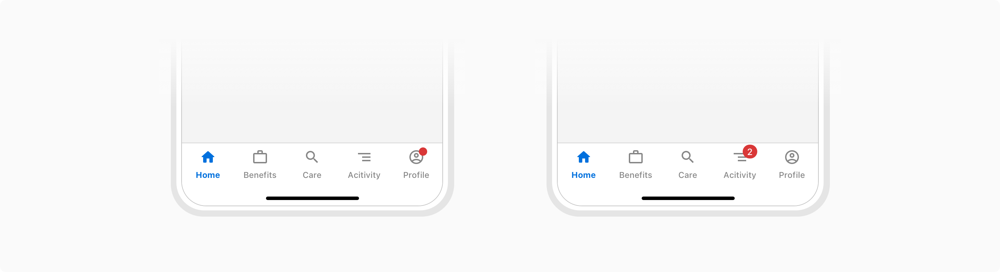
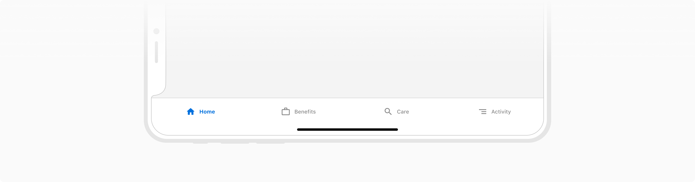
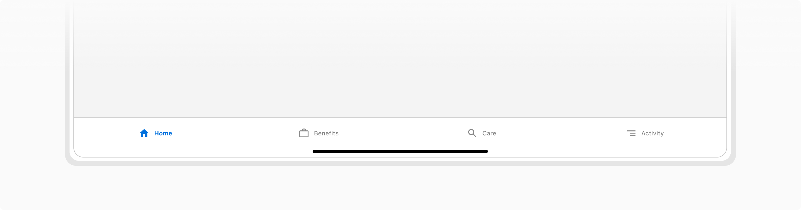

Bottom navigation allows the user to switch between top-level navigations of an app quickly. It is anchored to the bottom of the screen. 

### Structure

Bottom navigation consists of at least 2 tabs with one of the tabs in the active state. Each tab consists of an icon and a label. The background color is **Namak** in correspondence to the Header.

 
 

### Sizes

 

#### Regular height

It is used for **Mobile- Portrait orientation.**

 

#### Compact height

To maximize screen utilization, Bottom Navigation with compact height is used for -

-   Mobile - Landscape orientation
-   Tablets - Portrait & Landscape orientations.

 
 

### Properties

 

<Card shadow='none'>
  <Table
    showMenu={false}
    separator={true}
    data={[
      {
        Property: 'Width',
        Value: 'Full width',
        Configurable: '❌',
      },
      {
        Property: 'Height',
        Value: 'One of the two fixed heights - Regular and Compact',
        Configurable: '❌',
      },
      {
        Property: 'Background color',
        Value: 'Namak',
        Configurable: '❌',
      },
      {
        Property: 'Notification',
        Value: 'Without count and With count',
        Configurable: '-',
      },
      {
        Property: 'Number of tabs',
        Value: '2-5',
        Configurable: '✅',
      },
      {
        Property: 'Divider',
        Value: 'Header divider',
        Configurable: '❌',
      },
    ]}
    schema={[
      {
        name: 'Property',
        displayName: 'Property',
        width: '34%',
        sorting: false,
        separator: true,
        cellType: 'DEFAULT'
      },
      {
        name: 'Value',
        displayName: 'Value',
        width: '33%',
        sorting: false,
        separator: true
        
      },
      {
        name: 'Configurable',
        displayName: 'Configurable?',
        width: '33%',
        sorting: false,
        separator: true
      },
    ]}
    withHeader={false}
  />
</Card>
 
 

### Usage

 

#### Tab label

Keep the label of the tab concise, typically limiting it to a single word. It should convey the purpose along with the icon. 
Refrain from truncating, shrinking, or wrapping text. 

*Do and don't*
 

#### Number of tabs

Bottom Navigation consists of at least 2 tabs with one in the active state at any point in time. Too many tabs reduce the tappable area. For more than 5 tabs, add a 'More' tab.

 

For more than 5 tabs, encapsulate the less prominant tabs in a 'More' tab

 
 

#### Showing notifications

Tabs can show notifications to indicate the availability of new information. There are two options available -

• Without count - It consists of a red dot.

• With count - It consists of a Pill to display a number.

 
 

#### Scrolling behavior

Bottom navigation consists of the same tabs throughout the app to reduce cognitive load. It stays visible by default while scrolling but can be configured to hide in order to offer maximum viewable content while scrolling.

 

#### Mobile & Tablet Orientation

 

-   Portrait orientation in Mobile uses regular height

 

-   Landscape orientation in Mobile uses compact height

 

-   Portrait orientation in Tablet uses compact height

 

-   Landscape orientation in Tablet uses compact height

 
 