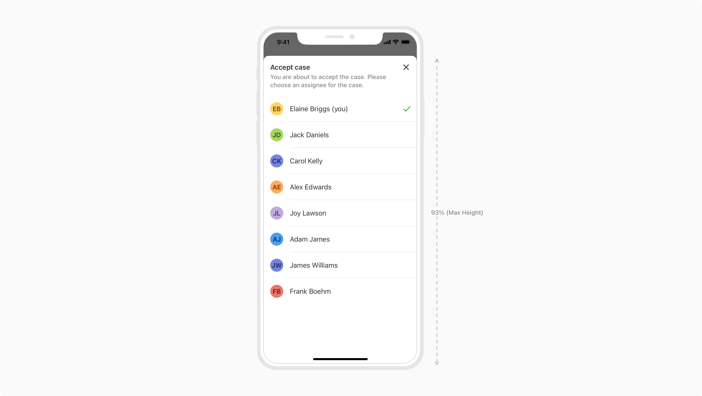
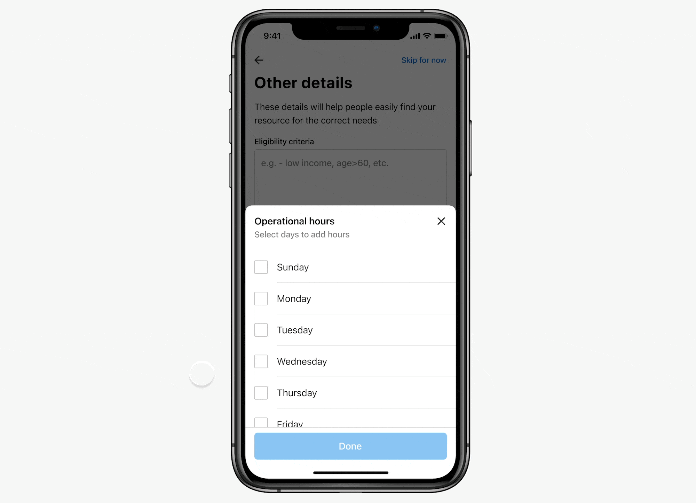

Bottom sheets are containers with content that supplements the screen's primary content. It allows people to perform a distinct task that’s related to the parent view without taking them away from their current context.

These sheets display as a result of a user-initiated action. They slide up from the bottom of the screen to reveal additional information and can be dismissed in order to resume the work in the parent flow. 

### Types

 

#### Modal bottom sheet

A sheet of this type appears above other UI elements and must be 
dismissed in order to interact with the underlying content. As indicated by the 
name this sheet will appear along with an overlay to dim the background, giving 
focus to the bottom sheet. Such sheets are dismissible in nature and hence contain a 'Close' action at the top right.

 
 

#### Non-Modal bottom sheet

This sheet displays in-app content that supplements the main view and co-exists with the main UI. It remains visible even when not actively in use, resting at the same elevation as an app. 

Non-modal sheets can either be dismissible or non-dismissible in nature depending upon the use case. Such sheets are great when you have supplementary actions for people to use without pausing the main task.

 
 

### Properties

 

<Card shadow='none'>
  <Table
    showMenu={false}
    separator={true}
    data={[
      {
        Property: 'Height',
        Value: 'The height can take following values: "Up to 60%" and "93%"',
        Configurable: '❌',
      },
      {
        Property: 'Width',
        Value: 'Full Width',
        Configurable: '❌',
      },
      {
        Property: 'Heading',
        Value: '<Heading>',
        Configurable: '❌',
      },
      {
        Property: 'Subheading',
        Value: '<Subheading>',
        Configurable: 'Optional',
      },
      {
        Property: 'Divider',
        Value: '-',
        Configurable: 'Optional',
      },
    ]}
    schema={[
      {
        name: 'Property',
        displayName: 'Property',
        width: '34%',
        sorting: false,
        separator: true,
        cellType: 'DEFAULT'
      },
      {
        name: 'Value',
        displayName: 'Value',
        width: '33%',
        sorting: false,
        separator: true
        
      },
      {
        name: 'Configurable',
        displayName: 'Configurable?',
        width: '33%',
        sorting: false,
        separator: true
      },
    ]}
    withHeader={false}
  />
</Card>
 
 

### Usage

 

#### Height Constraints

There are two types of heights a bottom sheet can have -

-   **Half View - Variable height (up to a max of 60% screen height)** 

In this case, height of the sheet will depend on the content it is accommodating. This dynamic height can go up to 60% of screen height in order to provide easy access to the topmost actions, allowing progressive disclosure of the sheet’s content.

-   **Full View - Fixed maximum height (93% of screen height)** 

This sheet spans across most of the screen height and is suitable for large content.
If in case 1 above, the height of the data cannot be predicted i.e. the data can be scrollable or not, it is recommended to transition the 60% height to 93% when a user starts scrolling.

**Note - The figures of 60% and 93% were chosen to maximize the available area for content.**

Based on the content, the bottom sheet can adjust it's height upto 60% of the screen height.

 

Sheet spanning across most of the screen height, suitable for large content.

 
 

#### Scrolling Behaviour

The height of the bottom sheet can be adjusted by scrolling upwards/downwards on the sheet to take up more of the viewport. Bottom sheets whose contents exceed 60% of the screen height can be pulled across the full screen (93% of the overall height), and then scrolling internally.

At the time of scrolling, the header sticks to the top of the sheet having a header divider, whereas the content below it scrolls. 

<Card shadow='none'>
  <Table
    showMenu={false}
    separator={true}
    data={[
      {
        Property: 'Under 60% of screen height',
        Value: 'Matches the content height',
        Configurable: 'No scrolling needed',
      },
      {
        Property: 'Greater than 60% of screen height',
        Value: 'Recommend default: 60% of screen height, After scroll: 93% of screen height',
        Configurable: 'On scroll, the sheet expands to its max height and scrolls content internally',
      },
    ]}
    schema={[
      {
        name: 'Property',
        displayName: 'Content',
        width: '30%',
        sorting: false,
        separator: true,
        cellType: 'DEFAULT'
      },
      {
        name: 'Value',
        displayName: 'Sheet Height',
        width: '40%',
        sorting: false,
        separator: true
        
      },
      {
        name: 'Configurable',
        displayName: 'Scrolling Behaviour',
        width: '30%',
        sorting: false,
        separator: true
      },
    ]}
    withHeader={false}
  />
</Card>
 
 

 
 
 

#### Dismissible vs Non-Dismissible Sheet

 

<Card shadow='none'>
  <Table
    showMenu={false}
    separator={true}
    data={[
      {
        Property: 'Dismissible always',
        Value: 'Dismissible or non-dismissible depending on the use case',
      },
    ]}
    schema={[
      {
        name: 'Property',
        displayName: 'Modal sheet',
        width: '30%',
        sorting: false,
        separator: true,
        cellType: 'DEFAULT'
      },
      {
        name: 'Value',
        displayName: 'Non-modal sheet',
        width: '70%',
        sorting: false,
        separator: true
        
      },
    ]}
    withHeader={false}
  />
</Card>
 
 

#### Dismissing a Bottom Sheet

Bottom sheets can be dismissed in the following ways: 

##### Close Button

Sheets can be closed by clicking the close affordance in the header of the bottom sheets. 

##### Tapping the overlay

Modal Sheets can also be closed by clicking on the overlay behind sheets.

 

#### Resizing a sheet with drag handle

A non-modal sheet can be dismissible or not. In case it is not, the users can drag or flick the sheet from the handle bar area to resize and snap it to different heights.

A drag handle **must not be** used to drag down to close a sheet.

 

#### Bottom Sheet vs Page

A page takes people to a whole new space detaching them from the parent flow, whereas a sheet allows part of the parent view to remain visible behind it, helping people retain their original context as they interact with the sheet. 

Bottom sheets should not have complex flows in them. For complex and multi-step flows consider using pages. 

*Do Don't iamge*