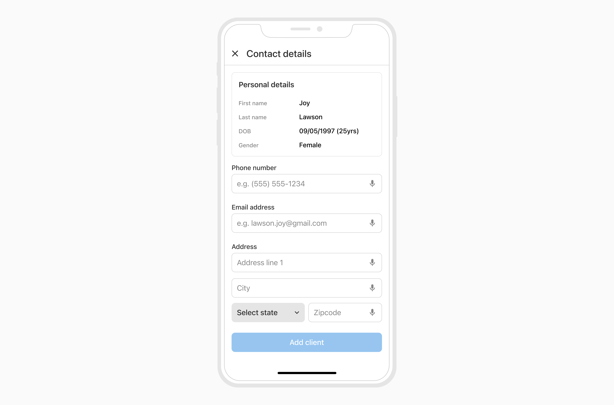
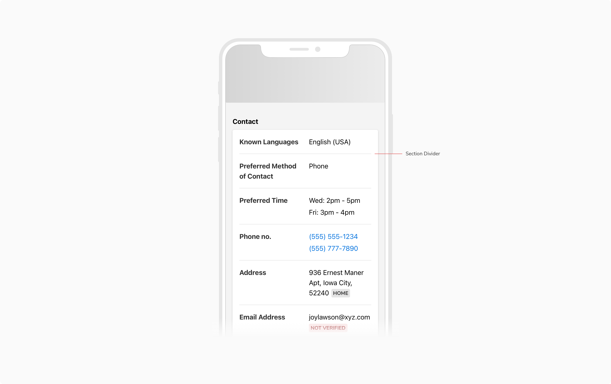
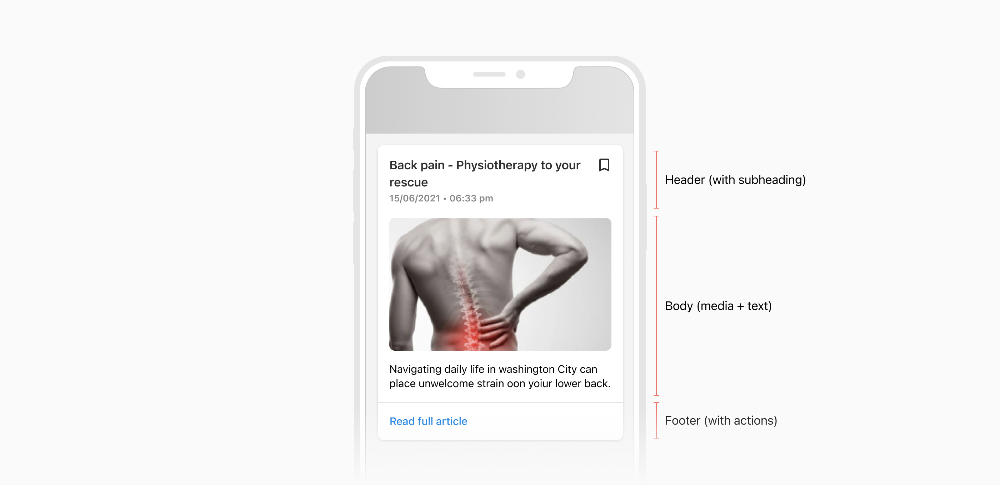
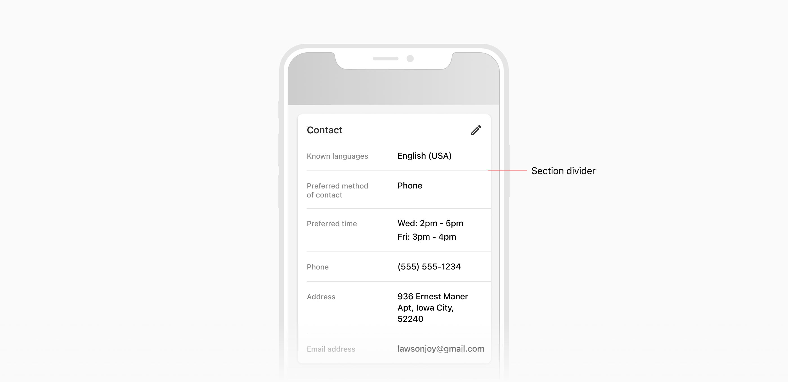

Cards act as containers to group related information and actions together. Elements like text and images should be placed inside cards in a way that clearly indicates hierarchy.

### Types

 

#### Default card
Default card is the most used type of card. It consists of a shadow, Shadow 10 by default.

#### Flat card
Flat card is used to either create sections within a default card i.e. card inside a card or use cards on screens with white background.

#### High shadow
High shadow cards are recommended to use when the screen consists of only card type entities. It consists of a shadow, Shadow 40. 

 
 

### Properties

 

<table style="width: 100%">
  <tbody>
    <tr>
      <th style="width:33%; text-align: left;">Property</th>
      <th style="width:33%; text-align: left;">Value(s)</th>
      <th style="width:33%; text-align: left;">Default value</th>
    </tr>
    <tr style="vertical-align: top">
      <td>Style</td>
      <td>
        <ul>
          <li>Shadow 0 (Flat card)</li>
          <li>Shadow 10 (Default shadow)</li>
          <li>Shadow 40 (High shadow)</li>
        </ul>
      </td>
      <td>Shadow 10 (Default shadow)</td>
    </tr>
    <tr style="vertical-align: top">
      <td>Corner Radius</td>
      <td>8px</td>
      <td>-</td>
    </tr>
  </tbody>
</table>

 
 

### Usage

 

#### Card Structure

The umbrella view of the card consists of a **header** at the top, the **body**, and the **footer** at the bottom. 
These elements are not always mandatory and can be customized according to the requirements.

 

##### Templates

We recommend some templates to fasten up the whole design process. 
All the elements(except the card header) are optional and can be omitted according to the requirements. 

 

#### Card with Sections

A card can have multiple sections to show related but distinct information. 
A divider can be used to separate different sections in a card.

 
 

#### Usage of high shadow cards

High shadow cards are recommended to use when the screen consists of only card type entities. 

For screens where the content is the combination of cards, lists, etc it is not recommended to use the high shadow cards to avoid the inconsistency in the actual and the visual hierarchies of the entities. 

**Note:** In the example below, the image on the left has only cards hence is a use case for High shadow cards. Whereas in the image on right, using high shadow cards convey a different visual hierarchy for both, the list and the card, even though they are on the same level of information hierarchy. 

 