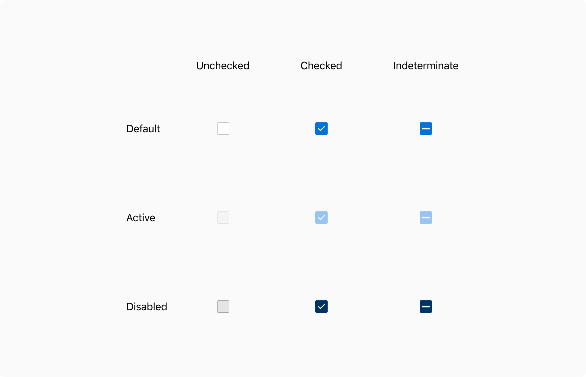
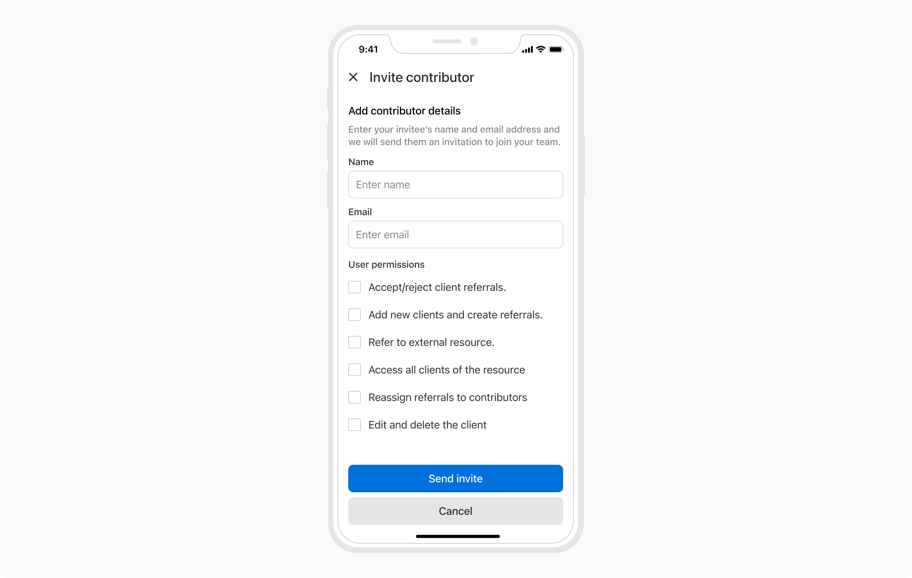
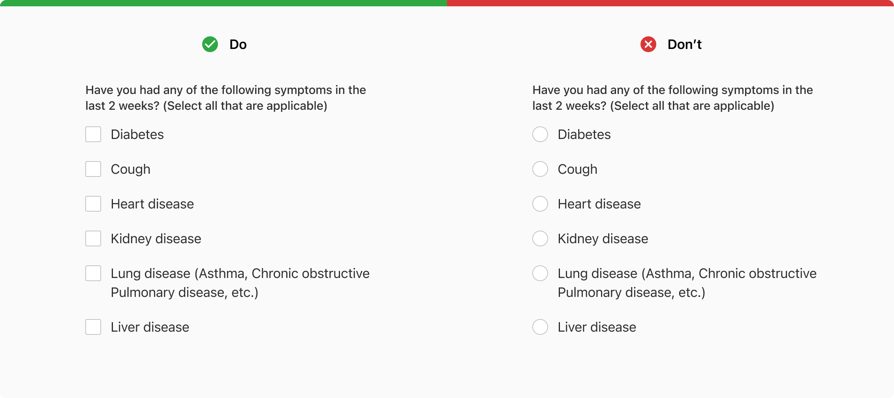
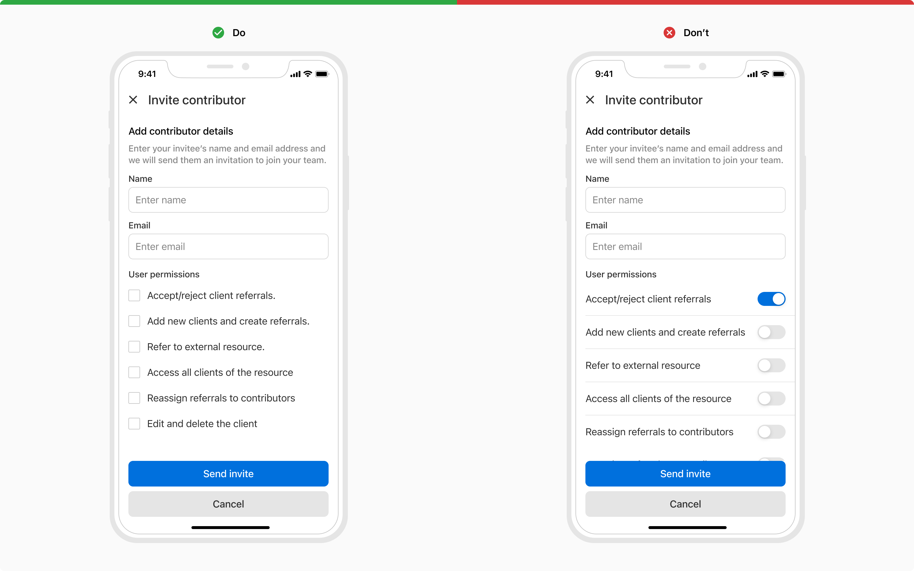
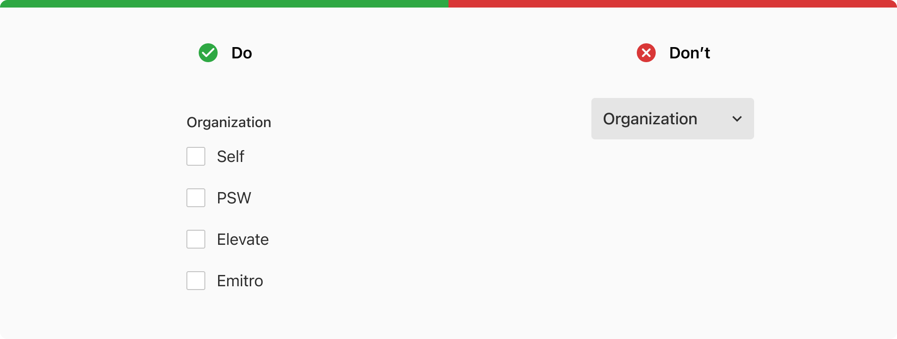

A checkbox lets users select one or more values from a list of options. Options are not mutually exclusive here so the selection of any option won’t affect the other.

### Variants

#### Default

The default variant comes with a label along with the checkbox control. This entire combination of checkbox control and label is tappable to change the checkbox selection.

 

#### With help text

The checkbox can have a help text below the label to provide additional information about that particular option. The help text will always be aligned with the label. 

Tapping over the help text does not change the state of the checkbox.

 
 

### States

Checkboxes can be checked, unchecked, or indeterminate. Each of the selections has default, active and disabled states. 

 

### Properties

### Usage

#### Checkbox group

The checkbox group consists of a list of multiple options, with a label on the top. The label should clearly state the grouping category or the action to perform.

> Note: Minimum spacing between multiple options as well as the 1st option and group label should be 0px.

 

 

#### Options alignment

The options in a radio group can be aligned either vertically or horizontally. 

##### Vertical 

For vertical alignment, all the options of the checkbox group align vertically with one option in a line. This type of arrangement should be preferred over the horizontal arrangement for easier reading and scanning.

 

##### Horizontal

For horizontal alignment, all the options of the checkbox group align horizontally in a single line. Make sure to space the options appropriately so that it is clear which control goes with which label. 

If there are too many options it is not advisable to go for this type of arrangement because of less horizontal space available.

 

#### Nesting

Checkboxes can be nested in case of a list having sub-sections. The parent remains unchecked if no child is checked. 

The indeterminate state of the parent shows a partially checked state when there is a nested relationship. The parent checkbox will remain indeterminate until all of its child checkboxes are checked.

 

#### Overflow behavior

If the label or the help text with the checkbox component overflows, wrap it to the next line but make sure that the control and the label are top aligned.

 

#### Checkbox vs radio

Checkboxes allow users to select multiple options whereas radio allows only one selection from a list of mutually exclusive options.

 

#### Checkbox vs Switch

Consider using a checkbox instead of a switch when a confirmation action is required to apply the changes. For example in forms etc. 

 

#### Checkbox vs dropdown

The checkbox is recommended to use when there are fewer than 5-7 options as it is easier for users to compare and select the appropriate option and save an additional tap. 

However, if the number of options exceeds 5-7 or if the space is limited and the options can be collapsed then it is recommended to use dropdowns to utilize the space.

 

