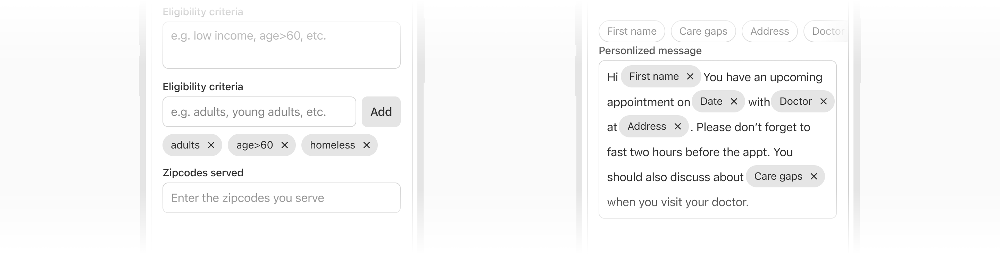
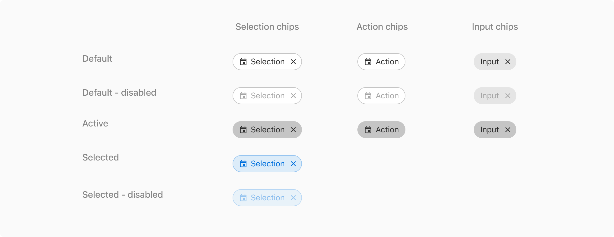
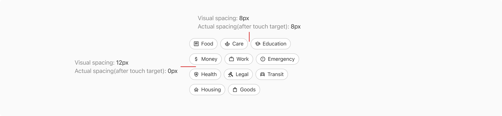

Chips are compact interactive elements that allow users to make selections, filter content, or trigger actions. Since they mostly appear in a group, they are compact in size and come to the rescue when regular components are either too overwhelming (e.g. buttons for selection) or too underwhelming (e.g. dropdowns for applied filters).

 

### Types

 

#### Selection Chips

Selection chips are used to let the users select one or many options from a group and the effect is immediate. Do not provide a single option for selection.

For example - applying filters on a page. In that case, as soon as a selection chip is clicked, the filtered results are shown.

 

#### Input Chips

Input chips are used inside inputs to behave as removable entries or tags.

 

#### Action Chips

Action chips are used when there is a group of related actions to perform. These actions are dynamic and contextual to the content.

 
 

### Variants

 

#### With icon on left

Chips can have an optional icon on the left preceding the label.

 

#### With remove button

Selection and input chips can have a remove button on the right of the label to remove them from the view.

![[Left] Selection chip vs [Right] Input chip](./images/mchips-5.png)

 
 

### Properties

 

<Card shadow='none'>
  <Table
    showMenu={false}
    separator={true}
    data={[
      {
        Property: 'Width',
        Value: '<width>',
        Configurable: '-',
      },
      {
        Property: 'Height',
        Value: '32px',
        Configurable: '❌',
      },
      {
        Property: 'Label',
        Value: '<label>',
        Configurable: '-',
      },
      {
        Property: 'Icon on left',
        Value: '<icon>',
        Configurable: 'Optional',
      },
      {
        Property: 'Remove icon button on right',
        Value: 'Icon name: close',
        Configurable: 'Optional',
      },
      {
        Property: 'Gradient while scrolling',
        Value: 'Height: 32px, Width: 40px Background: linear-gradient(90deg, rgba(244, 244, 244, 0) 0%, #F4F4F4 100%) or linear-gradient(90deg, rgba(255, 255, 255, 0) 0%, #FFFFFF 100%) "Background of the gradient must match the page background color."',
        Configurable: '❌',
      },
    ]}
    schema={[
      {
        name: 'Property',
        displayName: 'Property',
        width: '34%',
        sorting: false,
        separator: true,
        cellType: 'DEFAULT'
      },
      {
        name: 'Value',
        displayName: 'Value',
        width: '33%',
        sorting: false,
        separator: true
        
      },
      {
        name: 'Configurable',
        displayName: 'Configurable?',
        width: '33%',
        sorting: false,
        separator: true
      },
    ]}
    withHeader={false}
  />
</Card>
 
 

### States

Chips have the **default**, **disabled**, and **active** states. In addition to the aforementioned states, the selection chip also has the **selected** and **selected-disabled** states.

 
 

### Usage

 

#### Selection vs action vs input chips

 

<Card shadow='none'>
  <Table
    showMenu={false}
    separator={true}
    data={[
      {
        Property: 'Selection Chip',
        Value: 'Used to select from many and apply filters',
        Configurable: 'Removable',
      },
      {
        Property: 'Action Chip',
        Value: 'To perform actions related to the primary content',
        Configurable: 'Non-removable',
      },
      {
        Property: 'Input Chip',
        Value: 'To behave as removable tags in inputs',
        Configurable: 'Removable',
      },
    ]}
    schema={[
      {
        name: 'Property',
        displayName: 'Type',
        width: '20%',
        sorting: false,
        separator: true,
        cellType: 'DEFAULT'
      },
      {
        name: 'Value',
        displayName: 'Usage',
        width: '60%',
        sorting: false,
        separator: true
        
      },
      {
        name: 'Configurable',
        displayName: 'Behaviour',
        width: '20%',
        sorting: false,
        separator: true
      },
    ]}
    withHeader={false}
  />
</Card>
 
 

#### Chips group

Chips are compact elements and hence are best suitable to be used in groups with the horizontal spacing of `8px` and vertical spacing of `0px` between chips as the tappable area already goes beyond the visible vertical boundaries.

 
 

#### Overflow behavior

 

##### Wrapped to next line

Chips in a chip group can wrap to a new row if all the chips need to be visible. However, if there are more than two rows, consider using horizontal scrolling to save the vertical space.

 

##### Scrollable

The chips group can scroll horizontally if the width exceeds the viewport. A linear gradient shows up on the edges to indicate the overflowed chips.

**[Img 1]** Scroll indication in right 

**[Img 2]** Scroll indication in both sides

**[Img 3]** Scroll indication in left

![[Img 1] Scroll indication in right vs [Img 2] Scroll indication in both sides vs [Img 3] Scroll indication in left](./images/mchips-9.png)

 

**Note: It is not recommended to use wrapping and scrolling at the same time.**

 

#### Action chips vs buttons

The number and label of action chips are contextual to the content and appear dynamically as a group of multiple interactive elements, while buttons are expected to appear consistently and with a familiar call to action.

**Note: In the example below, the actions change depending upon the context of the chat, hence depicted by action chips. On the other hand while adding a new reminder, the actions at the bottom are always fixed in terms of number and the label. They are not contextual to the content and hence depicted by buttons.**

**[Left]** Action chips

**[Right]** Buttons at the bottom

![[Left] Action chips vs [Right] Buttons at the bottom](./images/mchips-10.png)

 

#### Selection chips vs radio/checkbox

Selection chips generally provide an immediate response but in forms where there is a space crunch, they can replace radio and checkboxes in order to display all the available options in a compact area.

**Note:In the example below using selection chips instead of radio and checkboxes saves a lot of space.**

**[Left - Recommended]** Example using selection chips

**[Right]** Example using radio and checkboxes

![[Left - Recommended] Example using selection chips vs [Right] Example using radio and checkboxes](./images/mchips-11.png)

 
 