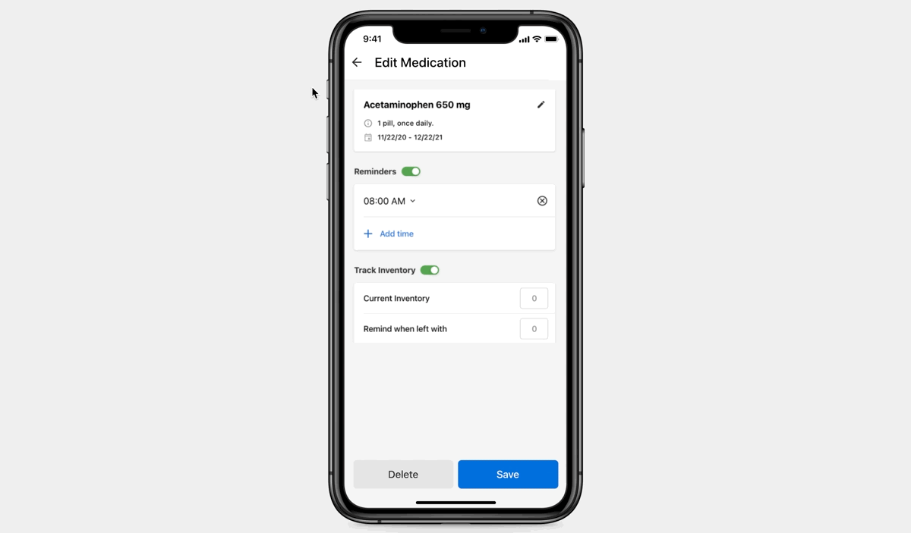
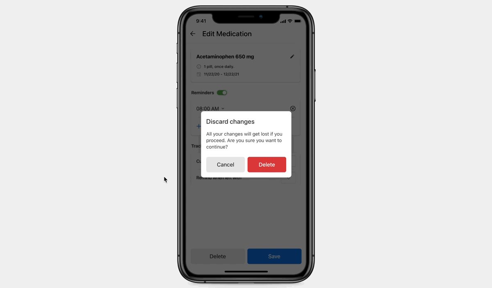
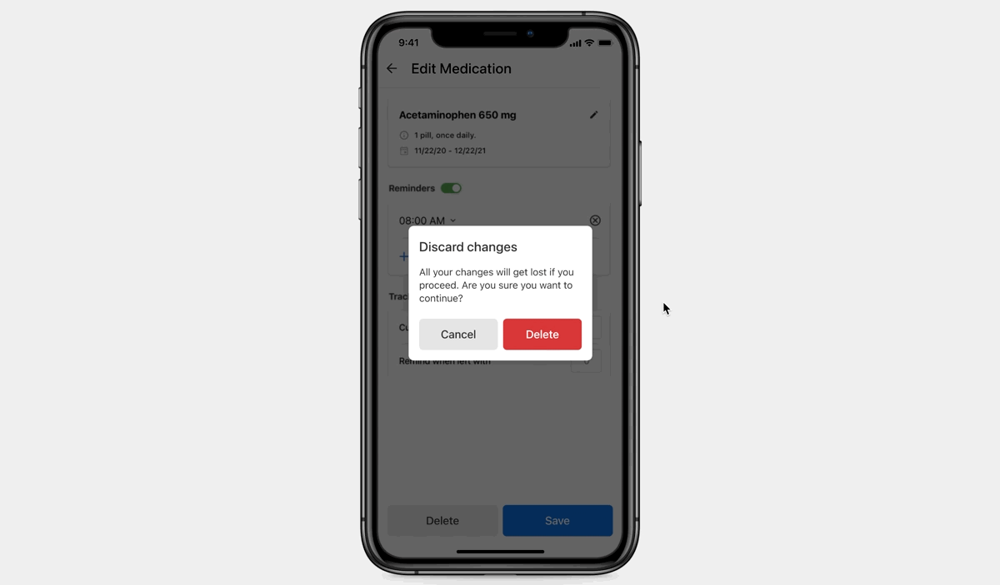
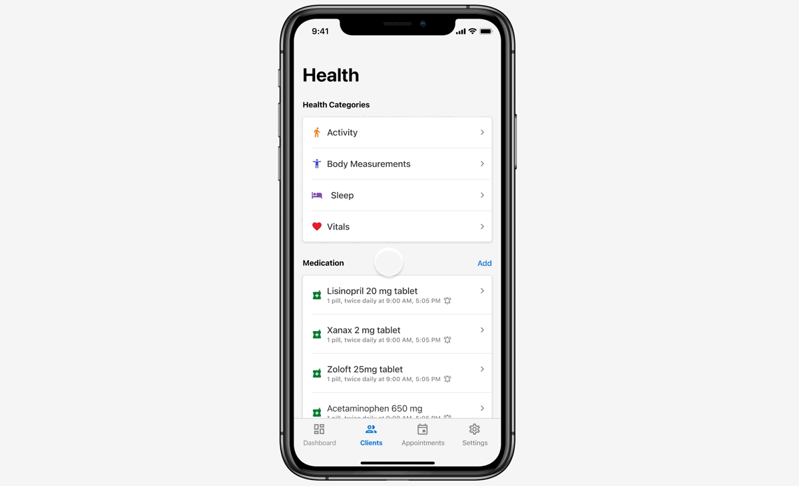

### Basic Dialog

 

#### Opening a Modal Bottom sheet

 

 
 

**Dialog**

<Card shadow='none'>
  <Table
    showMenu={false}
    separator={true}
    data={[
      {
        Property: 'Relative Position Y',
        Initial: '+20px',
        Final: '0px',
      },
      {
        Property: 'Opacity',
        Initial: '0',
        Final: '100',
      },
    ]}
    schema={[
      {
        name: 'Property',
        displayName: 'Property',
        width: '34%',
        sorting: false,
        separator: true,
        cellType: 'DEFAULT'
      },
      {
        name: 'Initial',
        displayName: 'Initial state',
        width: '33%',
        sorting: false,
        separator: true,
      },
      {
        name: 'Final',
        displayName: 'Final state',
        width: '33%',
        sorting: false,
        separator: true,
      },
    ]}
    withHeader={false}
  />
</Card>
 

**Motion**

<Card shadow='none'>
  <Table
    showMenu={false}
    separator={true}
    data={[
      {
        Curve: 'Expressive Motion',
        Duration: 'Entrance Easing',
      }
    ]}
    schema={[
      {
        name: 'Curve',
        displayName: 'Style of Motion',
        width: '50%',
        sorting: false,
        separator: true,
      },
      {
        name: 'Duration',
        displayName: 'Easing',
        width: '50%',
        sorting: false,
        separator: true
      },
    ]}
    withHeader={false}
  />
</Card>
 

**Curve**

<Card shadow='none'>
  <Table
    showMenu={false}
    separator={true}
    data={[
      {
        Curve: 'cubic-bezier(0, 0, 0.3, 1)',
        Duration: '120ms',
      }
    ]}
    schema={[
      {
        name: 'Curve',
        displayName: 'Curve',
        width: '50%',
        sorting: false,
        separator: true,
        cellRenderer: ({ data }) => {
          return <Rectangle name={data.Curve} />;
        },
      },
      {
        name: 'Duration',
        displayName: 'Duration',
        width: '50%',
        sorting: false,
        separator: true
        
      },
    ]}
    withHeader={false}
  />
</Card>
 
 

**Overlay**

<Card shadow='none'>
  <Table
    showMenu={false}
    separator={true}
    data={[
      {
        Property: 'Opacity',
        Initial: '0%',
        Final: '100%',
      },
    ]}
    schema={[
      {
        name: 'Property',
        displayName: 'Property',
        width: '34%',
        sorting: false,
        separator: true,
        cellType: 'DEFAULT'
      },
      {
        name: 'Initial',
        displayName: 'Initial state',
        width: '33%',
        sorting: false,
        separator: true,
      },
      {
        name: 'Final',
        displayName: 'Final state',
        width: '33%',
        sorting: false,
        separator: true,
      },
    ]}
    withHeader={false}
  />
</Card>
 

**Motion**

<Card shadow='none'>
  <Table
    showMenu={false}
    separator={true}
    data={[
      {
        Curve: 'Expressive Motion',
        Duration: 'Entrance Easing',
      }
    ]}
    schema={[
      {
        name: 'Curve',
        displayName: 'Style of Motion',
        width: '50%',
        sorting: false,
        separator: true,
      },
      {
        name: 'Duration',
        displayName: 'Easing',
        width: '50%',
        sorting: false,
        separator: true
      },
    ]}
    withHeader={false}
  />
</Card>
 

**Curve**

<Card shadow='none'>
  <Table
    showMenu={false}
    separator={true}
    data={[
      {
        Curve: 'cubic-bezier(0, 0, 0.3, 1)',
        Duration: '120ms',
      }
    ]}
    schema={[
      {
        name: 'Curve',
        displayName: 'Curve',
        width: '50%',
        sorting: false,
        separator: true,
        cellRenderer: ({ data }) => {
          return <Rectangle name={data.Curve} />;
        },
      },
      {
        name: 'Duration',
        displayName: 'Duration',
        width: '50%',
        sorting: false,
        separator: true
        
      },
    ]}
    withHeader={false}
  />
</Card>
 
 

#### Closing a Bottom sheet

 

##### When the action takes the users back

 

 
 

**Dialog**

<Card shadow='none'>
  <Table
    showMenu={false}
    separator={true}
    data={[
      {
        Property: 'Relative Position Y',
        Initial: '0px',
        Final: '+20px',
      },
      {
        Property: 'Opacity',
        Initial: '100%',
        Final: '0',
      },
    ]}
    schema={[
      {
        name: 'Property',
        displayName: 'Property',
        width: '34%',
        sorting: false,
        separator: true,
        cellType: 'DEFAULT'
      },
      {
        name: 'Initial',
        displayName: 'Initial state',
        width: '33%',
        sorting: false,
        separator: true,
      },
      {
        name: 'Final',
        displayName: 'Final state',
        width: '33%',
        sorting: false,
        separator: true,
      },
    ]}
    withHeader={false}
  />
</Card>
 

**Motion**

<Card shadow='none'>
  <Table
    showMenu={false}
    separator={true}
    data={[
      {
        Curve: 'Expressive Motion',
        Duration: 'Exit Easing',
      }
    ]}
    schema={[
      {
        name: 'Curve',
        displayName: 'Style of Motion',
        width: '50%',
        sorting: false,
        separator: true,
      },
      {
        name: 'Duration',
        displayName: 'Easing',
        width: '50%',
        sorting: false,
        separator: true
      },
    ]}
    withHeader={false}
  />
</Card>
 

**Curve**

<Card shadow='none'>
  <Table
    showMenu={false}
    separator={true}
    data={[
      {
        Curve: 'cubic-bezier(0.4, 0.14, 1, 1)',
        Duration: '120ms',
      }
    ]}
    schema={[
      {
        name: 'Curve',
        displayName: 'Curve',
        width: '50%',
        sorting: false,
        separator: true,
        cellRenderer: ({ data }) => {
          return <Rectangle name={data.Curve} />;
        },
      },
      {
        name: 'Duration',
        displayName: 'Duration',
        width: '50%',
        sorting: false,
        separator: true
        
      },
    ]}
    withHeader={false}
  />
</Card>
 
 

**Overlay**

<Card shadow='none'>
  <Table
    showMenu={false}
    separator={true}
    data={[
      {
        Property: 'Opacity',
        Initial: '100%',
        Final: '0',
      },
    ]}
    schema={[
      {
        name: 'Property',
        displayName: 'Property',
        width: '34%',
        sorting: false,
        separator: true,
        cellType: 'DEFAULT'
      },
      {
        name: 'Initial',
        displayName: 'Initial state',
        width: '33%',
        sorting: false,
        separator: true,
      },
      {
        name: 'Final',
        displayName: 'Final state',
        width: '33%',
        sorting: false,
        separator: true,
      },
    ]}
    withHeader={false}
  />
</Card>
 

**Motion**

<Card shadow='none'>
  <Table
    showMenu={false}
    separator={true}
    data={[
      {
        Curve: 'Expressive Motion',
        Duration: 'Exit Easing',
      }
    ]}
    schema={[
      {
        name: 'Curve',
        displayName: 'Style of Motion',
        width: '50%',
        sorting: false,
        separator: true,
      },
      {
        name: 'Duration',
        displayName: 'Easing',
        width: '50%',
        sorting: false,
        separator: true
      },
    ]}
    withHeader={false}
  />
</Card>
 

**Curve**

<Card shadow='none'>
  <Table
    showMenu={false}
    separator={true}
    data={[
      {
        Curve: 'cubic-bezier(0.4, 0.14, 1, 1)',
        Duration: '120ms',
      }
    ]}
    schema={[
      {
        name: 'Curve',
        displayName: 'Curve',
        width: '50%',
        sorting: false,
        separator: true,
        cellRenderer: ({ data }) => {
          return <Rectangle name={data.Curve} />;
        },
      },
      {
        name: 'Duration',
        displayName: 'Duration',
        width: '50%',
        sorting: false,
        separator: true
        
      },
    ]}
    withHeader={false}
  />
</Card>
 
 

##### When the action takes the users forward

 

 
 

**Dialog**

<Card shadow='none'>
  <Table
    showMenu={false}
    separator={true}
    data={[
      {
        Property: 'Relative Position Y',
        Initial: '0px',
        Final: '-20px',
      },
      {
        Property: 'Opacity',
        Initial: '100%',
        Final: '0',
      },
    ]}
    schema={[
      {
        name: 'Property',
        displayName: 'Property',
        width: '34%',
        sorting: false,
        separator: true,
        cellType: 'DEFAULT'
      },
      {
        name: 'Initial',
        displayName: 'Initial state',
        width: '33%',
        sorting: false,
        separator: true,
      },
      {
        name: 'Final',
        displayName: 'Final state',
        width: '33%',
        sorting: false,
        separator: true,
      },
    ]}
    withHeader={false}
  />
</Card>
 

**Motion**

<Card shadow='none'>
  <Table
    showMenu={false}
    separator={true}
    data={[
      {
        Curve: 'Expressive Motion',
        Duration: 'Exit Easing',
      }
    ]}
    schema={[
      {
        name: 'Curve',
        displayName: 'Style of Motion',
        width: '50%',
        sorting: false,
        separator: true,
      },
      {
        name: 'Duration',
        displayName: 'Easing',
        width: '50%',
        sorting: false,
        separator: true
      },
    ]}
    withHeader={false}
  />
</Card>
 

**Curve**

<Card shadow='none'>
  <Table
    showMenu={false}
    separator={true}
    data={[
      {
        Curve: 'cubic-bezier(0.4, 0.14, 1, 1)',
        Duration: '120ms',
      }
    ]}
    schema={[
      {
        name: 'Curve',
        displayName: 'Curve',
        width: '50%',
        sorting: false,
        separator: true,
        cellRenderer: ({ data }) => {
          return <Rectangle name={data.Curve} />;
        },
      },
      {
        name: 'Duration',
        displayName: 'Duration',
        width: '50%',
        sorting: false,
        separator: true
        
      },
    ]}
    withHeader={false}
  />
</Card>
 
 

**Overlay**

<Card shadow='none'>
  <Table
    showMenu={false}
    separator={true}
    data={[
      {
        Property: 'Opacity',
        Initial: '100%',
        Final: '0',
      },
    ]}
    schema={[
      {
        name: 'Property',
        displayName: 'Property',
        width: '34%',
        sorting: false,
        separator: true,
        cellType: 'DEFAULT'
      },
      {
        name: 'Initial',
        displayName: 'Initial state',
        width: '33%',
        sorting: false,
        separator: true,
      },
      {
        name: 'Final',
        displayName: 'Final state',
        width: '33%',
        sorting: false,
        separator: true,
      },
    ]}
    withHeader={false}
  />
</Card>
 

**Motion**

<Card shadow='none'>
  <Table
    showMenu={false}
    separator={true}
    data={[
      {
        Curve: 'Expressive Motion',
        Duration: 'Exit Easing',
      }
    ]}
    schema={[
      {
        name: 'Curve',
        displayName: 'Style of Motion',
        width: '50%',
        sorting: false,
        separator: true,
      },
      {
        name: 'Duration',
        displayName: 'Easing',
        width: '50%',
        sorting: false,
        separator: true
      },
    ]}
    withHeader={false}
  />
</Card>
 

**Curve**

<Card shadow='none'>
  <Table
    showMenu={false}
    separator={true}
    data={[
      {
        Curve: 'cubic-bezier(0.4, 0.14, 1, 1)',
        Duration: '120ms',
      }
    ]}
    schema={[
      {
        name: 'Curve',
        displayName: 'Curve',
        width: '50%',
        sorting: false,
        separator: true,
        cellRenderer: ({ data }) => {
          return <Rectangle name={data.Curve} />;
        },
      },
      {
        name: 'Duration',
        displayName: 'Duration',
        width: '50%',
        sorting: false,
        separator: true
        
      },
    ]}
    withHeader={false}
  />
</Card>
 
 
 

### Full-Screen Dialog

 

#### Single step

 

 
 

##### Opening the dialog

 

<Card shadow='none'>
  <Table
    showMenu={false}
    separator={true}
    data={[
      {
        Interaction: 'Move-in (↑)',
        Curve: 'Expressive Motion',
        Duration: 'Entrance Easing',
      }
    ]}
    schema={[
      {
        name: 'Interaction',
        displayName: 'Type of Interaction',
        width: '33%',
        sorting: false,
        separator: true,
      },
      {
        name: 'Curve',
        displayName: 'Style of Motion',
        width: '33%',
        sorting: false,
        separator: true,
      },
      {
        name: 'Duration',
        displayName: 'Easing',
        width: '33%',
        sorting: false,
        separator: true
      },
    ]}
    withHeader={false}
  />
</Card>
 

**Curve**

<Card shadow='none'>
  <Table
    showMenu={false}
    separator={true}
    data={[
      {
        Curve: 'cubic-bezier(0, 0, 0.3, 1)',
        Duration: '240ms',
      }
    ]}
    schema={[
      {
        name: 'Curve',
        displayName: 'Curve',
        width: '50%',
        sorting: false,
        separator: true,
        cellRenderer: ({ data }) => {
          return <Rectangle name={data.Curve} />;
        },
      },
      {
        name: 'Duration',
        displayName: 'Duration',
        width: '50%',
        sorting: false,
        separator: true
        
      },
    ]}
    withHeader={false}
  />
</Card>
 
 

##### Closing the dialog

 

<Card shadow='none'>
  <Table
    showMenu={false}
    separator={true}
    data={[
      {
        Interaction: 'Move-out (↓)',
        Curve: 'Expressive Motion',
        Duration: 'Exit Easing',
      }
    ]}
    schema={[
      {
        name: 'Interaction',
        displayName: 'Type of Interaction',
        width: '33%',
        sorting: false,
        separator: true,
      },
      {
        name: 'Curve',
        displayName: 'Style of Motion',
        width: '33%',
        sorting: false,
        separator: true,
      },
      {
        name: 'Duration',
        displayName: 'Easing',
        width: '33%',
        sorting: false,
        separator: true
      },
    ]}
    withHeader={false}
  />
</Card>
 

**Curve**

<Card shadow='none'>
  <Table
    showMenu={false}
    separator={true}
    data={[
      {
        Curve: 'cubic-bezier(0.4, 0.14, 1, 1)',
        Duration: '240ms',
      }
    ]}
    schema={[
      {
        name: 'Curve',
        displayName: 'Curve',
        width: '50%',
        sorting: false,
        separator: true,
        cellRenderer: ({ data }) => {
          return <Rectangle name={data.Curve} />;
        },
      },
      {
        name: 'Duration',
        displayName: 'Duration',
        width: '50%',
        sorting: false,
        separator: true
        
      },
    ]}
    withHeader={false}
  />
</Card>
 
 

#### Multi-step

 

 
 

##### Opening the dialog

 

<Card shadow='none'>
  <Table
    showMenu={false}
    separator={true}
    data={[
      {
        Interaction: 'Move-in (↑)',
        Curve: 'Expressive Motion',
        Duration: 'Entrance Easing',
      }
    ]}
    schema={[
      {
        name: 'Interaction',
        displayName: 'Type of Interaction',
        width: '33%',
        sorting: false,
        separator: true,
      },
      {
        name: 'Curve',
        displayName: 'Style of Motion',
        width: '33%',
        sorting: false,
        separator: true,
      },
      {
        name: 'Duration',
        displayName: 'Easing',
        width: '33%',
        sorting: false,
        separator: true
      },
    ]}
    withHeader={false}
  />
</Card>
 

**Curve**

<Card shadow='none'>
  <Table
    showMenu={false}
    separator={true}
    data={[
      {
        Curve: 'cubic-bezier(0, 0, 0.3, 1)',
        Duration: '240ms',
      }
    ]}
    schema={[
      {
        name: 'Curve',
        displayName: 'Curve',
        width: '50%',
        sorting: false,
        separator: true,
        cellRenderer: ({ data }) => {
          return <Rectangle name={data.Curve} />;
        },
      },
      {
        name: 'Duration',
        displayName: 'Duration',
        width: '50%',
        sorting: false,
        separator: true
        
      },
    ]}
    withHeader={false}
  />
</Card>
 
 

##### Navigating to the next steps 

 

<Card shadow='none'>
  <Table
    showMenu={false}
    separator={true}
    data={[
      {
        Interaction: 'Slide-in (←)',
        Curve: 'Expressive Motion',
        Duration: 'Exit Easing',
      }
    ]}
    schema={[
      {
        name: 'Interaction',
        displayName: 'Type of Interaction',
        width: '33%',
        sorting: false,
        separator: true,
      },
      {
        name: 'Curve',
        displayName: 'Style of Motion',
        width: '33%',
        sorting: false,
        separator: true,
      },
      {
        name: 'Duration',
        displayName: 'Easing',
        width: '33%',
        sorting: false,
        separator: true
      },
    ]}
    withHeader={false}
  />
</Card>
 

**Curve**

<Card shadow='none'>
  <Table
    showMenu={false}
    separator={true}
    data={[
      {
        Curve: 'cubic-bezier(0, 0, 0.3, 1)',
        Duration: '240ms',
      }
    ]}
    schema={[
      {
        name: 'Curve',
        displayName: 'Curve',
        width: '50%',
        sorting: false,
        separator: true,
        cellRenderer: ({ data }) => {
          return <Rectangle name={data.Curve} />;
        },
      },
      {
        name: 'Duration',
        displayName: 'Duration',
        width: '50%',
        sorting: false,
        separator: true
        
      },
    ]}
    withHeader={false}
  />
</Card>
 
 

##### Navigating back to the previous steps

 

<Card shadow='none'>
  <Table
    showMenu={false}
    separator={true}
    data={[
      {
        Interaction: 'Slide-out (→)',
        Curve: 'Expressive Motion',
        Duration: 'Exit Easing',
      }
    ]}
    schema={[
      {
        name: 'Interaction',
        displayName: 'Type of Interaction',
        width: '33%',
        sorting: false,
        separator: true,
      },
      {
        name: 'Curve',
        displayName: 'Style of Motion',
        width: '33%',
        sorting: false,
        separator: true,
      },
      {
        name: 'Duration',
        displayName: 'Easing',
        width: '33%',
        sorting: false,
        separator: true
      },
    ]}
    withHeader={false}
  />
</Card>
 

**Curve**

<Card shadow='none'>
  <Table
    showMenu={false}
    separator={true}
    data={[
      {
        Curve: 'cubic-bezier(0.4, 0.14, 1, 1)',
        Duration: '240ms',
      }
    ]}
    schema={[
      {
        name: 'Curve',
        displayName: 'Curve',
        width: '50%',
        sorting: false,
        separator: true,
        cellRenderer: ({ data }) => {
          return <Rectangle name={data.Curve} />;
        },
      },
      {
        name: 'Duration',
        displayName: 'Duration',
        width: '50%',
        sorting: false,
        separator: true
        
      },
    ]}
    withHeader={false}
  />
</Card>
 
 

##### Closing the dialog

 

<Card shadow='none'>
  <Table
    showMenu={false}
    separator={true}
    data={[
      {
        Interaction: 'Move-out (↓)',
        Curve: 'Expressive Motion',
        Duration: 'Exit Easing',
      }
    ]}
    schema={[
      {
        name: 'Interaction',
        displayName: 'Type of Interaction',
        width: '33%',
        sorting: false,
        separator: true,
      },
      {
        name: 'Curve',
        displayName: 'Style of Motion',
        width: '33%',
        sorting: false,
        separator: true,
      },
      {
        name: 'Duration',
        displayName: 'Easing',
        width: '33%',
        sorting: false,
        separator: true
      },
    ]}
    withHeader={false}
  />
</Card>
 

**Curve**

<Card shadow='none'>
  <Table
    showMenu={false}
    separator={true}
    data={[
      {
        Curve: 'cubic-bezier(0.4, 0.14, 1, 1)',
        Duration: '240ms',
      }
    ]}
    schema={[
      {
        name: 'Curve',
        displayName: 'Curve',
        width: '50%',
        sorting: false,
        separator: true,
        cellRenderer: ({ data }) => {
          return <Rectangle name={data.Curve} />;
        },
      },
      {
        name: 'Duration',
        displayName: 'Duration',
        width: '50%',
        sorting: false,
        separator: true
        
      },
    ]}
    withHeader={false}
  />
</Card>
 
 
 
