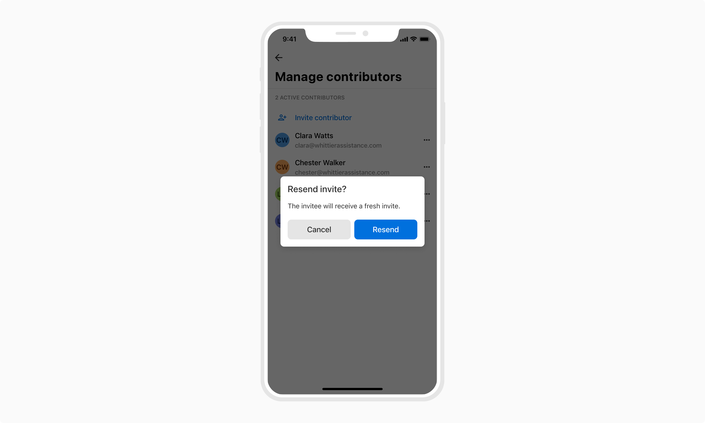
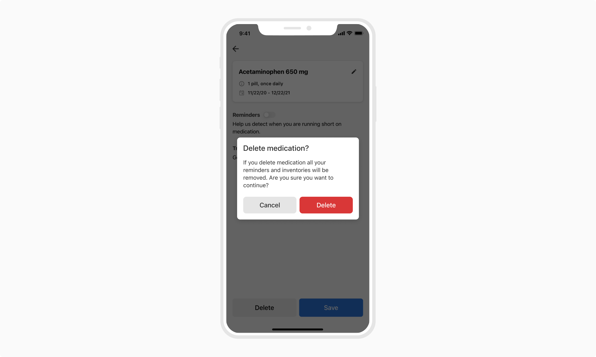
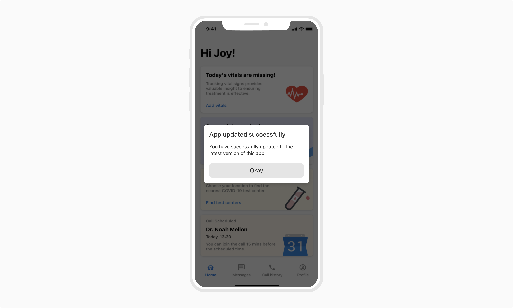
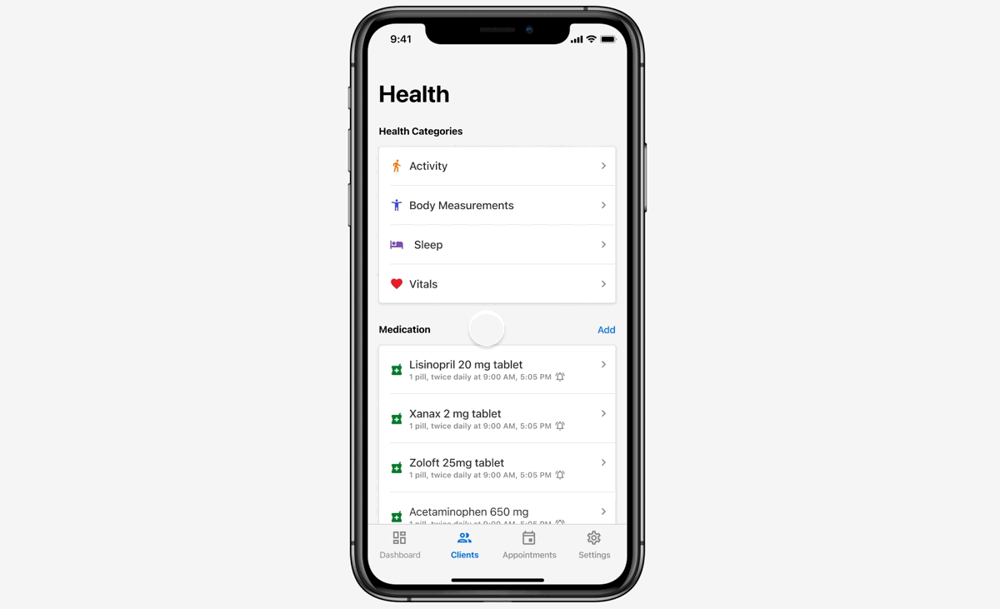
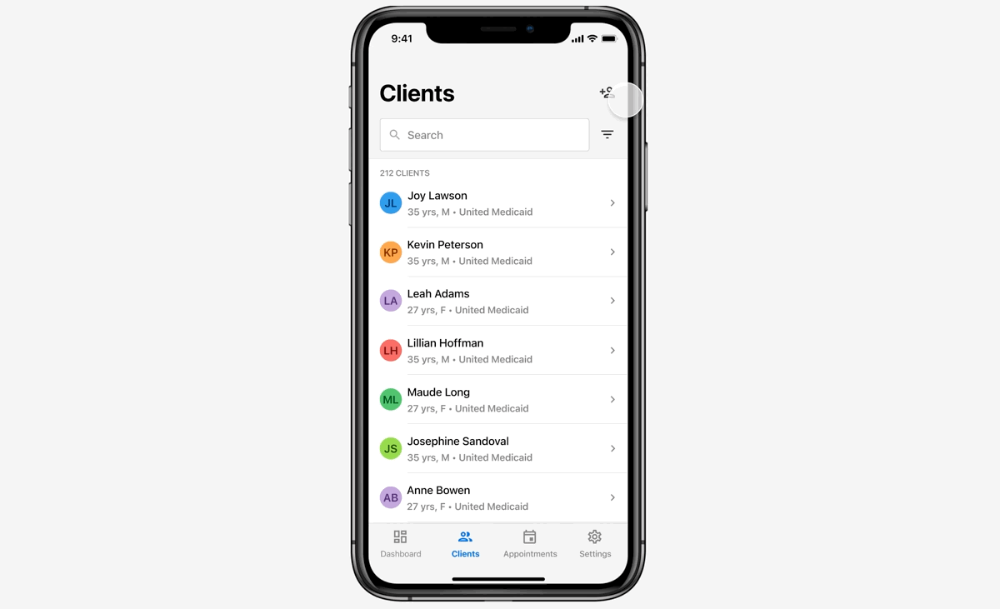
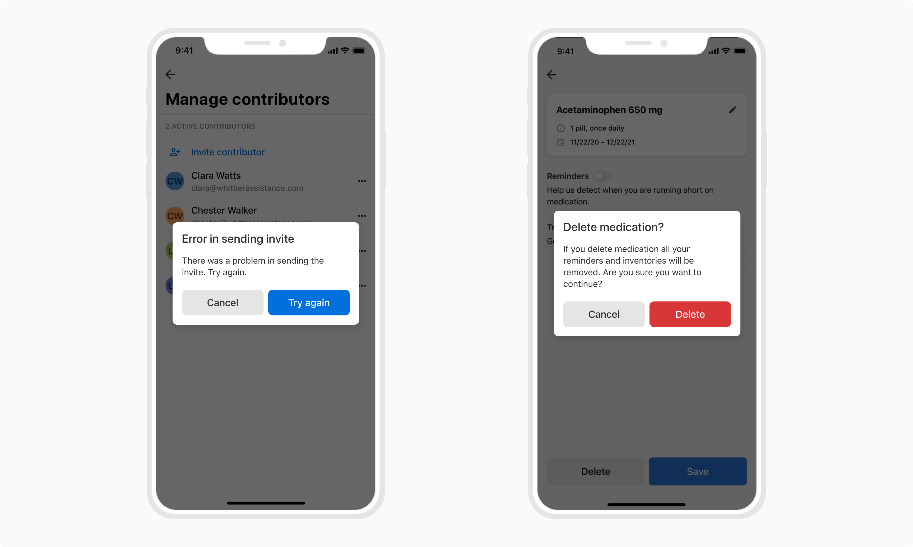

Dialogs are used to present information, critical alerts, and confirmations to the users. They retain focus until dismissed or a required action has been taken.
Dialogs are interruptive and hence should be used sparingly.

 

### Types

 

#### Confirmational

Confirmational dialogs are used to take confirmation from users before taking any important action.

 
 

#### Alerts

Alerts are used to convey critical information before taking a destructive action such as delete, discard, deactivate, etc.

 
 

#### Informational

Informational dialogs are used to convey information to users where interaction with that information is not required.

 
 

#### Full screen dialogs (Mobile only)

As the name suggests, such dialogs take up the entire screen and are suitable for end-to-end self-contained transactions _(which have a clear start and endpoint)_ such as creating, editing, or deleting an entity.

For the limited time frame of these transactions, a full-screen dialog takes the users out of the general user flow, lets them focus on the action, and then takes them back to where they started. The data edited or changed through such screens require an action to either save or discard the changes.

The **Cancel button ( X )** present at the top left is used to return to the main flow.

**Note:Since these types of dialogs take up the entire screen they are not suitable for screens larger than mobile screens.**

 

<Card shadow='none'>
  <Table
    showMenu={false}
    separator={true}
    data={[
      {
        Property: 'Action',
        Value: 'Close button, (Back button from 2nd step onwards)',
        Configurable: '❌',
      },
      {
        Property: 'Background color',
        Value: 'Namak',
        Configurable: '❌',
      },
      {
        Property: 'Page transition',
        Value: 'Single Step: Slide up (Bottom to top), Multi-Step: First Step - Slide up (Bottom to top), Subsequent Steps - Slide in (Left to right) from 2nd step onwards',
        Configurable: 'Optional',
      },
    ]}
    schema={[
      {
        name: 'Property',
        displayName: 'Property',
        width: '25%',
        sorting: false,
        separator: true,
        cellType: 'DEFAULT'
      },
      {
        name: 'Value',
        displayName: 'Value',
        width: '50%',
        sorting: false,
        separator: true
        
      },
      {
        name: 'Configurable',
        displayName: 'Configurable?',
        width: '25%',
        sorting: false,
        separator: true
      },
    ]}
    withHeader={false}
  />
</Card>
 
 

##### Single step

These are the most basic type of full-screen dialogs, where there is only one step in the flow. 

 
 

##### Multi step

For cases where the transactions such as creating an entity take more than one step, stacking of the subpages is done. The users can navigate back through the steps using the Back button(←) which takes place of the Cancel button(X) from the 2nd step onwards.

 
 
 

### Properties

 

<Card shadow='none'>
  <Table
    showMenu={false}
    separator={true}
    data={[
      {
        Property: 'Width (Except full-screen dialog)',
        Value: '320px',
        Configurable: '❌',
      },
      {
        Property: 'Height',
        Value: '<height>',
        Configurable: '-',
      },
      {
        Property: 'Background color',
        Value: 'Namak',
        Configurable: '❌',
      },
      {
        Property: 'Corner radius',
        Value: '8px',
        Configurable: '❌',
      },
      {
        Property: 'Elevation',
        Value: 'Shadow 30',
        Configurable: '❌',
      },
      {
        Property: 'Divider (in header & footer)',
        Value: 'Non-scrollable content: No divider, Scrollable content: Divider (type - header)',
        Configurable: 'Conditional',
      },
    ]}
    schema={[
      {
        name: 'Property',
        displayName: 'Property',
        width: '33%',
        sorting: false,
        separator: true,
        cellType: 'DEFAULT'
      },
      {
        name: 'Value',
        displayName: 'Value',
        width: '34%',
        sorting: false,
        separator: true
        
      },
      {
        name: 'Configurable',
        displayName: 'Configurable?',
        width: '33%',
        sorting: false,
        separator: true
      },
    ]}
    withHeader={false}
  />
</Card>
 
 

### Usage

 

#### Position and alignment

A dialog is a type of modal and hence has the highest elevation in an app. They are positioned centrally and appear with overlays to dim the background giving focus to the dialog.

-   A dialog positioned centrally [Phone]

![A dialog positioned centrally [Phone]](./images/dialogs-6.png)

 
 

-   A dialog positioned centrally [Tablet]

![A dialog positioned centrally [Tablet]](./images/dialogs-7.png)

 
 

#### Actions

 

##### Appearance & count

Dialogs present a focused and limited set of actions. The number of actions **must not exceed two** which are primary and secondary. In case of an informational dialog, a single action is enough.

Primary(affirmative) actions are used to resolve what triggered the dialog. These actions may be destructive like "Delete" or "Remove" if it suits the context. Secondary(dismissive) actions dismiss the proposed action and return the user to the originating screen or step.

 
 

##### Alignment

Actions can be aligned horizontally, with primary being the rightmost action (regardless of the nature of the primary action).

However, if the label of the action is too long to fit horizontally then for those cases actions can be stacked.

![[Left] Horizontal alignment vs [Right] Vertical alignment](./images/dialogs-9.png)

 
 

#### Dismissing behavior

Dialogs may be dismissed in the following ways:

 

##### Tapping the secondary/dismissive action

The dialog always consists of a secondary(dismissive) action, tapping on which will dismiss the dialog.

 

##### Tapping the system's back button

Dialogs can also be dismissed by tapping the back button of the system (applicable only to Android).

 

##### Tapping the overlay

Dialogs can also be dismissed by tapping outside the dialog. However, this behavior is set to be inactive by default.