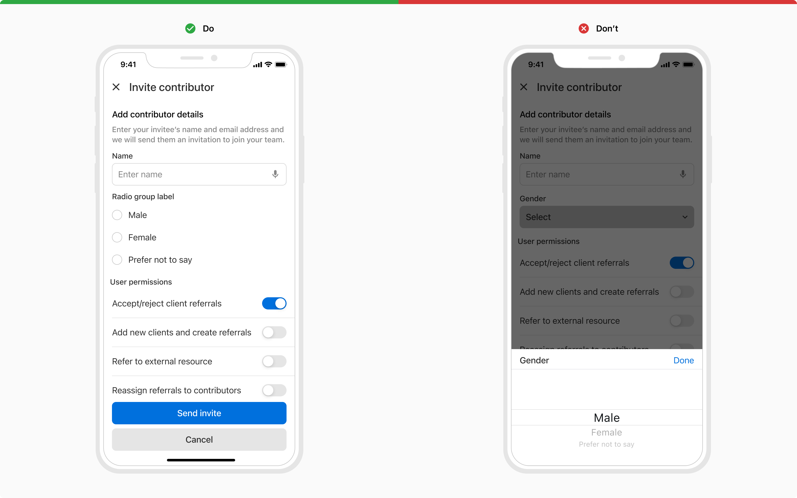

Dropdowns display a list of options for users to choose from. They provide the option to let users select a single option or multiple.

### Structure
Dropdown is made up of 2 key components - a custom **button** which acts as a trigger and a platform-native **picker** which acts as a container for the options.

 
 

### Variants
 

#### Button variants
The custom button for dropdowns comes with a few variants -

##### Standard
The standard variant consists of just text which changes its state when one or more options are selected.

##### With icon
This variant comes with an icon in the left preceding the text to provide additional cues regarding the type of the options.

##### Inline label
This variant comes with a label preceding the text and can be used at places where there is a space crunch.

### Sizes
Dropdowns come in **2 sizes** - regular and small.

### States
 

#### Button states
The custom button comes in **3 states** - default, active and disabled.

 
 

### Usage
 

#### Label position
The label provides a better understanding of what kind of selection is expected. Labels can be placed either on the top of the dropdown or can be placed inline with the value or placeholder of the dropdown.

![[Left] Label on top, [Right] Inline label](./images/dropdown-7.png)

#### Help text
Help text can be provided beneath a dropdown to add context regarding the type of input required just like the input fields.

#### For multi-select
Native picker supports single-select from a list of options. To provide multi-select, use a list in a bottom sheet or a full screen dialog.

 

#### Dropdown vs. Checkbox/Radio
It is recommended to use dropdowns if the number of single-select options exceeds 5 or if the space is limited, to better utilize the space. Checkbox/Radios should be used if the options are fewer than 5 and there are no space restrictions.

![[Left] Checkbox vs. [Right] Dropdown](./images/dropdown-11.png)
 
 

#### Picker vs. Lists
For long lists of values which typically load after an API call, display a list in a bottom sheet or a full screen dialog. Include search if needed, for example, a list of cities, organizations, medicines, etc. 

![[Left] List vs. [Right] Picker](./images/dropdown-10.png)
