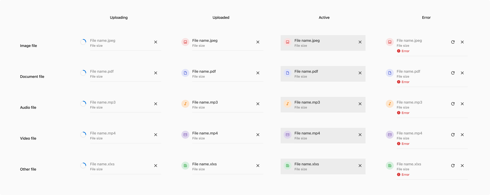
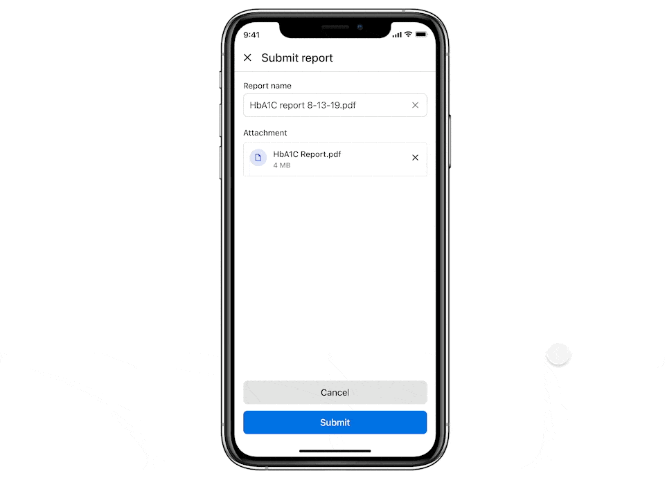

A file item is used to show the status of a file being uploaded or downloaded. It contains information such as the file name, upload progress, any error, etc. 

### Variants

#### Image
This variant is used when an image-type file is uploaded such as .jpg, .png, etc.

 
 

#### Document
Document

 
 

#### Video
This variant is used when a video-type file is uploaded such as .mov, .mp4, etc.

 
 

#### Audio
This variant is used when an audio-type file is uploaded such as .mp3, etc.

 
 

#### Other
This variant is used when the uploaded file is of a format that is not mentioned above. 

 
 

### States
The file uploader item comes in 4 states i.e., uploading, uploaded, active, and error.

 
 

### Properties

<table style="width: 100%">
  <tbody>
    <tr>
      <th style="width:33%; text-align: left;">Property</th>
      <th style="width:33%; text-align: left;">Value(s)</th>
      <th style="width:33%; text-align: left;">Default value</th>
    </tr>
    <tr style="vertical-align: top">
      <td>File type icon</td>
      <td>Icons based on -
          <ul>
              <li>Image type</li>
              <li>Audio type</li>
              <li>Video type</li>
              <li>Document type</li>
              <li>Other types</li>
          </ul>
      </td>
      <td>-</td>
    </tr>
    <tr style="vertical-align: top">
      <td>Filename</td>
      <td>&#60;File_name.format&#62;</td>
      <td>-</td>
    </tr>
    <tr style="vertical-align: top">
      <td>Right action <em>(conditional)</em></td>
      <td>&#60;close&#62;</td>
      <td>-</td>
    </tr>
     <tr style="vertical-align: top">
      <td>Try again action <em>(condition: will appear only in case of error)</em></td>
      <td>&#60;refresh&#62;</td>
      <td>-</td>
    </tr>
    <tr style="vertical-align: top">
      <td>Error <em>(conditional)</em></td>
      <td>
          <ul>
              <li>Network failure</li>
              <li>File format not accepted</li>
              <li>File is too large</li>
              <li>Technical error occurred</li>
          </ul>
      </td>
      <td>-</td>
    </tr>
  </tbody>
</table>
 

### Usage
 

#### Opening file from a file item
The file shown in the file item can be opened to view directly by tapping over the respective file item.

