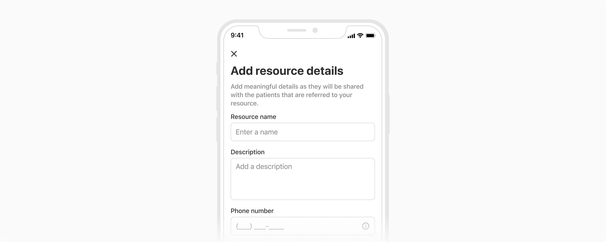

Input enables your product to take input values from the users. 
It supports multiple text types including characters and numbers. It can be used anywhere, 
though it mostly appears in conjunction with other input elements to create a form. 

### Types

 

#### Basic

Basic input contains the input box, text, an optional help text, or an optional icon on the right.

 
 

#### Icon left

This type of input contains an icon on the left of the text along with an optional icon on the right.

 
 

#### With label

Label helps the users understand what sort of information is required. It should be concise. Effective labeling improves usability.

This variant of input comes with a label on top, an optional required indicator (•), or an optional tag depending on the use case.

**[Image 1]** Input with label

**[Image 2]** Input with label & help text 

**[Image 3]** Input with label & inline error message

![[Image 1] Input with label vs [Image 2] Input with label & help text [Image 3] Input with label & inline error message](./images/minputs-3.png)

 
 

#### Metric input

Metric input takes numbers as input. It can have increment/decrement actions, prefixes, or suffixes according to the requirements.

Tapping this type of input will display a number pad on mobile/tablet devices.

##### Basic metric

This type of metric input has optional **increment/decrement** actions on the left and right sides of the input text respectively. Additionally, the user can tap on the input text and enter the desired value directly.

Basic metric comes in two sizes:

-  Regular
-  Small

**[Left]** Regular metric input 

**[Right]** Small metric input

![[Left] Regular metric input vs [Right] Small metric input](./images/minputs-4.png)

 
 

##### With prefix/suffix

Metric inputs can either have **prefixes** like the currency symbols($, €, ₹, etc) or **suffixes** like the units of measures(kg, mm, in, lbs, etc) to provide additional information about the data being input.

**[Left]** Input with prefix

**[Right]** Small with suffix

![[Left] Input with prefix vs [Right] Small with suffix](./images/minputs-5.png)

 
 

#### Free text area

Free text area lets users enter data much longer than a basic input. It can also have a scrollbar.

And just like the basic input, it can also have a help text at the bottom and inherits all the different states of a basic input.

 
 

#### Verification Code Input

Verification code input allows users to enter the code sent to their systems to verify themselves. These codes can be either 4 or 6 digits long.

 
 

### Properties

 

<Card shadow='none'>
  <Table
    showMenu={false}
    separator={true}
    data={[
      {
        Property: 'Width',
        Value: '<Width>',
        Configurable: '-',
      },
      {
        Property: 'Height',
        Value: '44px',
        Configurable: '❌',
      },
      {
        Property: 'Corner radius',
        Value: '8px',
        Configurable: '❌',
      },
      {
        Property: 'Background color',
        Value: 'Namak',
        Configurable: '❌',
      },
      {
        Property: 'Border',
        Value: '1px Stone (#D5D5D5)',
        Configurable: '❌',
      },
    ]}
    schema={[
      {
        name: 'Property',
        displayName: 'Property',
        width: '34%',
        sorting: false,
        separator: true,
        cellType: 'DEFAULT'
      },
      {
        name: 'Value',
        displayName: 'Value',
        width: '33%',
        sorting: false,
        separator: true
        
      },
      {
        name: 'Configurable',
        displayName: 'Configurable?',
        width: '33%',
        sorting: false,
        separator: true
      },
    ]}
    withHeader={false}
  />
</Card>
 
 

### Usage

 

#### Required vs optional

Inputs can be marked as optional or required depending upon the context. To avoid unnecessary clutter, mark only the minority fields as optional or required.

**Note:** It is recommended to keep the notations of required and optional fields consistent throughout the app as different notations can confuse users.

**[Left]** Optional fields in minority 

**[Right]** Required fields in minority

![[Left] Optional fields in minority vs [Right] Required fields in minority](./images/minputs-8.png)

 
 

#### Help text

Help text provides users additional information regarding the input. It appears just below the input box.

It should be preferred over the info icon on the right of the text as that icon might not persist when the users start typing.

**[Left]** Using help text 

**[Right]** Using icon on right

![[Left] Using help text vs [Right] Using icon on right](./images/minputs-9.png)

 
 

#### Using an icon on right

The icon on right should be used when interacting with that icon manipulates the input text directly.

In the example below -

-   Clear icon in the email field removes what has been input
-   Visibility (eye) icon in password input shows or hides the password being input
-   Mic icon in the search bar modifies the input method.

 
 

#### Input Masking

Input masks are helpful for the data fields that have a specific input format, as it provides the formatting cues to help users know the format in which the data is expected for the field.

 
 
 