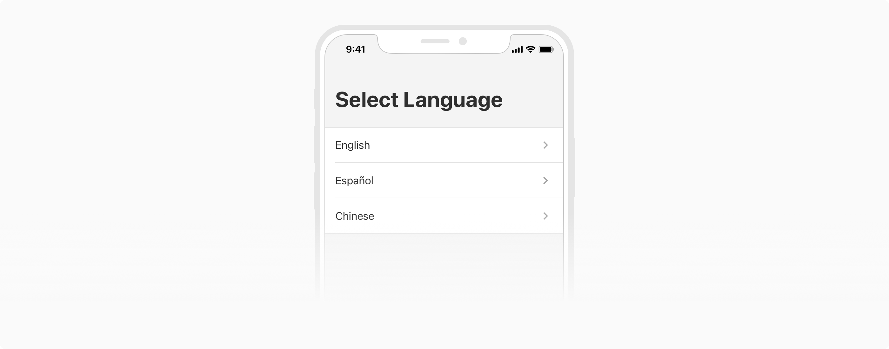
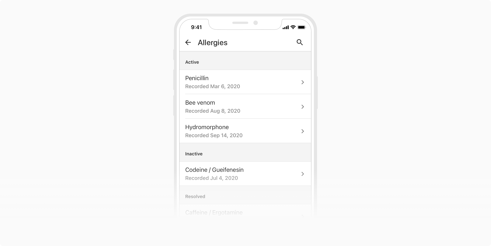
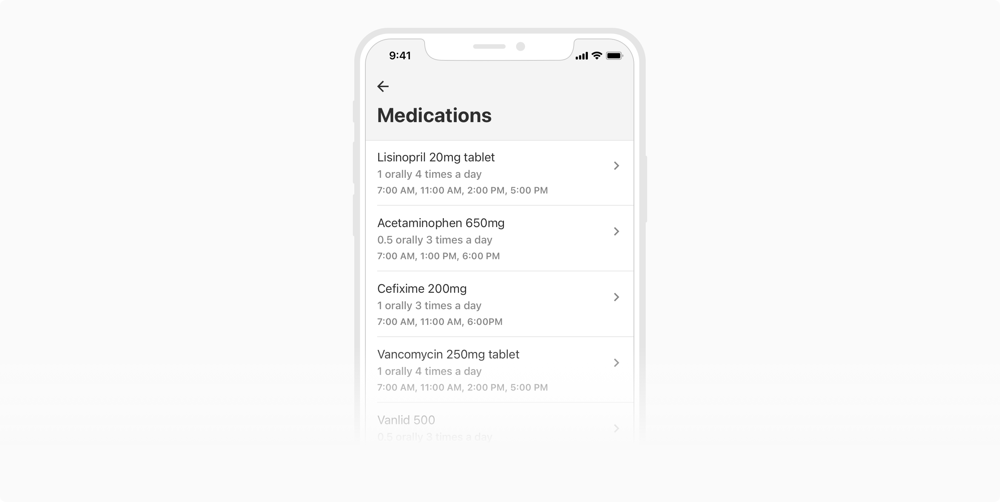
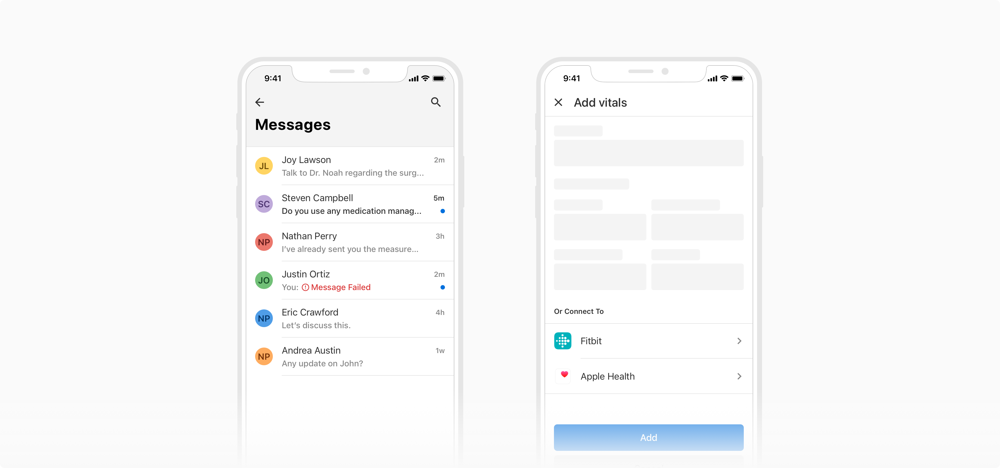
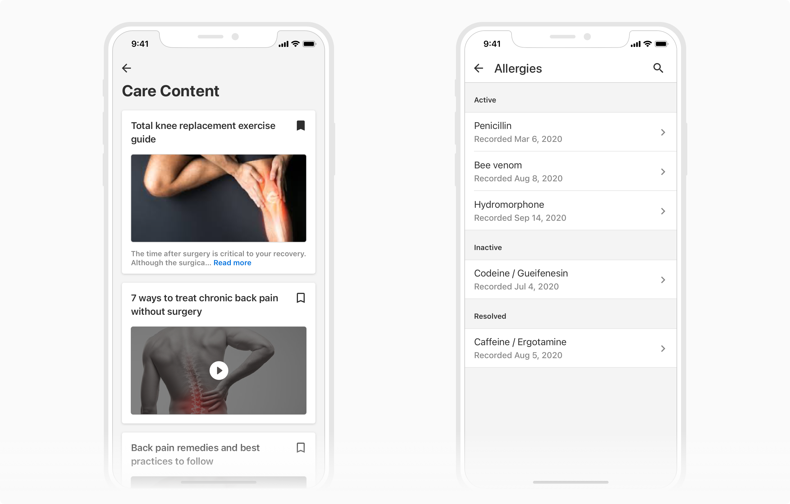
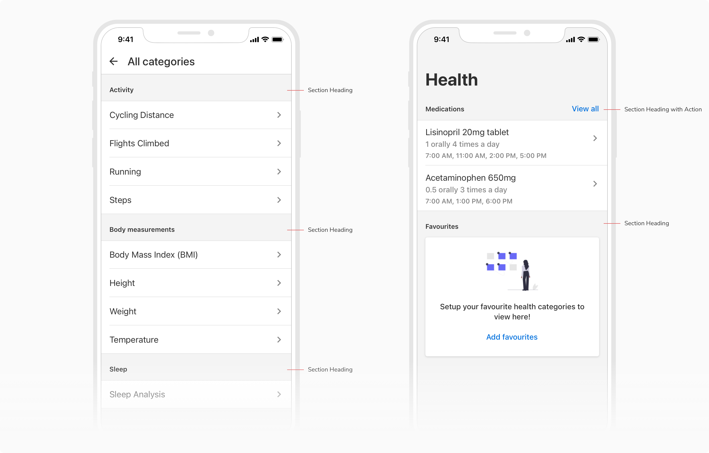
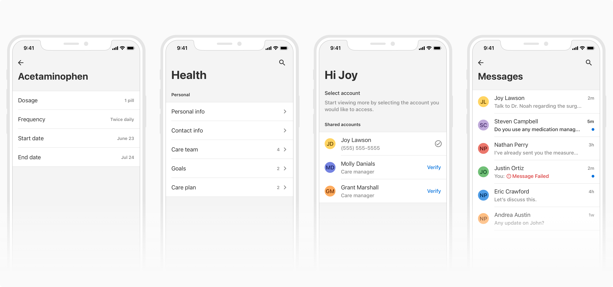
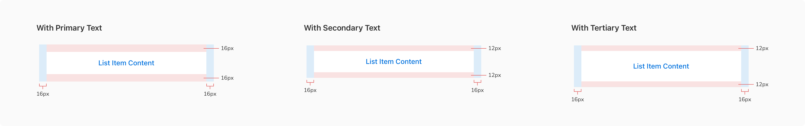
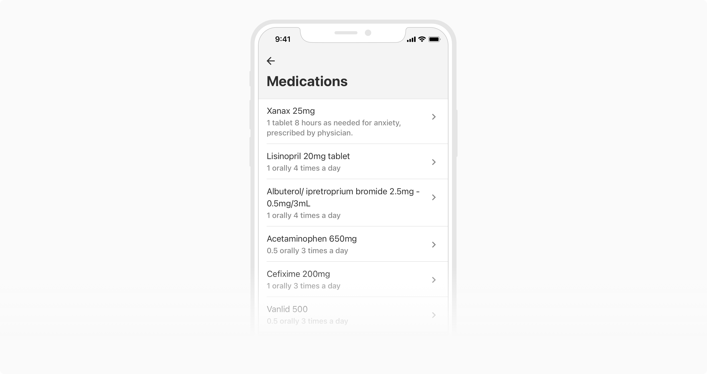

A list consists of related content grouped together and organized vertically or horizontally. Lists present the content (text, supporting visuals, etc) in a consistent format to make them easily scannable. 

### Structure
Lists consist of rows called List Items. Depending on what the users need to get from your list UI design, the content of list items can take various forms: 

1. **Text**

    *Primary* - It conveys the most important piece of information.

    *Secondary* (optional) - It provides some additional information about the list item along with the primary text. It can either be a simple text or a meta-list. It is not recommended to use secondary text as the only text item. 
    
    *Tertiary* (optional) - Tertiary text can either be simple text or a meta-list. It is not recommended to use tertiary text as the only text item.

2. **Supporting visuals/anchor points** (optional) - They appear as the leftmost items and provide additional information about the list items e.g. avatars, icons, images, checkboxes.  
3. **List controls** (optional) - They can display meta-information or actions for the list items e.g. metadata, icons, checkboxes, switches, etc.
4. **Dividers** - They are great for distinguishing each item in the list. 
 

### Variants
The content of list items can come in following variants. All of these can be combined to get the desired results.

#### Default
The default list item variant consists of just a single line of text, in order to convey the most important information.

 
 

#### With secondary text
This variant comes with a secondary text just below the primary one.

 
 

#### With tertiary text
This variant comes with a tertiary text along with the secondary & primary text.

 
 

#### With a supporting visual
This variant gives an option to have an icon, image, avatar or checkbox in the left just before the text starts.

 
 

### Usage
#### List vs. Cards
In a list, every individual list item has a similar hierarchy and content i.e. all of them follow a template whereas there is no such pattern in cards. Cards act as containers which can have any type of content inside them.

 
 

#### Grouping
Several list items can be grouped together under a section heading to accommodate other types of components (list, cards, etc.) on the same page.

 
 

#### Custom List Items
An empty list item can be used to design custom list items. One thing to keep in mind while designing a custom list item is that the padding inside the list item should be preserved.

 
 

 
 

#### Content
Avoid excessively long lines of text in the list items as this can clutter the list and might increase the cognitive load. All the text layers should individually have either 1 or at most 2 lines of text.

 
 