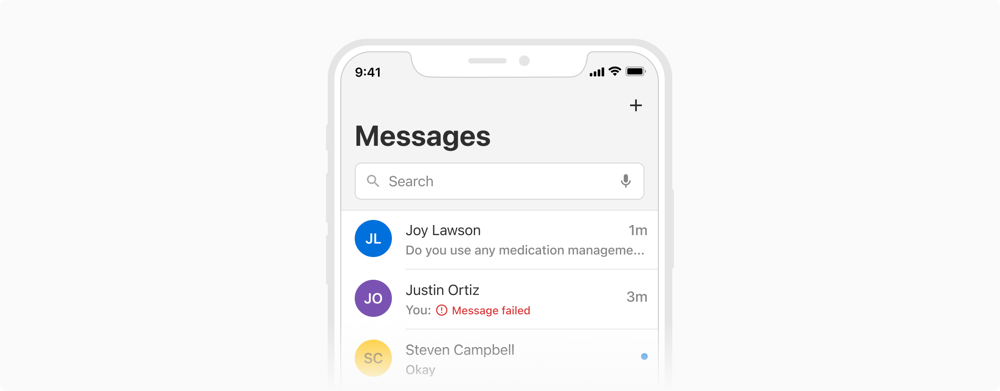

Messages are used to provide collective feedback to the users about an action or a state. They have a significant visual loudness to draw users’ attention.

### Types
 

#### Standard
This is the default variant when it comes to messages. It has a significant visual loudness and should be used with caution.

#### Inline message
It is the less attention-grabbing counterpart and hence can be used in between components or patterns.

### Variants

Standard message comes with a few variants -
#### With title
A title can be shown at the top of the messages. It is typically used to summarize the description in case it's long.

#### With actions
Actions can be a part of messages and are typically used to directly or indirectly dismiss them.

### Appearances
Messages come in **4 appearances** basis on the intent -

#### Info
The info appearance is used when the message needs to provide information that requires some attention from the users.

#### Warning
The warning appearance is used when the message needs to notify a warning that might need users' attention.

#### Alert
The alert appearance is used when the message needs to provide an error or failure information that requires immediate attention.

#### Success
The success variant is used when the inline message needs to notify the successful completion of a task or action.

### Properties
#### Standard message
<table style="width: 100%">
  <tbody>
    <tr>
      <th style="width:33%; text-align: left;">Property</th>
      <th style="width:33%; text-align: left;">Value(s)</th>
      <th style="width:33%; text-align: left;">Default value</th>
    </tr>
    <tr style="vertical-align: top">
      <td>Appearance</td>
      <td>
          <ul>
              <li>Info</li>
              <li>Success</li>
              <li>Warning</li>
              <li>Alert</li>
          </ul>
      </td>
      <td>Info</td>
    </tr>
    <tr style="vertical-align: top">
      <td>Title <em>(optional)</em></td>
      <td>&#60;title&#62;</td>
      <td>-</td>
    </tr>
    <tr style="vertical-align: top">
      <td>Description</td>
      <td>&#60;description&#62;</td>
      <td>-</td>
    </tr>
    <tr style="vertical-align: top">
      <td>Actions <em>(optional)</em></td>
      <td>
          <ul>
              <li>Action 1</li>
              <li>Action 2</li>
          </ul>
      </td>
      <td>-</td>
    </tr>
  </tbody>
</table>
 

#### Inline message
<table style="width: 100%">
  <tbody>
    <tr>
      <th style="width:33%; text-align: left;">Property</th>
      <th style="width:33%; text-align: left;">Value(s)</th>
      <th style="width:33%; text-align: left;">Default value</th>
    </tr>
    <tr style="vertical-align: top">
      <td>Appearance</td>
      <td>
          <ul>
              <li>Info</li>
              <li>Success</li>
              <li>Warning</li>
              <li>Alert</li>
          </ul>
      </td>
      <td>Info</td>
    </tr>
    <tr style="vertical-align: top">
      <td>Description</td>
      <td>&#60;description&#62;</td>
      <td>-</td>
    </tr>
  </tbody>
</table>
 

### Usage
 

#### Non-dismissive
Messages are non-dismissive in nature. They appear with the rest of the components and cannot be dismissed directly.

#### Position & width of the message component

##### Standard
Message component always appears at the top of a section but just below the header. The width of the message component always spans the width of its container (leaving the appropriate padding) or as per the content appearing below it.

 

##### Inline message
Inline message component appears inline or below the component it is related to, with a 4px margin at the top and spans the width of the component.

 
 

#### Standard vs. Inline message
Inline message variant should be used when feedback relative to some specific content has to be provided to the users. Whereas, the standard message variant should be used when collective feedback for a section or an entire page has to be provided to the users.

 
 

#### Inline message vs Help text
Inline message is used to provide inline feedback regarding a state or action and hence it is reactive (only appears after something has happened, to provide feedback). Whereas help text is used to provide additional information typically appearing just below a component e.g. input, dropdown, etc.

