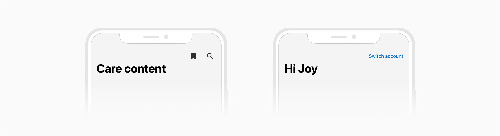
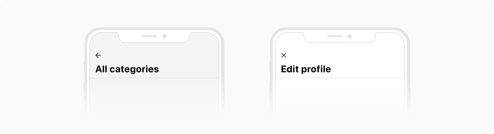

Page headers are used to convey what a page collectively contains e.g. Messages, Profile information, etc. They appear at the top of the page, below the status bar, and enable navigation. 

### Types
Page headers come in **2 types** basis on where the users currently are in the app hierarchy - level 0 and level 1.

#### Level 0
Level 0 header is used at the topmost level of navigation.

 

#### Level 1
Level 1 header is used for the second and subsequent level(s). It should replace the level 0 header when used. Users can navigate to the previous page using the back button present in the top left side of the header.

 

### Variants
Both the level 0 and level 1 page headers come in **5 variants** - default, with subheading, with icon buttons, with label button and with tabs.

All of these variants can be combined to get the desired results with the limitation of having just 1 type of actions i.e. either the icon buttons or a label button can be there at a time.

#### Default
Default variant consists of just the heading. In level 1, it also comes with a back button.

**Level 0**

 

**Level 1**

 

#### With subheading
This variant comes with a subheading just below the heading.

**Level 0**

 

**Level 1**

 

#### With icon buttons
This variant comes with an option to have up to **2 icon buttons** in the top right of the header.

**Level 0**

 

**Level 1**

 

#### With label button
This variant comes with an option to have a label button in the top right of the header.

**Level 0**

 

**Level 1**

 

#### With tabs
This variant comes with an option to have tabs just below the heading.

**Level 0**

 

**Level 1**

 

### Sizes
Page headers come in **2 sizes** - prominent and compact.

#### Prominent

**Level 0**

 

**Level 1**

 
 

#### Compact

**Level 0**

 

**Level 1**

 

### Usage
#### Scrolling behavior
As user scrolls the page content, the prominent header transitions to the compact header to maximize the space available for content consumption.

On scroll, the background of the header becomes white with a divider appearing in the bottom, to create a sense of visual separation.

 

#### Actions combination
The actions on the extreme left and the extreme right of the header are purely optional. However, the number of actions should not exceed 2 for any side. 

**Actions on Left**

On left, it is suggested to use a single icon button which can take up the following forms: 
* **A back button (←)**, which returns to the previous page.
* **A close button (X)**, which closes the modal type pages.

 

**Actions on Right**

On the right side, either a label button or a maximum of two icon buttons can be used but the **combination of both is not allowed.**
* **Icon buttons**, which are contextual to the page content. A maximum of 2 actions are allowed, **if there are more actions, hide them under a Menu (•••) button.**
* **Label button**, which is to be used when the icon buttons are not intuitive enough. Try to use a compact copy for the link button in order to accommodate other content effectively.

 

#### Modal vs non-modal page header
Non-modal pages are pages that can stack on top of one another. Users can navigate back through the previous levels using the back arrow (**←**) placed at the top left of the header.

While modal pages are those which the users can dismiss or cancel using the close button (**X**) placed at the top left of the header. 

 