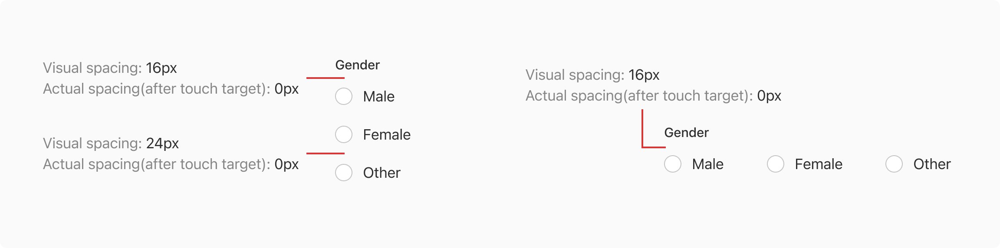
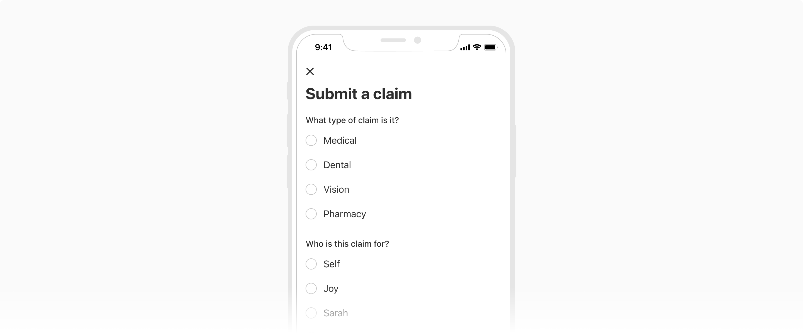
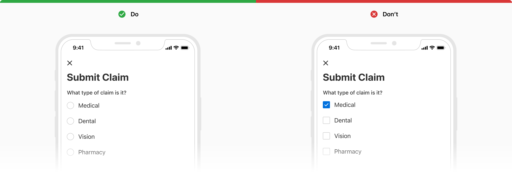
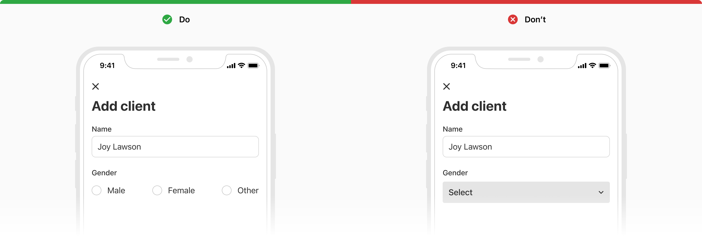

Radio lets users select *one value* from a list of mutually exclusive choices. Whenever a user makes a new selection, the previously selected option is deselected. If multi-select is required use checkboxes instead of radio.

### Variants
#### Default
The default variant comes with a label along with the radio control.

 
 

#### With help text
Radio can have a help text below the label to provide additional information about that particular option. The help text will always be aligned with the label. 
Tapping over the help text does not change the state of the radio.

 
 

### States
Radio comes in **2 selection states** - selected and unselected. And each of these can have **3 interactive states** - default, active and disabled.

#### Selected

 
 

#### Unselected

 
 

### Usage
#### Radio group
The radio group consists of a list of multiple options, with a label on the top. The label should clearly state the grouping category or the action to perform.

**Note**: Minimum spacing between multiple options as well as the 1st option and group label should be `0px`.

 
 

#### Options alignment
The options in a radio group can be aligned either verticallyorhorizontally.

##### Horizontal
For horizontal arrangement, all the options of the radio group align horizontally in a single line. Make sure to space the options appropriately so that it is clear which control goes with which label. 

If there are too many options it is not advisable to go for this type of arrangement because of less horizontal space available.

 
 

##### Vertical
For vertical alignment, all the options of the radio group align vertically with one option in a line. This type of arrangement should be preferred over the horizontal arrangement for easier reading and scanning.

 
 

#### Overflow behavior
If the label or the help text with the radio component overflows, wrap it to the next line but make sure that the control and the label are top aligned.

 
 

#### Radio vs. checkbox
Checkboxes allow users to select multiple options whereas radio allows only one selection from a list of mutually exclusive options.

 
 

#### Radio vs. dropdown
Radio is recommended to use when there are fewer than 5-7 options as it is easier for users to compare and select the appropriate option and save an additional tap. 

However, if the number of options exceeds 5-7 or if the space is limited and the options can be collapsed then it is recommended to use dropdowns to utilize the space.

 
 

#### Default selection
* If a radio group is optional to fill, no option from the list should be selected by default.
* Even if the radio group is mandatory to fill, it is recommended not to have a default option selected in order to avoid submitting that option by mistake. However, if the need arises you have the choice to make an option selected by default. In that case, make sure to select the safest and most likely option.